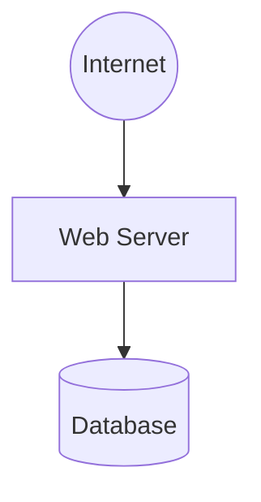
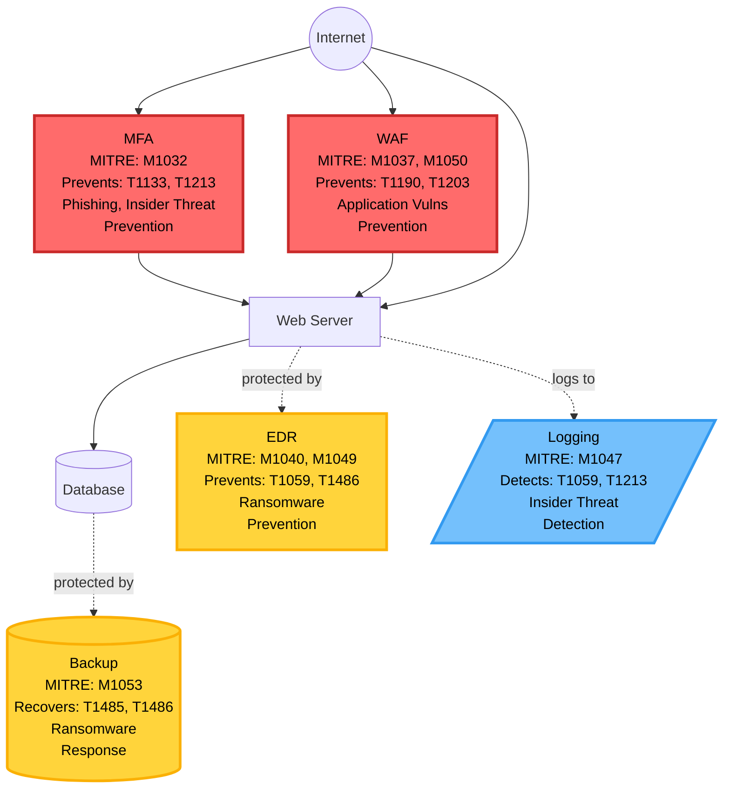

# ThreatAssessor

Production-ready CLI that analyzes architecture diagrams and generates comprehensive threat assessments with MITRE ATT&CK mapping and AI/ML threat analysis.

**Status:** 🚧 v1.3-dev In Development - Phase 3D Week 1 ✅ Complete  
**Phase 3C+:** Orchestrator with improvement roadmaps (16 files generated) ✅  
**Phase 3D Week 1:** Mixture of Experts (MoE) agent architecture + sequential validation ✅ Complete  
**Phase 3D Week 2-4:** Expert refactoring + unified orchestration (3 weeks remaining)

**Core Feature:** Architecture diagram → Attack paths + AI/ML analysis + Priority-coded controls + Improvement roadmaps + Residual risk

---

## Quick Start

```bash
source .venv/bin/activate

# Option 1: Quick deterministic analysis (no LLM, ~30s)
./demo_deterministic_engine.sh          # Validates architecture + shows deterministic engine

# Option 2: Complete Mixture of Experts (MoE) pipeline (with LLM validation, ~2 min) ⭐ RECOMMENDED
./demo_expert_llm.sh          # Full 3-layer validation + coherent dashboard

# For your own architecture:
# Option 1: One-command demo (easiest)
./demo_expert_llm.sh your_architecture.mmd

# Option 2: Step-by-step (for debugging)
# 1. Validate (checks for orphan nodes)
./demo_deterministic_engine.sh --validate-orphan your_architecture.mmd

# 2. Run full analysis (deterministic + MoE validation + dashboard)
python3 -m chatbot.main --gen-arch-truth your_architecture.mmd
python3 -c "
from chatbot.modules.agents import run_moe_pipeline
result = run_moe_pipeline('report/your_architecture')
print(f'Final confidence: {result.final_confidence:.1f}%')
"
python3 -m chatbot.modules.executive_dashboard_generator report/your_architecture

# 3. View reports (start with dashboard)
cd report/your_architecture/
cat 00_executive_dashboard.md   # ⭐ PRIMARY - Start here (CISO report)
cat 01_executive_summary.md     # Business summary with ROI
cat 02_technical_report.md      # MITRE mapping + attack paths
cat 03_action_plan.md           # 8-week implementation roadmap
cat 08_improvement_summary.md   # Human-readable improvement plan
open 08b_recommended_target.mmd # View recommended security roadmap
```

**Output:** 16 files per architecture (dashboard + reports + critiques + MoE consensus + improvement roadmaps + diagrams)  
**Time:** ~2 minutes (30s deterministic + 45s MoE + 5s dashboard + 30s diagram generation)

---

## What You Get

### Input (before.mmd)
Your vulnerable architecture:


**Baseline:** 3 nodes, 0 security controls, direct internet exposure

### Output

**1. Enhanced Architecture Diagram (after.mmd) with Priority Color Coding**

The system generates a comprehensive diagram with:
- **Priority color coding** (Phase 3B++): 🔴 Critical (red), 🟡 High (yellow), 🔵 Medium (blue), 🟢 Baseline (green)
- **MITRE technique IDs** (T####) showing what attacks each control addresses
- **MITRE mitigation IDs** (M####) showing control mappings
- **Attack path indicators** (#1, #2, #3) showing which paths the control protects
- **DIR category labels** (Prevention, Detection, Isolation, Response)
- **Control placement logic** based on attack path analysis
- **Connection types**: solid arrows (inline controls), dotted arrows (monitoring/applies-to-all)

Example controls from actual output (priority color-coded):
```
NEW_MFA["Mfa<br/>MITRE: M1032<br/>Prevents: T1133, T1213, T1485<br/>Phishing, Insider Threat, Ransomware<br/>Prevention"]
NEW_WAF["Waf<br/>MITRE: M1037, M1050<br/>Prevents: T1190, T1203<br/>Application Vulns<br/>Prevention"]
NEW_BACKUP[("Backup<br/>MITRE: M1053<br/>Recovers: T1485, T1486, T1490<br/>Ransomware<br/>Response")]
NEW_LOGGING[/"Logging<br/>MITRE: M1047<br/>Detects: T1059, T1213<br/>Insider Threat<br/>Detection"/]

style NEW_MFA fill:#ff6b6b,stroke:#c92a2a,stroke-width:3px,color:#000000      # 🔴 CRITICAL
style NEW_WAF fill:#ff6b6b,stroke:#c92a2a,stroke-width:3px,color:#000000      # 🔴 CRITICAL  
style NEW_BACKUP fill:#ffd43b,stroke:#fab005,stroke-width:3px,color:#000000   # 🟡 HIGH
style NEW_LOGGING fill:#74c0fc,stroke:#339af0,stroke-width:3px,color:#000000  # 🔵 MEDIUM
```

**Generated diagram (simplified example showing 5 of 17 controls with priority colors):**

*Note: This shows 5 key controls for clarity. The actual output includes all 17 controls with complete MITRE mappings and priority color coding.*

**Features:**
- ✅ Priority color coding: 🔴 Critical (red), 🟡 High (yellow), 🔵 Medium (blue), 🟢 Baseline (green)
- ✅ 15-37 recommended controls (RAPIDS + AI/ML, stops at 100% technique coverage)
- ✅ MITRE technique mapping per control (T#### = attack types)
- ✅ MITRE mitigation mapping (M#### = control standards)
- ✅ RAPIDS threat categories (Phishing, Ransomware, Insider Threat, etc.)
- ✅ DIR framework labels (Prevention, Detection, Isolation, Response)
- ✅ Path-based placement (MFA at entry, Backup at data layer, EDR on endpoints)
- ✅ Black text on colored backgrounds (high contrast, readable)

**See full sample:** Run `./demo_expert_llm.sh` to generate complete example in `report/01_minimal_vulnerable/` (16 files with priority-colored controls)

**2. Complete Report Package (16 Files)**
```
report/your_architecture/
├── 00_executive_dashboard.md   # Executive dashboard (NEW - Phase 3D Week 3)
├── ground_truth.json           # Deterministic analysis (99.5% base)
│
├── 04_architect_critique.json  # Architect validation (72-85/100)
├── 05_tester_critique.json     # Tester validation (85-90/100)
├── 06_red_team_critique.json   # Red Team validation (40-60/100 exploit)
├── 07_moe_orchestrator.json    # MoE consensus (NEW - Phase 3D)
├── 07_orchestrator_report.json # Legacy format (backward compatible)
│
├── 01_executive_summary.md     # Business summary with ROI
├── 02_technical_report.md      # MITRE mapping + attack paths
├── 03_action_plan.md           # 8-week implementation roadmap
├── 08_improvement_summary.md   # Human-readable improvement plan
│
├── before.mmd                  # Current architecture (input)
├── after.mmd                   # With all controls (priority color-coded)
├── 08a_quick_wins.mmd          # Quick wins (CRITICAL, 1-2 weeks)
├── 08b_recommended_target.mmd  # Recommended (CRITICAL+HIGH, 1-3 months) ⭐
└── 08c_maximum_security.mmd    # Maximum (all controls, 6+ months)
```

**Sample:** Run `./demo_expert_llm.sh` to generate complete example in `report/01_minimal_vulnerable/` (16 files)

**Key Metrics:**
- **BEFORE Risk:** Current risk with present controls (e.g., 65/100 MITIGATE)
- **AFTER Risk:** Target risk after recommendations (e.g., 9.5/100 ACCEPT)
- **ROI:** 85% risk reduction with justified control investments
- **Confidence:** 93-96% (99.5% base ± expert validations)
- **MoE Validation:** Sequential validation by 3 expert agents (Architect, Tester, Red Team)

---

## Demonstrations

### Demo 1: Quick Validation (Deterministic Only)
```bash
# Validates architecture and shows deterministic threat analysis
./demo_deterministic_engine.sh

# Validate your own architecture (checks for orphan nodes)
./demo_deterministic_engine.sh --validate-orphan your_architecture.mmd
```

**Shows:** (~30 seconds, no LLM required)
- Orphan node detection
- RAPIDS threat assessment (6 categories)
- Residual risk calculation (BEFORE/AFTER)
- Prevention + DIR control recommendations
- 7 files generated (ground_truth + reports + diagrams)

### Demo 2: Complete MoE Pipeline (Recommended) ⭐
```bash
# Complete 3-layer validation with coherent dashboard
./demo_expert_llm.sh

# Use your own architecture
./demo_expert_llm.sh your_architecture.mmd
```

**Shows:** (~2 minutes, requires LLM API key)
- Layer 1: Deterministic analysis (99.5% confidence)
- Layer 2: Mixture of Experts (MoE) validation (3 expert critics)
- Layer 3: Executive dashboard (coherent narrative)
- 16 files generated (dashboard + reports + critiques + diagrams)
- Automatic coherence validation

### Self-Test
```bash
python3 -m chatbot.main --self-test
# ✅ Validates 84.9% accuracy claim (8 seconds)
```

### Generate Random Architectures
```bash
# Generate test architectures for experimentation
python3 -m chatbot.main --gen-random-arch --complexity low
python3 -m chatbot.main --gen-random-arch --complexity medium --orientation LR
python3 -m chatbot.main --gen-random-arch --complexity high --seed 42

# Options:
# --complexity: low (4-6 nodes), medium (7-12 nodes), high (13-20 nodes)
# --orientation: TB (top-bottom), LR (left-right)
# --seed: Reproducible generation (same seed = same architecture)
```

**Use cases:**
- Testing threat assessment on various architectures
- Training and demonstrations
- Reproducible test scenarios with `--seed`

---

## Key Features

### 🏗️ Architecture Threat Assessment
- **RAPIDS-driven:** 6 threat categories (Ransomware, App Vulns, Phishing, Insider, DoS, Supply Chain)
- **AI/ML threat analysis:** ARC Framework (88 controls, 9 risk categories) + MITRE ATLAS (170 techniques, 35 mitigations)
- **Attack path analysis:** Per-node technique mapping with MITRE IDs
- **Residual risk:** BEFORE/AFTER calculation with business thresholds
- **Prevention + DIR:** Defense-in-depth (Prevention 40%, Detect 30%, Isolate 20%, Respond 10%)
- **Orphan detection:** Identifies unreachable components before analysis
- **100% technique coverage:** Exhaustive mapping of all 44 MITRE mitigations

### 📊 Report Generation
- **Executive summary:** Business justification with ROI (for C-level)
- **Technical report:** MITRE techniques + attack paths (for security team)
- **Action plan:** 8-week implementation roadmap (for project managers)
- **Visual diagrams:** Before/after with context-aware control labels

### ✅ Validation
- **6-check framework:** Path completeness, orphan detection, mitigation exhaustiveness, diagram completeness, layered defense, hop coverage
- **99.5% confidence:** Validated across 22 test architectures
- **0 orphans:** All test architectures pass orphan detection
- **100% technique coverage:** All RAPIDS threats mapped to MITRE controls

**See:** [docs/core/V1_FEATURES.md](docs/core/V1_FEATURES.md) for complete feature list

---

## Performance

| Metric | Value |
|--------|-------|
| Analysis time | 30-60 seconds |
| Confidence | 99.5% (avg across 22 architectures) |
| Validation pass rate | 100% (22/22 architectures) |
| Technique coverage | 100% (all RAPIDS threats mapped) |
| Orphan detection | 0 orphans in all test cases |
| Control recommendations | 15-37 per architecture (17 RAPIDS + up to 20 AI/ML controls) |
| AI/ML architectures supported | ✅ LLM, agents, vector DB, embeddings, code execution |

---

## Installation

### Prerequisites
- Python 3.9+
- Virtual environment (included)
- OpenRouter API key (optional, for LLM features)

### Setup
```bash
# Clone repository
git clone <repo-url>
cd DEV-TEST

# Activate environment
source .venv/bin/activate

# Verify installation
python3 -m chatbot.main --help

# Optional: Set API key for LLM features
echo "OPENROUTER_API_KEY=sk-or-v1-xxxxx" > .env
```

**Required Data Files** (44MB + 45MB, not in git):
- `chatbot/data/enterprise-attack.json` - MITRE ATT&CK data
- `chatbot/data/technique_embeddings.json` - Pre-computed embeddings

---

## Documentation

### Essential Reading
- **[README.md](README.md)** (this file) - Quick start
- **[CLAUDE.md](CLAUDE.md)** - Developer guidelines
- **[STATUS_AND_PLAN.md](STATUS_AND_PLAN.md)** - Project status
- **[docs/README.md](docs/README.md)** - Documentation map

### Core Documentation
- **[V1 Features](docs/core/V1_FEATURES.md)** - Complete feature documentation
- **[Confidence Methodology](docs/core/CONFIDENCE_METHODOLOGY.md)** - 6-factor validation
- **[Prevention + DIR Framework](docs/core/PREVENTION_VS_MITIGATION.md)** - Defense-in-depth
- **[Reference Architectures](docs/core/REFERENCE_ARCHITECTURES.md)** - Validation benchmarks

### Pattern Documentation
- **[Threat Patterns Overview](docs/patterns/README.md)** - Pattern catalog and development guidelines
- **[AI/ML Pattern Status](docs/patterns/AI_PATTERN_STATUS.md)** - ARC Framework + MITRE ATLAS integration
- **[AI/ML Pattern Verification](docs/patterns/AI_PATTERN_VERIFICATION.md)** - Integration test results

### Operations
- **[Operations Guide](docs/operations/OPERATIONS.md)** - Troubleshooting and maintenance
- **[Architecture Validation](docs/operations/ARCHITECTURE_VALIDATION.md)** - Orphan node guide

### Development
- **[System Architecture](docs/development/ARCHITECTURE.md)** - Design details
- **[LLM Provider](docs/development/LLM_PROVIDER_ARCHITECTURE.md)** - LLM client architecture

### Phases
- **[Phase 3B Improvements](docs/phases/PHASE3B_IMPROVEMENTS.md)** - Confidence to 99.1%
- **[Phase 3B+ Diagram Placement](docs/phases/PHASE3B_DIAGRAM_PLACEMENT.md)** - Visual improvements
- **[Phase 3C Overview](docs/phases/PHASE3C_OVERVIEW.md)** - LLM as Judge/Critic (4-agent system)
- **[Phase 3C MVP1 Summary](docs/phases/PHASE3C_MVP1_SUMMARY.md)** - Architect agent complete ✅

---

## Advanced Options

### Debugging and CI/CD

```bash
# Debug mode - shows detailed logging
python3 -m chatbot.main --gen-arch-truth architecture.mmd --verbose

# Silent self-test - returns exit code 0 (pass) or 1 (fail)
python3 -m chatbot.main --self-test-quiet
# Useful for CI/CD pipelines
```

### Legacy Features (Phase 2A)

```bash
# Direct semantic search (requires API key, predates architecture analysis)
python3 -m chatbot.main --query "PowerShell attack" --format executive
# Formats: technical, action-plan, executive, all
# Note: This is legacy functionality. Use --gen-arch-truth for architecture analysis.
```

**Note:** Most users should use the primary commands shown in Quick Start. For LLM validation, use `./demo_expert_llm.sh` which runs the complete MoE pipeline.

---

## Common Usage Patterns

### Architecture Assessment Workflow
```bash
# 1. Create/edit architecture diagram
vi my_architecture.mmd

# 2. Validate for orphan nodes
./demo_deterministic_engine.sh --validate-orphan my_architecture.mmd

# 3. Fix any orphans (if found)
# Add entry points or connections

# 4. Run threat analysis
python3 -m chatbot.main --gen-arch-truth my_architecture.mmd

# 5. Review reports
cd report/my_architecture/
cat 01_executive_summary.md
```

### Batch Validation
```bash
# Check all test architectures
python3 scripts/backtest_all_architectures.py

# Check for orphan nodes
python3 scripts/validation/check_orphans.py

# Validate specific architecture
python3 -m chatbot.modules.completeness_validator architecture_name
```

---

## Troubleshooting

### Orphan Nodes Detected
**Problem:** Architecture has components unreachable from entry points

**Solution:**
```bash
# Check which nodes are orphans
python3 scripts/validation/check_orphans.py architecture_name

# Fix patterns:
# 1. Add entry point: VPN((VPN)) --> OrphanNode
# 2. Connect to path: ExistingNode --> OrphanNode
# 3. Remove if out of scope

# See detailed guide
cat docs/operations/ARCHITECTURE_VALIDATION.md
```

### Analysis Confidence Low
**Problem:** Validation shows <95% confidence

**Solution:**
```bash
# Check validation details
python3 -m chatbot.modules.completeness_validator architecture_name

# Common issues:
# - Orphan nodes (add entry points)
# - Missing entry points (use double parentheses: ((Entry)))
# - Incomplete connections
```

### Reports Not Generated
**Problem:** `report/` directory empty

**Solution:**
```bash
# Check Mermaid syntax
cat architecture.mmd | grep "flowchart\|graph"

# Run with verbose output
python3 -m chatbot.main --gen-arch-truth architecture.mmd 2>&1 | grep ERROR

# Verify data files present
ls -lh chatbot/data/*.json
```

**See:** [docs/operations/OPERATIONS.md](docs/operations/OPERATIONS.md) for detailed troubleshooting

---

## Technology Stack

| Component | Technology |
|-----------|-----------|
| Language | Python 3.9+ |
| Embeddings | nvidia/llama-nemotron-embed-vl-1b-v2:free (2048 dim) |
| LLM (optional) | nvidia/nemotron-3-nano-omni-30b-a3b-reasoning:free |
| API Router | LiteLLM 1.73.6 |
| Data Source | MITRE ATT&CK v16 (835 techniques, 268 mitigations) |
| AI/ML Data | MITRE ATLAS (170 techniques, 35 mitigations) |
| AI/ML Framework | ARC Framework (88 controls, 9 risk categories) |

---

## Project Status

| Phase | Status | Description |
|-------|--------|-------------|
| Phase 2A | ✅ Complete | Semantic search + LLM + Scoring |
| Phase 3A | ✅ Complete | RAPIDS-driven threat modeling (81% confidence) |
| Phase 3B | ✅ Complete | Prevention/DIR + Residual Risk (99.1% confidence) |
| Phase 3B+ | ✅ Complete | Intelligent control placement + Orphan detection (99.5% confidence) |
| Phase 3B++ | ✅ Complete | Priority color coding (red/yellow/blue/green) |
| Phase 3C+ | ✅ Complete | Orchestrator + Improvement roadmaps (16 files generated) |
| v1.3 (AI/ML) | ✅ Complete | AI/ML threat pattern with ARC Framework + MITRE ATLAS |
| **Phase 3D Week 1** | ✅ **Complete** | **Mixture of Experts (MoE) agent architecture + sequential validation (16 files)** |
| Phase 3D Week 2-4 | 🚧 In Progress | Expert refactoring + unified orchestration (3 weeks) |
| Phase 4 | 📦 Future | Web UI (15-20 hours) |

**Current:** v1.3-dev (Phase 3D Week 1) - MoE Architecture + Sequential Validation 🚀

**New in Phase 3D:**
- ✅ Clean agent structure (critics/analysts/orchestrators)
- ✅ Sequential validation with fail-fast
- ✅ Mixture of Experts (MoE) consensus (16 files including executive dashboard)
- ✅ 93-96% final confidence (99.5% base ± expert adjustments)

**Next:** Phase 3D Week 2 - Expert refactoring (validation-only, not parallel recommendations)

**See:** [STATUS_AND_PLAN.md](STATUS_AND_PLAN.md) for detailed roadmap

---

## Contributing

**Development Guidelines:** See [CLAUDE.md](CLAUDE.md)
- 95% confidence rule (validate before coding)
- Code standards and testing requirements
- Documentation guidelines

**Testing:**
```bash
# Run validation
python3 scripts/backtest_all_architectures.py

# Check orphans
python3 scripts/validation/check_orphans.py

# Validate architecture
python3 -m chatbot.modules.completeness_validator architecture_name
```

---

## Quick Commands

```bash
# Validate architecture
./demo_deterministic_engine.sh --validate-orphan architecture.mmd

# Run analysis
python3 -m chatbot.main --gen-arch-truth architecture.mmd

# Check validation
python3 -m chatbot.modules.completeness_validator architecture_name

# Run demo
./demo_deterministic_engine.sh

# Self-test
python3 -m chatbot.main --self-test

# Generate random test architecture
python3 -m chatbot.main --gen-random-arch --complexity medium --seed 42
```

---

## Acknowledgments

### Threat Frameworks
- **MITRE ATT&CK Framework** - https://attack.mitre.org - Enterprise threat intelligence
- **MITRE ATLAS** - https://atlas.mitre.org - Adversarial Threat Landscape for AI Systems (170 techniques, 35 mitigations)
- **ARC Framework** - https://govtech-responsibleai.github.io/agentic-risk-capability-framework/ - Agentic Risk & Capability Framework by GovTech ResponsibleAI (88 controls, 9 risk categories)

### Technology
- **OpenRouter API** - https://openrouter.ai
- **LiteLLM** - https://github.com/BerriAI/litellm

---

**Version:** 1.3-dev (Mixture of Experts Architecture - Phase 3D Week 1 Complete)  
**Last Updated:** 2026-05-18  
**Status:** 🚧 In Development - MoE sequential validation + agent structure ✅
