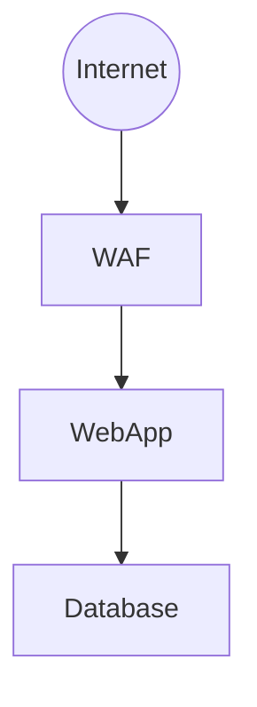

# MITRE ATT&CK Threat Assessment System

Production-ready CLI that analyzes architecture diagrams and generates comprehensive threat assessments with MITRE ATT&CK mapping.

**Status:** ✅ v1.0 Production Ready (99.5% confidence)  
**Core Feature:** Architecture diagram → Attack paths + Control recommendations + Residual risk (BEFORE/AFTER)

---

## Quick Start

```bash
source .venv/bin/activate

# 1. Validate architecture (checks for orphan nodes)
./demo_architecture.sh --validate-orphan your_architecture.mmd

# 2. Run threat analysis
python3 -m chatbot.main --gen-arch-truth your_architecture.mmd

# 3. View reports
cd report/your_architecture/
cat 01_executive_summary.md     # Business summary with ROI
cat 02_technical_report.md      # MITRE mapping + attack paths
cat 03_action_plan.md           # 8-week implementation roadmap
```

**Output:** 3 reports + 2 diagrams (before/after) in `report/<architecture_name>/`

---

## What You Get

### Input
Mermaid architecture diagram (.mmd):


### Output
```
report/your_architecture/
├── 01_executive_summary.md    # BEFORE: 65/100 → AFTER: 9.5/100 (85% risk reduction)
├── 02_technical_report.md     # RAPIDS threats + MITRE techniques + attack paths
├── 03_action_plan.md          # 8-week roadmap with cost estimates
├── before.mmd                 # Current architecture
└── after.mmd                  # With recommended controls (visual)
```

**Key Metrics:**
- **BEFORE Risk:** Current risk with present controls (e.g., 65/100 MITIGATE)
- **AFTER Risk:** Target risk after recommendations (e.g., 9.5/100 ACCEPT)
- **ROI:** Risk reduction percentage + cost justification
- **Confidence:** 99.5% (validated across 22 architectures)

---

## Demonstrations

### Architecture Analysis Demo
```bash
# Run demo comparison (vulnerable vs defended)
./demo_architecture.sh

# Validate your own architecture first
./demo_architecture.sh --validate-orphan your_architecture.mmd
```

**Shows:**
- Pre-analysis orphan node validation
- Side-by-side comparison (vulnerable vs defended)
- RAPIDS threat assessment (6 categories)
- Residual risk calculation (BEFORE/AFTER)
- Prevention + DIR control recommendations
- ~2 minutes runtime

### Self-Test
```bash
python3 -m chatbot.main --self-test
# ✅ Validates 84.9% accuracy claim (8 seconds)
```

---

## Key Features

### 🏗️ Architecture Threat Assessment
- **RAPIDS-driven:** 6 threat categories (Ransomware, App Vulns, Phishing, Insider, DoS, Supply Chain)
- **Attack path analysis:** Per-node technique mapping with MITRE IDs
- **Residual risk:** BEFORE/AFTER calculation with business thresholds
- **Prevention + DIR:** Defense-in-depth (Prevention 40%, Detect 30%, Isolate 20%, Respond 10%)
- **Orphan detection:** Identifies unreachable components before analysis
- **100% technique coverage:** Exhaustive mapping of all 44 MITRE mitigations

### 📊 Report Generation
- **Executive summary:** Business justification with ROI (for C-level)
- **Technical report:** MITRE techniques + attack paths (for security team)
- **Action plan:** 8-week implementation roadmap (for project managers)
- **Visual diagrams:** Before/after with context-aware control labels

### ✅ Validation
- **6-check framework:** Path completeness, orphan detection, mitigation exhaustiveness, diagram completeness, layered defense, hop coverage
- **99.5% confidence:** Validated across 22 test architectures
- **0 orphans:** All test architectures pass orphan detection
- **100% technique coverage:** All RAPIDS threats mapped to MITRE controls

**See:** [docs/core/V1_FEATURES.md](docs/core/V1_FEATURES.md) for complete feature list

---

## Performance

| Metric | Value |
|--------|-------|
| Analysis time | 30-60 seconds |
| Confidence | 99.5% (avg across 22 architectures) |
| Validation pass rate | 100% (22/22 architectures) |
| Technique coverage | 100% (all RAPIDS threats mapped) |
| Orphan detection | 0 orphans in all test cases |
| Control recommendations | 15-17 per architecture (dynamic, stops at 100% coverage) |

---

## Installation

### Prerequisites
- Python 3.9+
- Virtual environment (included)
- OpenRouter API key (optional, for LLM features)

### Setup
```bash
# Clone repository
git clone <repo-url>
cd DEV-TEST

# Activate environment
source .venv/bin/activate

# Verify installation
python3 -m chatbot.main --help

# Optional: Set API key for LLM features
echo "OPENROUTER_API_KEY=sk-or-v1-xxxxx" > .env
```

**Required Data Files** (44MB + 45MB, not in git):
- `chatbot/data/enterprise-attack.json` - MITRE ATT&CK data
- `chatbot/data/technique_embeddings.json` - Pre-computed embeddings

---

## Documentation

### Essential Reading
- **[README.md](README.md)** (this file) - Quick start
- **[CLAUDE.md](CLAUDE.md)** - Developer guidelines
- **[STATUS_AND_PLAN.md](STATUS_AND_PLAN.md)** - Project status
- **[docs/README.md](docs/README.md)** - Documentation map

### Core Documentation
- **[V1 Features](docs/core/V1_FEATURES.md)** - Complete feature documentation
- **[Confidence Methodology](docs/core/CONFIDENCE_METHODOLOGY.md)** - 6-factor validation
- **[Prevention + DIR Framework](docs/core/PREVENTION_VS_MITIGATION.md)** - Defense-in-depth
- **[Reference Architectures](docs/core/REFERENCE_ARCHITECTURES.md)** - Validation benchmarks

### Operations
- **[Operations Guide](docs/operations/OPERATIONS.md)** - Troubleshooting and maintenance
- **[Architecture Validation](docs/operations/ARCHITECTURE_VALIDATION.md)** - Orphan node guide

### Development
- **[System Architecture](docs/development/ARCHITECTURE.md)** - Design details
- **[LLM Provider](docs/development/LLM_PROVIDER_ARCHITECTURE.md)** - LLM client architecture

### Phases
- **[Phase 3B Improvements](docs/phases/PHASE3B_IMPROVEMENTS.md)** - Confidence to 99.1%
- **[Phase 3B+ Diagram Placement](docs/phases/PHASE3B_DIAGRAM_PLACEMENT.md)** - Visual improvements
- **[Phase 3C Overview](docs/phases/PHASE3C_OVERVIEW.md)** - Next: LLM as Judge (~4h)

---

## Common Usage Patterns

### Architecture Assessment Workflow
```bash
# 1. Create/edit architecture diagram
vi my_architecture.mmd

# 2. Validate for orphan nodes
./demo_architecture.sh --validate-orphan my_architecture.mmd

# 3. Fix any orphans (if found)
# Add entry points or connections

# 4. Run threat analysis
python3 -m chatbot.main --gen-arch-truth my_architecture.mmd

# 5. Review reports
cd report/my_architecture/
cat 01_executive_summary.md
```

### Batch Validation
```bash
# Check all test architectures
python3 scripts/backtest_all_architectures.py

# Check for orphan nodes
python3 scripts/check_orphans.py

# Validate specific architecture
python3 -m chatbot.modules.completeness_validator architecture_name
```

---

## Troubleshooting

### Orphan Nodes Detected
**Problem:** Architecture has components unreachable from entry points

**Solution:**
```bash
# Check which nodes are orphans
python3 scripts/check_orphans.py architecture_name

# Fix patterns:
# 1. Add entry point: VPN((VPN)) --> OrphanNode
# 2. Connect to path: ExistingNode --> OrphanNode
# 3. Remove if out of scope

# See detailed guide
cat docs/operations/ARCHITECTURE_VALIDATION.md
```

### Analysis Confidence Low
**Problem:** Validation shows <95% confidence

**Solution:**
```bash
# Check validation details
python3 -m chatbot.modules.completeness_validator architecture_name

# Common issues:
# - Orphan nodes (add entry points)
# - Missing entry points (use double parentheses: ((Entry)))
# - Incomplete connections
```

### Reports Not Generated
**Problem:** `report/` directory empty

**Solution:**
```bash
# Check Mermaid syntax
cat architecture.mmd | grep "flowchart\|graph"

# Run with verbose output
python3 -m chatbot.main --gen-arch-truth architecture.mmd 2>&1 | grep ERROR

# Verify data files present
ls -lh chatbot/data/*.json
```

**See:** [docs/operations/OPERATIONS.md](docs/operations/OPERATIONS.md) for detailed troubleshooting

---

## Technology Stack

| Component | Technology |
|-----------|-----------|
| Language | Python 3.9+ |
| Embeddings | nvidia/llama-nemotron-embed-vl-1b-v2:free (2048 dim) |
| LLM (optional) | nvidia/nemotron-3-nano-omni-30b-a3b-reasoning:free |
| API Router | LiteLLM 1.73.6 |
| Data Source | MITRE ATT&CK v16 (835 techniques, 268 mitigations) |

---

## Project Status

| Phase | Status | Description |
|-------|--------|-------------|
| Phase 2A | ✅ Complete | Semantic search + LLM + Scoring |
| Phase 3A | ✅ Complete | RAPIDS-driven threat modeling (81% confidence) |
| Phase 3B | ✅ Complete | Prevention/DIR + Residual Risk (99.1% confidence) |
| **Phase 3B+** | ✅ **Complete** | Intelligent control placement + Orphan detection (99.5% confidence) |
| Phase 3C | 📋 Next | LLM as Judge/Critic (~4 hours) |
| Phase 4 | 📦 Future | Web UI (15-20 hours) |

**Current:** v1.0 Production Ready - Architecture threat assessment with 99.5% confidence 🚀

**See:** [STATUS_AND_PLAN.md](STATUS_AND_PLAN.md) for detailed roadmap

---

## Contributing

**Development Guidelines:** See [CLAUDE.md](CLAUDE.md)
- 95% confidence rule (validate before coding)
- Code standards and testing requirements
- Documentation guidelines

**Testing:**
```bash
# Run validation
python3 scripts/backtest_all_architectures.py

# Check orphans
python3 scripts/check_orphans.py

# Validate architecture
python3 -m chatbot.modules.completeness_validator architecture_name
```

---

## Quick Commands

```bash
# Validate architecture
./demo_architecture.sh --validate-orphan architecture.mmd

# Run analysis
python3 -m chatbot.main --gen-arch-truth architecture.mmd

# Check validation
python3 -m chatbot.modules.completeness_validator architecture_name

# Run demo
./demo_architecture.sh

# Self-test
python3 -m chatbot.main --self-test
```

---

## Acknowledgments

- **MITRE ATT&CK Framework** - https://attack.mitre.org
- **OpenRouter API** - https://openrouter.ai
- **LiteLLM** - https://github.com/BerriAI/litellm

---

**Version:** 1.0 (Phase 3B+ Complete)  
**Last Updated:** 2026-05-09  
**Status:** ✅ Production Ready (99.5% confidence) 🚀
