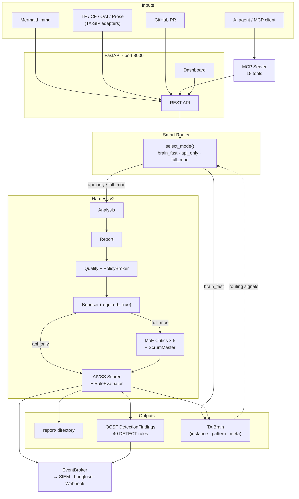

# ThreatAssessor

Upload a Mermaid (`.mmd`) architecture diagram and receive a MITRE ATT&CK-mapped threat model, SOC detection signals, and optional MoE expert review — in under two minutes.

## What you get

- **Threat model** — MITRE ATT&CK techniques mapped per node and hop; deterministic, no LLM required
- **SOC signals** — 40 DETECT rules evaluated per run; OCSF DetectionFinding 2004 events emitted to SIEM / Langfuse / webhook
- **Expert review** — 5-critic MoE panel (Architect / Tester / Red Team / Purple Team / Blackhat) + ScrumMaster synthesis, on demand
- **TA Brain** — self-growing knowledge graph that predicts findings for known topology patterns and drives smart routing

## Architecture


```mermaid
flowchart TD
    subgraph Inputs
        mmd_in["Mermaid .mmd"]
        sip_in["TF / CF / OAI / Prose\n(TA-SIP adapters)"]
        pr_in["GitHub PR"]
        ai_in["AI agent / MCP client"]
    end

    subgraph Service["FastAPI  ·  port 8000"]
        rest_api["REST API"]
        dash_ui["Dashboard"]
    end

    mcp_srv["MCP Server\n18 tools"]

    subgraph Router["Smart Router"]
        sr["select_mode()\nbrain_fast · api_only · full_moe"]
    end

    subgraph Harness["Harness v2"]
        an_s["Analysis"]
        rp_s["Report"]
        ql_s["Quality + PolicyBroker"]
        bo_s["Bouncer  (required=True)"]
        cr_s["MoE Critics × 5\n+ ScrumMaster"]
        av_s["AIVSS Scorer\n+ RuleEvaluator"]
    end

    eb["EventBroker\n→ SIEM · Langfuse · Webhook"]

    subgraph Outputs
        rep_o["report/ directory"]
        ocsf_o["OCSF DetectionFindings\n40 DETECT rules"]
        brn_o["TA Brain\n(instance · pattern · meta)"]
    end

    mmd_in --> rest_api
    sip_in --> rest_api
    pr_in --> rest_api
    ai_in --> mcp_srv
    mcp_srv --> rest_api
    dash_ui --> rest_api

    rest_api --> sr
    brn_o -.->|routing signals| sr

    sr -->|brain_fast| brn_o
    sr -->|api_only / full_moe| an_s

    an_s --> rp_s
    rp_s --> ql_s
    ql_s --> bo_s
    bo_s -->|api_only| av_s
    bo_s -->|full_moe| cr_s
    cr_s --> av_s

    av_s --> rep_o
    av_s --> ocsf_o
    av_s --> brn_o
    av_s --> eb
    ocsf_o --> eb
```

Three pipeline modes: **brain_fast** serves predictions from the TA Brain for known topology patterns (~50ms); **api_only** runs the deterministic analysis pipeline; **full_moe** adds the 5-critic expert panel. The Smart Router selects the mode automatically based on Brain confidence and AIVSS history.

## Quick start

### Prerequisites

- Python 3.10+
- Two data files in `chatbot/data/` (not in the repo):

| File | Source | Size |
|---|---|---|
| `enterprise-attack.json` | [MITRE CTI releases](https://github.com/mitre/cti/tree/master/enterprise-attack) | ~44 MB |
| `technique_embeddings.npz` | Pre-computed — run `/build-embeddings-cache` after placing the JSON above | ~3 MB |

### Install and run

```bash
python3 -m venv .venv && source .venv/bin/activate
pip install -r requirements.txt
cp .env.example .env          # set API_KEY; add OPENROUTER_API_KEY for MoE review
make start                    # http://localhost:8000/dashboard
```

### Try it

33 sample `.mmd` diagrams in `tests/data/architectures/` cover cloud-native, zero-trust, IoT, agentic AI, data pipeline, multi-region, and microservices patterns.

```bash
curl -X POST http://localhost:8000/api/v1/analyze \
  -H "TM-API-KEY: your-key" \
  -F "architecture_file=@tests/data/architectures/00_serviceentry.mmd"
```

Deterministic analysis runs without an LLM key. Add `OPENROUTER_API_KEY` for MoE Expert Review.

## MCP server

Exposes ThreatAssessor as 18 tools to Claude Desktop and any MCP-compatible agent. REST API must be running first.

**Claude Desktop config** (`claude_desktop_config.json`):

```json
{
  "mcpServers": {
    "threatassessor": {
      "command": "python",
      "args": ["-m", "mcp_server.server"],
      "env": {
        "TM_API_BASE_URL": "http://localhost:8000",
        "TM_API_KEY": "your-key-here"
      }
    }
  }
}
```

Key tools:

| Tool | What it does |
|---|---|
| `analyze_architecture` | Submit `.mmd` → full threat model (~30s) |
| `governance_check` | Fast MMD governance scan (~50ms, no LLM) |
| `run_expert_review` | Queue FULL_MOE review, returns `job_id` |
| `get_detect_trends` | DETECT rule firing trends per architecture |
| `query_ta_brain` | Predict findings from corpus patterns |
| `export_assessment` | Full TA bundle (`ta-export/1.0`, OTM-compatible) |

Full tool list and per-client integration snippets: [`mcp_server/README.md`](mcp_server/README.md).

## Configuration

All variables documented in `.env.example`. Minimum required:

| Variable | Description |
|---|---|
| `API_KEY` | REST API auth (`openssl rand -hex 32`) |
| `LLM_PROVIDER` | `openrouter` \| `bedrock` \| `anthropic` \| `azure` |
| `OPENROUTER_API_KEY` | `sk-or-v1-...` — free tier at openrouter.ai |

Optional per-agent model overrides via `AGENT_MODEL_*`. Validate routing:

```bash
python3 .claude/skills/check-model-routing/scripts/check-model-routing.py
```

## Security notes

**API auth** — all endpoints require `TM-API-KEY` except `/health`. Generate: `openssl rand -hex 32`.

**MCP transport** — stdio (default) has no network exposure. Network transport (`--transport sse` / `--transport streamable-http`) requires `TM_MCP_KEY`.

**Governance gate** — `BouncerStage` (`required=True`) halts the pipeline on `CRITICAL` signals before any LLM token is spent. 40 DETECT rules emit OCSF events for SOC consumption.

## Go deeper

- [`CLAUDE.md`](CLAUDE.md) — full module map, harness concepts, all check commands
- [`mcp_server/README.md`](mcp_server/README.md) — all 18 tools, 4-step test protocol, client integration snippets
- [`policies/soc_detection_rules.yaml`](policies/soc_detection_rules.yaml) — 40 DETECT rules with OWASP/ATLAS/incident provenance
- [`docs/DECISIONS.md`](docs/DECISIONS.md) — architectural decision log (local only, gitignored)

## Build story

28 parts on Medium — from diagram to detection layer, with every design decision exposed:

| # | Title | What it covers |
|---|---|---|
| 1 | [From Diagram to Threat Model Report in Minutes](https://medium.com/@breadtan/from-diagram-to-threat-model-report-in-minutes-building-an-ai-assisted-threat-model-assessor-b730d9f91459) | MITRE ATT&CK + ATLAS + ARC + Singapore SSP — four sources, one diagram, under two minutes |
| 2 | [Cloud Threat Modelling: CSP-Aware, Risk-First — CAVEAT + CCM + SSP](https://medium.com/@breadtan/cloud-threat-modelling-csp-aware-risk-first-caveat-ccm-ssp-c367ac96d6cf) | How cloud-specific attack patterns layer onto the RAPIDS baseline; SSRM, IAM inference, GenAI profiles |
| 3 | [When Good Enough Is Not Enough: Teaching a Threat Assessor to See What It Couldn't](https://medium.com/@breadtan/when-good-enough-is-not-enough-teaching-a-threat-assessor-to-see-what-it-couldnt-0e027d6578fe) | MoE critics, self-validation, and closing the gaps a deterministic engine misses |
| 4 | [StoryCaster: Read the Human Stories Hidden in Your Architecture](https://medium.com/@breadtan/storycaster-read-the-human-stories-hidden-in-your-architecture-4fed8dfdcf05) | User journey co-generation — corroborated vs post-compromise paths, APT attribution, KEV CVEs |
| 5 | [When the Critics Disagree: ScrumMaster and the Art of Security Harmony](https://medium.com/@breadtan/when-the-critics-disagree-scrummaster-and-the-art-of-security-harmony-6cfacb7eb05e) | ScrumMaster synthesis, harmony checking, performance telemetry across the full critic pipeline |
| 6 | [The Conductor's Job: How a Lightweight Harness Keeps Your AI Pipeline Together](https://medium.com/@breadtan/the-conductors-job-how-a-lightweight-harness-keeps-your-ai-pipeline-together-9667f5712d9f) | Harness architecture — scenario registry, stage isolation, model guardian, and governance gate |
| 7 | [Threat Modeling Is the Art of Storytelling a Graph](https://medium.com/@breadtan/threat-modeling-is-the-art-of-storytelling-a-graph-719d0ef5a536) | Practitioner reflection — what good, bad, and ugly TM look like; what AI changes and what it doesn't |
| 8 | [You Can't Improve What You Don't Measure: A Practical Rubric for Threat Model Quality](https://medium.com/@breadtan/you-cant-improve-what-you-don-t-measure-a-practical-rubric-for-threat-model-quality-354f6f5856a2) | TATB four-rubric scorecard — Threat-Relevant, TTP-Accurate, Risk-Defensible, Plan-Actionable; the deterministic feedback loop |
| 9 | [The Flywheel Nobody Talks About: How a Benchmark Teaches Itself](https://medium.com/@breadtan/the-flywheel-nobody-talks-about-how-a-benchmark-teaches-itself-75e2dd955807) | Nova Pro independent labeller, labelled-corpus regression, recall 22% to 62% across 10 tuning rounds |
| 10 | [When the Benchmark Finds Its Own Blind Spots](https://medium.com/@breadtan/when-the-benchmark-finds-its-own-blind-spots-0d6461a5406b) | 26-arch corpus gauntlet — engine gaps, T1083/T1018 mitigation holes, and what a truthful TTP-Accurate score really means |
| 11 | [The Honest Harness: Learning, Unlearning, Relearning](https://medium.com/@breadtan/the-honest-harness-learning-unlearning-relearning-ffeec3e0166f) | Skill machine, UNSURE triage, AIVSS governing the critics, EventBroker audit trail, and the staged autonomy arc |
| 12 | [The Graph That Ate Its Own Architecture](https://medium.com/@breadtan/the-graph-that-ate-its-own-architecture-0186760253fe) | Replacing RAG with a 50ms deterministic graph; why frequency isn't criticality; canonicalisation as a query-time-only transform |
| 13 | [The Instrumentation We Forgot to Talk About](https://medium.com/@breadtan/the-instrumentation-we-forgot-to-talk-about-cd44c4a7a893) | EventBroker + 48 unit tests; the test suite as specification; sink isolation; why the instrumentation TA recommends for others is the same instrumentation TA runs on itself |
| 14 | [Beneath the Iceberg: The AI Pipeline Signals You Have But Aren't Reading](https://medium.com/@breadtan/beneath-the-iceberg-the-ai-pipeline-signals-you-have-but-arent-reading-e23abf9247f4) | 18 DETECT rules (now 30); the detect-loop flywheel; OWASP AST10 pipeline coverage; SOC KG provenance graph |
| 15 | [19 in a Day. Frequency Isn't the Signal.](https://medium.com/@breadtan/19-in-a-day-frequency-isnt-the-signal-ce2b3e459124) | DETECT-INJ-005 added same day Part 14 published; rule firing trend infrastructure; SOC KG trend badges |
| 16 | [Two Handymen and the Face: How ThreatAssessor Grew Ways to Be Used](https://medium.com/@breadtan/two-handymen-and-the-face-how-threatassessor-grew-ways-to-be-used-f6a80bb75064) | Skills as internal operator (41 skills); MCP as external interface (13 tools); adversarial sim live fire; governance_check 50ms gate |
| 17 | [The Architecture That Told You First: Four Signals from the AISI Incident](https://medium.com/@breadtan/architecture-that-told-you-first-four-signals-from-the-aisi-incident-727bfb75960c) | AISI INC-2026-07-28 breakdown; DETECT-EXF-006–028 grounded in real incident; governance_check two-severity split |
| 18 | [Skills That Built the Builder: How Developer Automation Grew Alongside ThreatAssessor](https://medium.com/@breadtan/skills-that-built-the-builder-how-developer-automation-grew-alongside-threatassessor-cc23897eee82) | 44-skill developer automation layer — regression suites, feedback flywheels, data portability, operational skills |
| 19 | [Always Verify, Never Trust — Even Yourself: ThreatAssessor's Self-Assessment](https://medium.com/@breadtan/always-verify-never-trust-even-yourself-threatassessors-self-assessment-47aea99e229b) | Running /harden-audit on TA itself — 1 Critical confirmed, 7 findings fixed, 2 new DETECT rules grounded in own findings |
| 20 | [The Wrong Ruler](https://medium.com/@breadtan/the-wrong-ruler-9b73117dbbbf) | Self-growing loop closed (Stage 8); brain-infer reveals 94% precision vs 0.09 calibration — the metric was measuring the wrong thing; 0.09→0.80 after fix |
| 21 | [Capability Is Attack Surface](https://medium.com/@breadtan/capability-is-attack-surface-57476a1f8ae2) | Every new capability introduces new surface — 3 findings all in same-session code; fix becomes detection rule (DETECT-SCT-003); 31 rules, 6 Critical |
| 22 | [Two Maps in the Jungle](https://medium.com/@breadtan/two-maps-in-the-jungle-6a26e2c24f20) | Divergence % between Brain predictions and live analysis as a novelty signal; teal = Workspace-only; what to do when the maps disagree |
| 23 | [The Leaderboard Lied](https://medium.com/@breadtan/the-leaderboard-lied-256ce70a7a1b) | 7-model benchmark campaign — pipeline bugs masquerading as model failures, cross-architecture variance, and why production model selection is a routing problem not a ranking contest |
| 24 | [What 9,000 Agent Malice Taught My Threat Detector](https://medium.com/@breadtan/what-9-000-agent-malice-taught-my-threat-detector-88e7f6d782b1) | StepShield replay against 36 DETECT rules — false positive on every clean session, two uncovered threat classes, and a new detection category: behavioural honesty monitoring |
| 25 | [The Brain Grew Up](https://medium.com/@breadtan/the-brain-grew-up-4e929965e533) | Confidence-weighted distiller (Engine Item 5), JSONL dedup fix, 57% complexity floor, and how closing the feedback loop turns a pattern store into an inference layer |
| 26 | [When Agents Go Wild: Six Stages, Four Signals](https://medium.com/@breadtan/when-agents-go-wild-six-stages-four-signals-70589e8031e4) | Four Anthropic alignment incidents mapped to a six-stage kill chain; three were blockable at architecture review time before the first tool call; EXF-007 and structural authorization gates |
| 27 | [Smart Routing Is Just Measurement in Disguise](https://medium.com/@breadtan/smart-routing-is-just-measurement-in-disguise-19d12e1673af) | 13-arch delta distribution drives mode selection (brain_fast / api_only / full_moe); topology fingerprint collision as the case against configuration; TAclaw routes without history by design |
| 28 | [Every Agent Is an Attack Surface — Including Your Pipeline](https://medium.com/@breadtan/every-agent-is-an-attack-surface-including-your-pipeline-4dd17c23054d) | DTap 5-vector taxonomy gap analysis; routing mode as a trust signal; pre-flight authority gate; taint propagation through the export bundle; the endogenous injection case |
