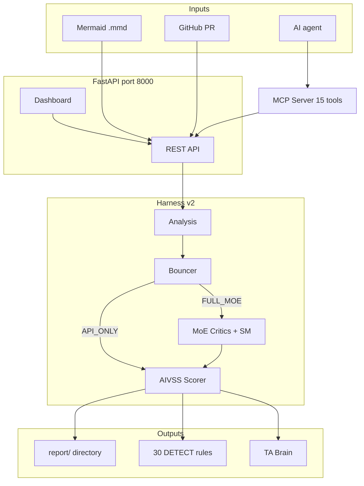

# ThreatAssessor

Upload a Mermaid (`.mmd`) architecture diagram and receive a MITRE ATT&CK-mapped threat model, SOC detection signals, and optional MoE expert review — in under two minutes.

## System overview


```mermaid
flowchart TD
    subgraph Inputs
        mmd_in["Mermaid .mmd"]
        pr_in["GitHub PR"]
        ai_in["AI agent"]
    end

    subgraph Service["FastAPI  port 8000"]
        rest_api["REST API"]
        dash_ui["Dashboard"]
    end

    mcp_srv["MCP Server  15 tools"]

    subgraph Harness["Harness v2"]
        an_s["Analysis"]
        bo_s["Bouncer"]
        cr_s["MoE Critics + SM"]
        av_s["AIVSS Scorer"]
    end

    subgraph Outputs
        rep_o["report/ directory"]
        det_o["30 DETECT rules"]
        brn_o["TA Brain"]
    end

    mmd_in --> rest_api
    pr_in --> rest_api
    ai_in --> mcp_srv
    mcp_srv --> rest_api

    rest_api --> an_s
    dash_ui --> rest_api

    an_s --> bo_s
    bo_s -->|"API_ONLY"| av_s
    bo_s -->|"FULL_MOE"| cr_s
    cr_s --> av_s

    av_s --> rep_o
    av_s --> det_o
    av_s --> brn_o
```

| Component | Responsibility | Location |
|---|---|---|
| **FastAPI service** | REST API, web dashboard, SSE streaming | `chatbot/api/` |
| **Harness v2** | Pipeline controller: stages, circuit breaker, event broker | `chatbot/harness/` |
| **Analysis engine** | Deterministic threat mapping — RAPIDS + MITRE ATT&CK embeddings | `chatbot/modules/ground_truth_generator.py` |
| **MoE critics** | 5-critic panel (Architect / Tester / Red Team / Purple Team / Blackhat) + ScrumMaster | `chatbot/modules/agents/critics/` |
| **SOC detection layer** | 30 DETECT rules → OCSF DetectionFinding 2004 events per run | `policies/soc_detection_rules.yaml` |
| **TA Brain** | Persistent knowledge graph distilled from corpus; TACO query and feedback loop | `chatbot/modules/ta_brain_*.py` |
| **AIVSS v4** | Three-flow safety scoring: inbound / internal / outbound | `chatbot/harness/stages.py` |
| **MCP server** | 15 tools exposing TA capabilities to Claude Desktop and external agents | `mcp_server/` |
| **GitHub Actions CI** | PR reviewer — governance check + full analysis on every `.mmd` change | `.github/workflows/ta-review.yml` |

## How a request flows

A `.mmd` file submitted to `POST /api/v1/analyze` passes through Harness v2 in order:

1. **AnalysisStage** — parses the diagram, runs RAPIDS pattern matching, maps MITRE ATT&CK techniques per node and hop, computes a confidence band, writes `ground_truth.json` and 16 report files to `report/<arch-name>/`.
2. **ReportStage** — generates the executive summary, technical report, action plan, improvement summary, ADR, and TATB scores.
3. **QualityStage** — evaluates governance signals (injection, evasion, PII leakage, sovereignty). Runs `PolicyBroker` to adjust per-agent model routing.
4. **BouncerStage** (`required=True`) — halts the pipeline if `exploitation.blocked` is set, a kill-switch is active, or outbound signals indicate compromise. Raises `BlockedPipelineError` → API returns 400.
5. **CriticStage × 5** (FULL_MOE only) — runs in `partial_parallel` mode by default; each critic receives user-journey context relevant to its rubric.
6. **ScrumMasterStage** (FULL_MOE only) — synthesises critic findings into sprint-ready impediments and an 8-week action plan.
7. **AIVSSStage** — produces inbound / internal / outbound safety scores and appends to `governance_signals_history.jsonl`.
8. **RuleEvaluator** — evaluates all 30 DETECT rules against the governance signals and emits OCSF DetectionFinding events.

For `POST /api/v1/analyze-stream`, the same pipeline runs with SSE progress events for the dashboard.

## Running it locally

### Prerequisites

- Python 3.10+
- Two data files in `chatbot/data/` (not in the repo):

| File | Source | Size |
|---|---|---|
| `enterprise-attack.json` | [MITRE CTI releases](https://github.com/mitre/cti/tree/master/enterprise-attack) | ~44 MB |
| `technique_embeddings.npz` | Pre-computed — run `/build-embeddings-cache` after placing the JSON above | ~3 MB |

### Install and start

```bash
# Create virtual environment and install dependencies
python3 -m venv .venv && source .venv/bin/activate
pip install -r requirements.txt

# Configure environment
cp .env.example .env
# Edit .env — at minimum set API_KEY and one LLM provider key:
#   OPENROUTER_API_KEY=sk-or-v1-...   (recommended — free tier at openrouter.ai)

# Start the API server
make start        # wraps ./scripts/api/api_start.sh
```

Then open **http://localhost:8000/dashboard**.

| URL | What |
|---|---|
| `http://localhost:8000/dashboard` | Web dashboard |
| `http://localhost:8000/docs` | Swagger API docs |
| `http://localhost:8000/health` | Health check |

```bash
make stop         # stop server
make restart      # restart
make logs         # tail logs/api.log
make test         # run test suite
```

### Try it

33 sample `.mmd` diagrams in `tests/data/architectures/` cover cloud-native, zero-trust, IoT, agentic AI, data pipeline, multi-region, and microservices patterns. Drag any into the dashboard's **Upload** tab, or run:

```bash
curl -X POST http://localhost:8000/api/v1/analyze \
  -H "TM-API-KEY: your-key" \
  -F "architecture_file=@tests/data/architectures/00_serviceentry.mmd"
```

No LLM key is required for deterministic-only analysis. Add `OPENROUTER_API_KEY` to run MoE Expert Review.

## MCP server

The MCP server exposes ThreatAssessor as 15 tools to Claude Desktop and any MCP-compatible agent. The REST API must be running first.

**Claude Desktop config** (`claude_desktop_config.json`):

```json
{
  "mcpServers": {
    "threatassessor": {
      "command": "python",
      "args": ["-m", "mcp_server.server"],
      "env": {
        "TM_API_BASE_URL": "http://localhost:8000",
        "TM_API_KEY": "your-key-here"
      }
    }
  }
}
```

For network transport (SSE / streamable-HTTP), start with `--transport sse --port 8001` and set `TM_MCP_KEY`.

| Tool | What it does |
|---|---|
| `analyze_architecture` | Submit `.mmd` → full threat model (~30s) |
| `run_expert_review` | Queue FULL_MOE, returns `job_id` |
| `get_job_status` | Poll job; `wait_for_completion=True` blocks until done |
| `get_threat_briefing` | CISO-ready briefing (md or json) |
| `get_ciso_brief` | Full CISO brief with investment tiers |
| `get_governance_signals` | AIVSS composite + signal dimensions |
| `get_detect_trends` | DETECT rule firing trends per architecture |
| `get_tatb_scores` | TATB benchmark scores (corpus or single arch) |
| `list_architectures` | All analysed architectures + metadata |
| `lookup_mitre_technique` | Technique details + mitigations by ATT&CK ID |
| `get_mcp_access_signals` | Live session access patterns (feeds DETECT-020–022) |
| `export_assessment` | TA bundle (`ta-export/1.0`, OTM-compatible) |
| `governance_check` | Fast MMD governance scan (~50ms, no LLM) |
| `query_ta_brain` | Query Brain patterns: infer / gaps / list |
| `record_brain_feedback` | Mark a Brain prediction confirmed / wrong / partial |

## Configuration

All variables documented in `.env.example`. Minimum required:

| Variable | Description |
|---|---|
| `API_KEY` | REST API auth (`openssl rand -hex 32`) |
| `LLM_PROVIDER` | `openrouter` \| `bedrock` \| `anthropic` \| `azure` |
| `OPENROUTER_API_KEY` | `sk-or-v1-...` — free tier at openrouter.ai |

Optional per-agent model overrides via `AGENT_MODEL_*` (Architect, Tester, Red Team, Purple Team, Blackhat, ScrumMaster, MOE). Validate routing without API calls:

```bash
python3 .claude/skills/check-model-routing/scripts/check-model-routing.py
```

## Security notes

**API authentication** — all endpoints require a `TM-API-KEY` header except `/health`. Generate with `openssl rand -hex 32`; set as `API_KEY` in `.env`.

**MCP transport** — stdio transport (default) has no network exposure. Network transport (`--transport sse` / `--transport streamable-http`) requires `TM_MCP_KEY`; the server refuses to start without it.

**Governance gate** — `BouncerStage` (`required=True`) halts the pipeline on `CRITICAL` exploitation signals before any critic or output stage runs. The 30 DETECT rules emit OCSF events for SOC consumption.

## Design decisions

**Deterministic first.** The analysis engine runs without any LLM call — RAPIDS pattern matching and MITRE ATT&CK embeddings produce the threat model. MoE critics run only on explicit `FULL_MOE` requests.

**BouncerStage as required.** Sits between QualityStage and the critics. A blocked pipeline raises `BlockedPipelineError` and returns HTTP 400 before any LLM token is spent.

**TA Brain is LLM-free.** All 7 completed stages (ingest, distil, cache, confidence decay, gap weighting, calibration, TACO processor) derive values from formulas and hashes. The topology signature is a pure SHA-256 of node shapes and edge patterns — collision-resistant across the 33-architecture corpus.

**Event bus between stages.** Each stage emits `HarnessEvent` objects to `EventBrokerCritic`, which fans out to SIEM, Langfuse, and webhook sinks. Stages have no knowledge of their consumers.

## Repo layout

```
DEV-TEST/
├── chatbot/
│   ├── api/                FastAPI app, routes, static dashboard (index.html + JS)
│   ├── harness/            Harness v2: controller, stages, governance, rule evaluator
│   ├── modules/            Analysis engine, MoE critics, TA Brain (ta_brain_*.py)
│   ├── config/             Settings loader, user_config.json, agent model config
│   └── services.py         ThreatAnalysisService — single callable surface
├── mcp_server/             MCP server: 15 tools, job client, access logger, sim personas
├── policies/               soc_detection_rules.yaml (30 rules), agent_governance.yaml
├── tests/
│   ├── data/architectures/ 33 sample .mmd files
│   └── unit/               Unit tests (213 for TA Brain alone)
├── scripts/
│   ├── api/                api_start.sh  api_stop.sh  api_status.sh  api_restart.sh
│   └── ci/                 ta_pr_review.py (GitHub Actions PR reviewer)
├── .github/workflows/      ta-review.yml — triggers on *.mmd PR changes
├── .env.example            All environment variable names with defaults
├── Makefile                Developer shortcuts: install / setup / start / stop / test
└── requirements.txt        Python dependencies
```
