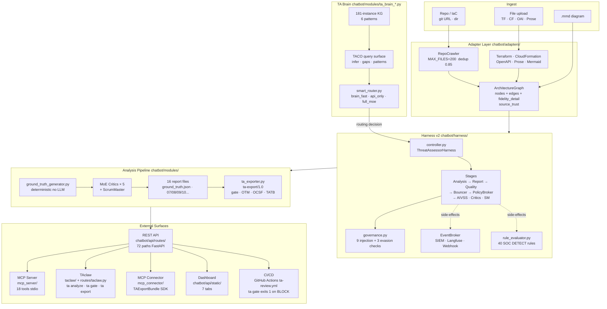

# ARCHITECTURE

**Version:** 1.0  
**Date:** 2026-09-20  
**Status:** Active — reflects Harness v2 + TA-SIP + TA Brain + Engine Items 1–10

---

## Purpose

ThreatAssessor turns an architecture diagram (or a whole repository) into an actionable threat model. It parses structure, maps MITRE ATT&CK techniques, applies five expert-review critics, scores the output against four quality rubrics, fires 40 SOC detection rules, and exports a signed assessment bundle — all through a single REST call, an MCP tool, or a CLI command.

The system is designed around one invariant: **every analysis path converges on the same Harness gate before any result leaves the system**. The path may be fast (brain pattern match) or full (multi-model MoE critics), but the governance check, AIVSS scoring, and ta-export bundle are non-negotiable steps on all paths.

---

## Layer Overview

| Layer | Package / Dir | Role |
|---|---|---|
| **Input** | `.mmd` files, git URLs, uploaded TF/CF/OAI/Prose | Raw material |
| **Adapters** | `chatbot/adapters/` | Format → `ArchitectureGraph` (nodes, edges, fidelity_detail) |
| **TA Brain** | `chatbot/modules/ta_brain_*.py` | 181-instance KG; TACO query; routing signals |
| **Smart Router** | `chatbot/harness/smart_router.py` | `select_mode()` → brain_fast / api_only / full_moe |
| **Analysis Pipeline** | `chatbot/modules/ground_truth_generator.py` + `moe_orchestrator` | Deterministic threat mapping + LLM expert review → 16 report files |
| **Harness v2** | `chatbot/harness/` | Stage sequencing, governance gate, 40 DETECT rules, EventBroker |
| **Export** | `chatbot/modules/ta_exporter.py`, `chatbot/schemas/ta_export_v1.json` | `ta-export/1.0` bundle (gate + OTM + OCSF + TATB + provenance) |
| **REST API** | `chatbot/api/routes/` | FastAPI surface: SSE streams, async job layer, admin (72 paths) |
| **MCP Server** | `mcp_server/` | 18 tools via stdio — for Claude Desktop and coding agents |
| **TAclaw** | `taclaw/`, `chatbot/api/routes/taclaw.py` | Autonomous repo assessment: crawl → adapt → merge → harness → export |
| **MCP Connector** | `mcp_connector/` | Typed SDK (`TAExportBundle`, `enrich_finding()`) for downstream integrations |
| **Dashboard** | `chatbot/api/static/` | 7-tab browser UI |
| **Policies** | `policies/` | Runtime governance config: DETECT rules, agent governance, model routing |

---

## System Diagram

---

## Three Execution Paths

All three paths share the same Harness gate (Bouncer) and ta-export output. See [HARNESS.md](HARNESS.md) for the full stage sequence per path.

| Path | Trigger | LLM calls | When |
|---|---|---|---|
| `brain_fast` | `select_mode()` → brain match, D5 ≥ 0.85 | 0 | Arch previously boxed; delta ≥ −0.15; high recall |
| `api_only` | Default when no brain match | 1 (Analysis) | New arch or below D5 gate |
| `full_moe` | AIVSS ≥ 7.0 or agentic arch | 6+ (Analysis + 5 critics + SM) | High-risk or first-run agentic |

**brain_fast path note:** `_brain_fast_stream()` in `streaming.py` calls `query_brain(infer)` and bypasses the harness entirely. The SSE complete payload carries `brain_quality` (Brier scores). TATB MoE sub-metrics fall back to neutral 50%. A `brier_combined ≥ 0.3` should trigger a full pipeline re-run.

---

## Key Design Invariants

These hold across all execution paths and all callers (REST, MCP, TAclaw, CLI):

1. **Adapters always produce `ArchitectureGraph`** — every input format normalises to the same node/edge/fidelity structure before anything downstream runs.

2. **Harness always gates** — `BouncerStage` (`required=True`) raises `BlockedPipelineError` on kill-switch or exploitation block before any LLM stage runs. No result exits the gate without passing all 5 Bouncer checks.

3. **`ta-export/1.0` is the canonical output** — the standardised bundle (`ta_export.json`) is the authoritative result for all callers. MCP tools, TAclaw, and CI gates all read from this schema.

4. **Smart routing decides before harness runs** — `select_mode(arch_name)` is called once, before the harness counter loop. The routing decision is stamped to the result; callers can inspect `routing_mode` in the export.

5. **Governance signals flow through** — `GovernanceSignals` are computed from the analysis output and stamped to `ta_export.json.provenance`. Every DETECT rule fires against this substrate, not re-computed on read.

6. **Policies are the runtime control plane** — no routing logic or governance threshold is hardcoded. `policies/model_routing.yaml`, `policies/agent_governance.yaml`, and `policies/soc_detection_rules.yaml` are the single source of truth for all runtime decisions.

---

## Component Relationships

For detailed data-flow diagrams, see the codemap graphs committed at `.claude/graphs/`:

| Graph | What it shows |
|---|---|
| `master.mmd` | Cross-domain system map (6 domains + test counts) |
| `pipeline.mmd` | `ground_truth_generator` → MoE critics → 16 report files |
| `harness.mmd` | Stage sequence + governance + EventBroker + sinks |
| `dashboard-tabs.mmd` | JS function ↔ API route ↔ Python module mapping |
| `workspace+brain.mmd` | TACO / Brain / Workspace sub-system |

**Note:** codemap graphs were last generated 2026-07-18. Re-run `/codemap` to refresh after significant structural changes.

---

## Related Design Docs

| Doc | Focus |
|---|---|
| [HARNESS.md](HARNESS.md) | Harness v2 stage order, routing paths, Engine Items 6–10, planned 11–16 |
| [TATB.md](TATB.md) | TATB benchmark rubric — four scoring dimensions + brain_fast coverage notes |
| [TACLAW.md](TACLAW.md) | TAclaw hardening plan — export completeness, smart routing, agent passport, test suite MVP |
| [DECISIONS.md](DECISIONS.md) | Architectural decision log — read at session start |
