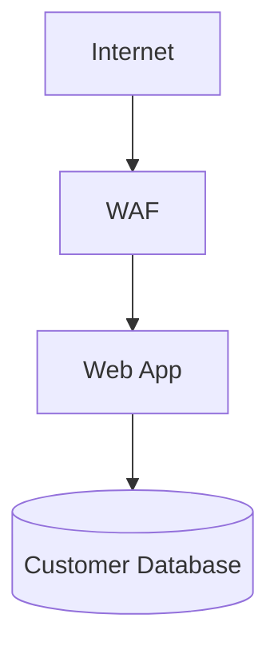

# Architecture Analysis

This project now includes a deterministic Mermaid architecture-analysis layer for threat modeling.

## What It Does

Given valid Mermaid flowchart syntax, the analyzer will:

- identify assets, entry points, trust boundaries, and data flows
- derive likely attack paths across the diagram structure
- use RAG context as supplemental risk evidence
- map findings to STRIDE and MITRE ATT&CK
- flag modeling gaps through a lightweight PASTA-style review
- return structured output that references concrete diagram nodes and edges

## Main Entry Points

- `chatbot/parsers/mermaid_parser.py`
  - `extract_rag_and_mermaid(raw_input)`
  - `parse_mermaid(mermaid_text)`
- `chatbot/analysis/architecture_analyzer.py`
  - `analyze_architecture_security(mermaid_text, rag_documents=None, scenario_text="", existing_threat_model=None)`
  - `analyze_combined_architecture_input(raw_input, existing_threat_model=None)`
- `chatbot/modules/agent.py`
  - `AgentManager.handle_architecture_assessment(...)`
  - `AgentManager.handle_combined_architecture_input(...)`

## Expected Input Shape

You can provide either:

1. Mermaid only



2. RAG text followed by Mermaid

```text
Risk notes:
- Shared credentials exist between app and database.
- Logging is inconsistent on the admin path.

graph TD
    U[Internet] --> W[WAF]
    W --> A[Web App]
    A --> D[(Customer Database)]
```

## Output Shape

The analyzer returns a dictionary with:

- `assets`
- `entry_points`
- `trust_boundaries`
- `data_flows`
- `attack_paths`
- `framework_validation`
- `threat_model_gaps`

Each `attack_paths[]` item includes:

- `path_nodes`
- `path_edges`
- `mitre_attack`
- `stride`
- `mitigations`
- likelihood / impact / priority

## Notes

- The current implementation is deterministic and heuristic-driven.
- It does not require live LLM or embedding calls.
- It is designed to be composable with the existing semantic MITRE pipeline later.
