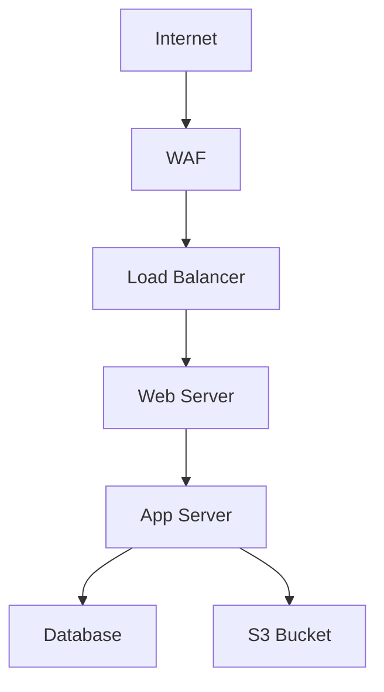

# MVP Specification: LLM-Enhanced MITRE Attack Path Analyzer

**Version:** 0.1.0  
**Date:** 2026-04-26  
**Status:** Draft - Pending Approval

---

## Vision Statement

A web-based application that accepts risk assessment reports (text) and architecture diagrams (Mermaid), then uses LLM-enhanced semantic search to:
1. Map threats to MITRE ATT&CK techniques
2. Visualize potential attack paths
3. Surface relevant MITRE coverage on an interactive map
4. Provide contextual mitigation advice

---

## Input Specifications

### Input Format 1: Risk Assessment Text
**Description:** Natural language description of threats, vulnerabilities, or security scenarios

**Examples:**
- Security audit reports
- Threat intelligence briefings
- Incident response notes
- Vulnerability assessments

**Processing:**
1. Extract threat indicators via LLM
2. Generate embeddings
3. Match to MITRE techniques via semantic search

**Sample Input:**
```
An attacker gained initial access through a phishing email containing a malicious 
PowerShell script. The script established persistence via scheduled tasks and 
exfiltrated data to an external S3 bucket using AWS CLI tools.
```

### Input Format 2: Architecture Diagram (Mermaid)
**Description:** System architecture represented in Mermaid diagram code

**Purpose:**
- Provide context about system components
- Identify attack surface areas
- Map vulnerabilities to specific components

**Sample Input:**


**Processing:**
1. Parse Mermaid code to extract components and connections
2. Identify potential attack paths between components
3. Map techniques to relevant architecture layers

---

## Output Specifications

### Output 1: Visual Attack Path
**Description:** Interactive graph showing potential attack progression

**Requirements:**
- Nodes: MITRE techniques (with IDs)
- Edges: Logical progression / dependencies
- Color coding: By tactic (Initial Access, Execution, Persistence, etc.)
- Interactive: Click for details, expand/collapse chains

**Technology Options (TBD):**
- D3.js (flexible, custom visualizations)
- Cytoscape.js (graph-focused, good for attack paths)
- React Flow (modern, component-based)
- MITRE ATT&CK Navigator (official, but limited customization)

### Output 2: MITRE Coverage Map
**Description:** Heatmap showing which techniques are relevant to the scenario

**Requirements:**
- Matrix view (Tactics × Techniques)
- Highlighting: Matched techniques stand out
- Confidence scores: Show semantic similarity scores
- Drill-down: Click technique for details + mitigations

**Technology Options (TBD):**
- MITRE ATT&CK Navigator (embed or extend)
- Custom heatmap (D3.js, Plotly)

### Output 3: Analysis Report
**Description:** LLM-generated narrative explaining findings

**Sections:**
1. **Executive Summary** - Key findings in plain language
2. **Attack Path Analysis** - Step-by-step progression explanation
3. **Technique Breakdown** - Each matched technique with:
   - Why it was matched (relevance score)
   - How it applies to the scenario
   - Detection opportunities
4. **Mitigation Recommendations** - Prioritized defenses
5. **Architecture-Specific Advice** - If Mermaid diagram provided

**Format:** Markdown or HTML (for web display)

---

## Technical Architecture (MVP)

### Frontend
**Framework:** [TBD - Needs Decision]
- **Option A:** React + Vite (modern, component-based)
- **Option B:** Vue.js (simpler learning curve)
- **Option C:** Vanilla JS + Bootstrap (minimal dependencies)

**Key Libraries:**
- Mermaid.js (diagram rendering)
- Visualization library (see Output 1 options)
- Markdown renderer (for LLM output)

### Backend
**Framework:** [TBD - Needs Decision]
- **Option A:** FastAPI (async, modern, OpenAPI docs)
- **Option B:** Flask (simpler, more established)

**API Endpoints:**
```
POST /api/analyze
  Body: { "text": "...", "mermaid": "..." }
  Response: {
    "techniques": [...],
    "attack_paths": [...],
    "analysis": "...",
    "confidence_scores": {...}
  }

GET /api/technique/{technique_id}
  Response: { "details": "...", "mitigations": [...] }

POST /api/embeddings/cache/rebuild
  Response: { "status": "...", "progress": "..." }
```

### Data Flow
```
[Web UI] 
  ↓ (POST /api/analyze)
[FastAPI/Flask Backend]
  ↓
[Input Processor]
  ├→ Text Parser (LLM extraction)
  └→ Mermaid Parser (component extraction)
  ↓
[Embedding Generator] (OpenRouter API)
  ↓
[Semantic Search] (cosine similarity vs cached embeddings)
  ↓
[LLM Analyzer] (Gemma 4-26B)
  ├→ Attack path construction
  ├→ Confidence scoring
  └→ Mitigation recommendations
  ↓
[Response Formatter]
  ↓
[Web UI] (Visualizations + Report)
```

---

## Implementation Phases (Revised for MVP)

### Phase 1: Foundation ✅ COMPLETE
- LLM client (LiteLLM + OpenRouter)
- Embedding client (Nemotron)
- Rate limiting infrastructure

### Phase 2: Semantic Search Engine (Next)
**Goal:** Replace keyword search with embeddings

**Deliverables:**
- `chatbot/modules/mitre_embeddings.py` - Embedding cache + search
- `chatbot/modules/llm_mitre_analyzer.py` - LLM refinement
- Updated `agent.py` - Use semantic search
- CLI testing - Verify improved matching

**Success Criteria:**
- Embedding cache generated (~823 techniques)
- Semantic search returns relevant techniques (score >0.5)
- LLM explains why techniques match
- Still CLI-based (defer UI to Phase 3)

**Estimated Time:** 2-3 hours

### Phase 3: Web Backend (API Layer)
**Goal:** RESTful API for analysis requests

**Deliverables:**
- `chatbot/api/` - FastAPI/Flask backend
- `chatbot/api/routes.py` - /analyze endpoint
- `chatbot/api/models.py` - Request/response schemas
- `chatbot/parsers/mermaid_parser.py` - Extract components from Mermaid
- `chatbot/analysis/attack_path.py` - Construct attack chains

**Success Criteria:**
- POST /analyze accepts text + Mermaid
- Returns structured JSON (techniques + paths)
- Mermaid components mapped to attack surface
- API documented (OpenAPI/Swagger)

**Estimated Time:** 4-5 hours

### Phase 4: Web Frontend (Visualization)
**Goal:** Interactive UI with attack path + MITRE map

**Deliverables:**
- `frontend/` - React/Vue/Vanilla app
- Attack path visualization (graph)
- MITRE coverage heatmap
- Input forms (text + Mermaid editor)
- Analysis report display (Markdown render)

**Success Criteria:**
- Users can input text + Mermaid diagram
- Attack path renders as interactive graph
- MITRE map highlights matched techniques
- LLM analysis displays in readable format

**Estimated Time:** 6-8 hours

### Phase 5: Polish & Deployment
**Goal:** Production-ready MVP

**Deliverables:**
- Error handling (API failures, invalid input)
- Loading states (embedding generation takes time)
- Example scenarios (pre-filled for demo)
- Docker deployment setup
- Documentation (user guide, API reference)

**Estimated Time:** 3-4 hours

---

## Open Questions (Need Decisions)

### 1. Web Framework Choice
**Backend:**
- [ ] FastAPI (async, modern, OpenAPI auto-docs)
- [ ] Flask (simpler, more examples available)

**Frontend:**
- [ ] React + Vite (modern, component-based)
- [ ] Vue.js (simpler, good docs)
- [ ] Vanilla JS (minimal dependencies, faster to start)

**Your preference?** ___________

### 2. Visualization Library
**Attack Path Graph:**
- [ ] D3.js (flexible, steep learning curve)
- [ ] Cytoscape.js (graph-focused, easier for attack paths)
- [ ] React Flow (if using React, modern)

**MITRE Map:**
- [ ] MITRE ATT&CK Navigator (official, limited customization)
- [ ] Custom heatmap (D3.js/Plotly, full control)

**Your preference?** ___________

### 3. Mermaid Parsing Strategy
**Option A:** Parse to extract components only (nodes/edges)
**Option B:** Analyze relationships for attack path hints
**Option C:** Use LLM to interpret diagram meaning

**Your preference?** ___________

### 4. Deployment Target
- [ ] Local development only (MVP scope)
- [ ] Docker container (easy deployment)
- [ ] Cloud deployment (AWS/Azure/GCP)

**Your preference?** ___________

### 5. Authentication/Multi-user?
- [ ] Single-user (MVP scope)
- [ ] Multi-user with auth (future)

**Your preference?** ___________

---

## Success Metrics (MVP)

### Functional Requirements
- [ ] Accept text input (risk assessment)
- [ ] Accept Mermaid diagram input
- [ ] Return matched MITRE techniques (semantic search)
- [ ] Visualize attack path (graph)
- [ ] Display MITRE coverage map
- [ ] Show LLM analysis (narrative)

### Performance Requirements
- [ ] Initial analysis: < 10 seconds (cached embeddings)
- [ ] Attack path rendering: < 2 seconds
- [ ] Handle reports up to 5000 words
- [ ] Support diagrams up to 50 nodes

### Quality Requirements
- [ ] Technique matching accuracy: >80% relevant (manual validation)
- [ ] No crashes on invalid Mermaid syntax (graceful errors)
- [ ] LLM output coherent and actionable

---

## Out of Scope (Post-MVP)

- Chatbot conversational interface (future Phase 6)
- Multi-turn refinement ("tell me more about T1059")
- User accounts / saved analyses
- Integration with SIEM/ticketing systems
- Custom MITRE matrix (enterprise-specific)
- PDF report generation
- Real-time collaboration

---

## Next Steps

1. **Review this spec** - Validate vision aligns with your needs
2. **Answer open questions** - Framework/library choices
3. **Approve Phase 2 start** - Begin semantic search implementation
4. **Define Phase 3 API schema** - Before building backend
5. **Mockup UI wireframes** - Before Phase 4 (optional but helpful)

---

**Approval Required:**
- [ ] Vision statement approved
- [ ] Input/output specs approved
- [ ] Technical architecture approved
- [ ] Implementation phases approved
- [ ] Open questions answered

**Approved by:** ___________  
**Date:** ___________
