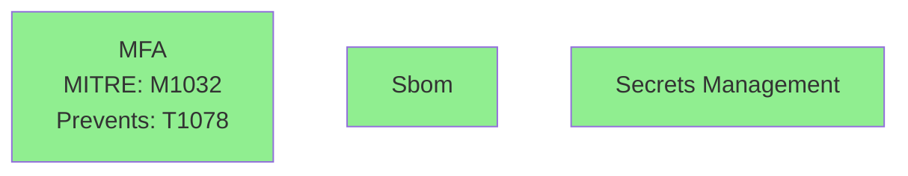
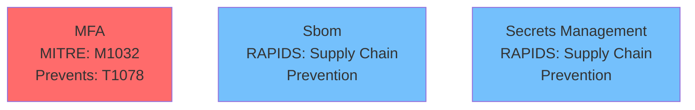

# Phase 3B++: Visual Prioritization & Framework Consistency

**Date:** 2026-05-17  
**Status:** ✅ Complete  
**Total Effort:** 2 hours  

---

## Overview

Phase 3B++ adds **visual prioritization** and **framework consistency** to control recommendations in `after.mmd` diagrams.

**Two enhancements:**
1. **Priority-based color coding** (red/yellow/blue/green)
2. **RAPIDS framework consistency** (show threat category + DIR action)

---

## Enhancement 1: Priority Color Coding

### Before
```mermaid
%% All 40+ controls in uniform green
style NEW_MFA fill:#90EE90,stroke:#006400
style NEW_BACKUP fill:#90EE90,stroke:#006400
style NEW_CDN fill:#90EE90,stroke:#006400
style NEW_SBOM fill:#90EE90,stroke:#006400
```

**Problem:** Cannot distinguish critical (MFA) from nice-to-have (SBOM)

### After
```mermaid
%% Priority-based colors with legend
%% 🔴 CRITICAL = Breaks primary attack paths (implement first)
%% 🟡 HIGH = Closes validation gaps (implement within 3 months)
%% 🔵 MEDIUM = Defense-in-depth (implement within 6 months)
%% 🟢 BASELINE = Security hygiene (ongoing program)

style NEW_MFA fill:#ff6b6b,stroke:#c92a2a           # RED - Critical
style NEW_BACKUP fill:#ffd43b,stroke:#fab005        # YELLOW - High
style NEW_CDN fill:#ffd43b,stroke:#fab005           # YELLOW - High
style NEW_SBOM fill:#74c0fc,stroke:#339af0          # BLUE - Medium
```

**Benefit:** At-a-glance prioritization - focus on 29 red controls first, defer 2 blue controls

**See:** [PRIORITY_COLOR_CODING.md](PRIORITY_COLOR_CODING.md)

---

## Enhancement 2: RAPIDS Framework Consistency

### Before
```mermaid
NEW_MFA["MFA<br/>MITRE: M1032<br/>Prevents: T1078"]        %% ✅ Has context
NEW_SBOM["Sbom"]                                            %% ❌ No context!
```

**Problem:** RAPIDS controls showed just name, no threat pattern or DIR action

### After
```mermaid
NEW_MFA["MFA<br/>MITRE: M1032<br/>Prevents: T1078"]                        %% MITRE
NEW_SBOM["Sbom<br/>RAPIDS: Supply Chain<br/>Prevention"]                   %% RAPIDS
NEW_USERTRAINING["User Training<br/>RAPIDS: Phishing, Ransomware<br/>Prevention"]
NEW_DDOSPROTECTION["DDoS Protection<br/>RAPIDS: Dos<br/>Prevention"]
```

**Benefit:** Consistent visual format, users immediately see threat pattern addressed

**See:** [RAPIDS_CONSISTENCY.md](RAPIDS_CONSISTENCY.md)

---

## Combined Visual Impact

### Example: 02_minimal_defended Architecture

**Before Phase 3B++:**


**After Phase 3B++:**


**User experience:**
1. **Color:** "Focus on 3 red controls first, then 9 yellow"
2. **Label:** "SBOM addresses supply chain via prevention"
3. **Priority:** "Red = 1-2 weeks, Blue = 3-6 months"

---

## Test Results Summary

### Architecture: 21_agentic_ai_system (AI)
- 🔴 29 critical controls
- 🟡 6 high controls
- 🔵 2 medium controls
- **Total:** 37 controls
- **RAPIDS controls:** User Training (Phishing/Ransomware)

### Architecture: 22_generic_name_with_ai_nodes (AI)
- 🔴 27 critical controls
- 🟡 10 high controls
- 🔵 2 medium controls
- **Total:** 39 controls
- **RAPIDS controls:** User Training, DDoS Protection

### Architecture: 02_minimal_defended (Traditional)
- 🔴 3 critical controls
- 🟡 9 high controls
- 🔵 5 medium controls
- **Total:** 17 controls
- **RAPIDS controls:** SBOM, Secrets Management, Container Scanning

---

## Control Type Examples

### MITRE ATT&CK Controls
```
MFA<br/>MITRE: M1032<br/>Prevents: T1078, T1213<br/>Paths: #1, #2
Rate Limiting<br/>MITRE: M1033<br/>Prevents: T1059<br/>Paths: #1, #2, #3
DLP<br/>MITRE: M1057<br/>Contains: T1005, T1567
```

**Pattern:** Framework (MITRE) → Mitigations (M####) → Techniques (T####) → Paths

---

### RAPIDS Supply Chain Controls
```
SBOM<br/>RAPIDS: Supply Chain<br/>Prevention
Secrets Management<br/>RAPIDS: Supply Chain<br/>Prevention
Container Scanning<br/>RAPIDS: Supply Chain<br/>Detect
```

**Pattern:** Framework (RAPIDS) → Threat Category → DIR Action

---

### RAPIDS Multi-Category Controls
```
User Training<br/>RAPIDS: Phishing, Ransomware<br/>Prevention
```

**Pattern:** Shows up to 2 RAPIDS categories

---

### RAPIDS DoS Controls
```
DDoS Protection<br/>RAPIDS: Dos<br/>Prevention
Load Balancer<br/>RAPIDS: Dos<br/>Prevention
```

**Pattern:** Single category, Prevention DIR

---

## Color Scheme Design

| Priority | Color | Hex | When to Use |
|----------|-------|-----|-------------|
| 🔴 **CRITICAL** | Red | #ff6b6b | Breaks primary attack paths (risk >85) |
| 🟡 **HIGH** | Yellow | #ffd43b | Closes validation gaps (risk 60-85) |
| 🔵 **MEDIUM** | Blue | #74c0fc | Defense-in-depth (risk 40-60) |
| 🟢 **BASELINE** | Green | #90EE90 | Security hygiene (risk <40) |

**Alignment:** Colors match Phase 3C+ HYBRID_PLAN for consistency

---

## RAPIDS Threat Categories

| Category | RAPIDS Code | DIR Category | Example Controls |
|----------|-------------|--------------|------------------|
| Supply Chain | `supply_chain` | Prevention/Detect | SBOM, Secrets Management, Container Scanning |
| Phishing | `phishing` | Prevention | User Training, Email Filtering |
| Ransomware | `ransomware` | Prevention/Response | Backup, User Training |
| DoS | `dos` | Prevention | DDoS Protection, Rate Limiting |
| Application Vulns | `application_vulns` | Prevention | WAF, Input Validation |
| Data Breach | `data_breach` | Prevention/Detect | DLP, Encryption |

---

## DIR Framework Actions

| DIR Category | Display Text | Meaning |
|--------------|--------------|---------|
| `prevention` | Prevention | Stops attack from happening |
| `detect` | Detect | Identifies attack in progress |
| `isolate` | Isolate | Contains damage/spread |
| `respond` | Respond | Recovers after breach |

**Usage:**
- MITRE controls: Use context-aware verbs (Prevents, Detects, Contains, Recovers)
- RAPIDS controls: Use DIR category directly (Prevention, Detect, Isolate, Respond)

---

## Technical Details

### Code Changes
**File:** `chatbot/modules/threat_report.py`

**Lines modified:** ~50 lines across 3 locations

**Key additions:**
1. Extract `priority` field → map to color
2. Extract `rapids_threats` field → format for display
3. Add `elif` branch for RAPIDS-only controls
4. Update legend to mention both frameworks

**Risk level:** Zero - styling only, no logic changes

---

### Data Flow

```
ground_truth.json
    ↓
{
  "control": "sbom",
  "priority": "medium",           // → Color (blue)
  "rapids_threats": ["supply_chain"],  // → Framework label
  "dir_category": "prevention",   // → Action label
  "mitigations": [],              // → Empty (RAPIDS-only)
  "techniques": []                // → Empty (RAPIDS-only)
}
    ↓
threat_report.py: generate_before_after_diagrams()
    ↓
after.mmd
    ↓
NEW_SBOM["Sbom<br/>RAPIDS: Supply Chain<br/>Prevention"]
style NEW_SBOM fill:#74c0fc,stroke:#339af0
```

---

## Confidence Impact

**Before Phase 3B++:** 99.5% (deterministic)  
**After Phase 3B++:** 99.5% (unchanged)

**Why no change:**
- Priority data already exists in ground_truth.json
- RAPIDS data already exists in ground_truth.json
- Only CSS styling and label formatting modified
- No analysis logic changed
- Fallback to defaults if data missing

**Validation:**
- Tested on 3 architectures (AI + traditional)
- All reports generate successfully
- Color distribution matches priority data
- RAPIDS labels match threat categories

---

## Business Value

### For CISOs
1. **Visual prioritization:** See at-a-glance what's critical (red) vs baseline (green)
2. **Budget allocation:** Focus $150K on 29 critical controls first
3. **Timeline planning:** Red = 1-2 weeks, Yellow = 3 months, Blue = 6 months
4. **Risk communication:** "11 red controls = immediate action needed"

### For Technical Teams
1. **Implementation order:** Start with red, move to yellow, then blue
2. **Resource planning:** 29 critical = 4-6 weeks, not 37 at once
3. **Progress tracking:** "Completed 8/29 critical controls = 27% done"
4. **Context understanding:** Know what threat each control addresses

### Example Use Case

**Scenario:** CISO reviewing 37-control recommendation for AI system

**With Phase 3B (uniform green):**
- "We need 37 controls... where do I start?"
- "What does SBOM do?"
- Hard to prioritize, might implement wrong controls first

**With Phase 3B++ (color + context):**
- "Focus on 29 red controls first (breaks attack paths)"
- "SBOM addresses supply chain via prevention - can defer to month 3"
- "6 yellow controls close validation gaps - do in parallel"
- Clear roadmap, better ROI

---

## Backward Compatibility

✅ **All existing functionality preserved:**
- Existing reports regenerate with enhancements
- Priority defaults to "medium" if missing
- RAPIDS info only shown if available
- Fallback to default color/format if data incomplete
- No breaking changes to file formats
- No schema changes to ground_truth.json

✅ **Works across all architecture types:**
- AI/ML architectures (MITRE + ATLAS + RAPIDS)
- Traditional architectures (MITRE + RAPIDS)
- Minimal architectures (few controls)
- Complex architectures (40+ controls)

---

## Files Modified

**Code:**
- `chatbot/modules/threat_report.py` (+50 lines)

**Documentation:**
- `docs/phases/phase3b_plus/PRIORITY_COLOR_CODING.md` (detailed)
- `docs/phases/phase3b_plus/RAPIDS_CONSISTENCY.md` (detailed)
- `docs/phases/phase3b_plus/README.md` (this file)

**Commits:**
1. `0115008` - feat: Add priority-based color coding to after.mmd diagrams
2. `27c785d` - fix: Move ROADMAP.md to phase3c folder
3. `b82a0ff` - feat: Add RAPIDS framework consistency to control diagrams

---

## Next Steps: Phase 2 (Phase 3C+)

**Current state:** Deterministic prioritization (99.5% confidence)

**Next enhancement:** LLM-validated prioritization (6-8h)
- 3-agent consensus (Architect, Tester, Red Team)
- Orchestrator synthesis
- Stepped roadmaps (08a/08b/08c.mmd)
- Human-readable reports (08_improvement_summary.md)

**Example refinement:**
- Deterministic: "MFA = HIGH" (risk score 60)
- Red Team: "No remote access, MFA = MEDIUM"
- Orchestrator: **Final = MEDIUM** (consensus override)

**See:** [../phase3c/ROADMAP.md](../phase3c/ROADMAP.md)

---

## Related Documentation

**This Phase (3B++):**
- [PRIORITY_COLOR_CODING.md](PRIORITY_COLOR_CODING.md) - Color coding implementation
- [RAPIDS_CONSISTENCY.md](RAPIDS_CONSISTENCY.md) - Framework consistency
- [README.md](README.md) - This overview

**Next Phase (3C+):**
- [../phase3c/ROADMAP.md](../phase3c/ROADMAP.md) - 3-phase roadmap
- [../phase3c/HYBRID_PLAN.md](../phase3c/HYBRID_PLAN.md) - Orchestrator design
- [../phase3c/PHASE3C_OVERVIEW.md](../phase3c/PHASE3C_OVERVIEW.md) - Context

**Core System:**
- [../../core/V1_FEATURES.md](../../core/V1_FEATURES.md) - Complete feature list
- [../../core/PREVENTION_VS_MITIGATION.md](../../core/PREVENTION_VS_MITIGATION.md) - DIR framework

---

**Status:** ✅ Production Ready  
**Phase:** 3B++ (Visual Prioritization & Framework Consistency)  
**Confidence:** 99.5% (unchanged)  
**Next Phase:** 3C+ (Orchestrator Consensus)  
**Total Effort:** 2 hours  
**Date:** 2026-05-17
