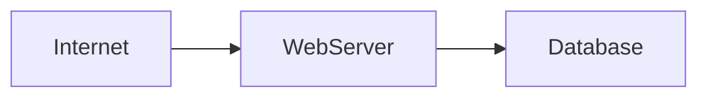
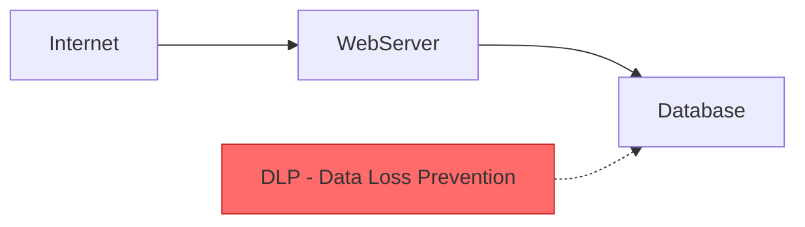
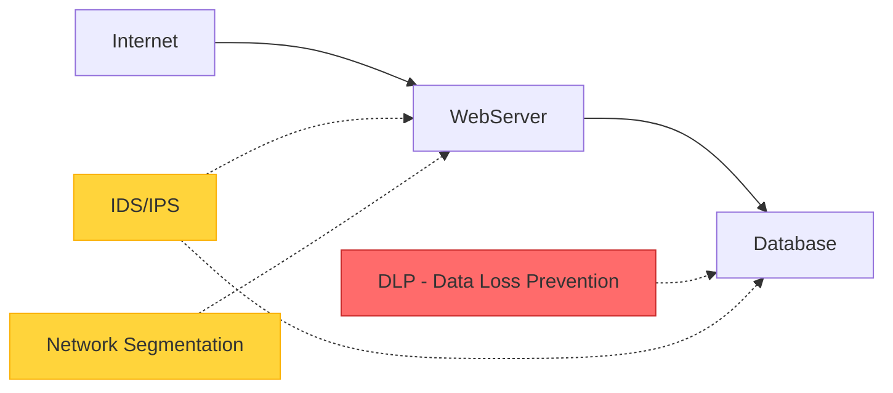
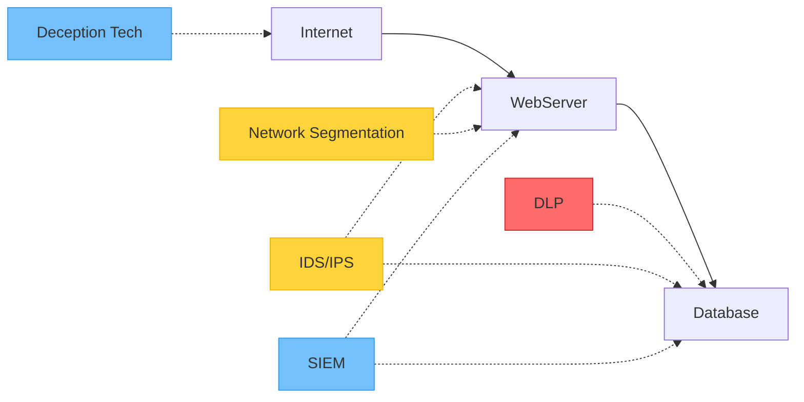

# Hybrid Plan: Consensus Architect & Improvement Reports

**Date:** 2026-05-16  
**Status:** 📋 PLANNED (not yet implemented)  
**Estimated Effort:** 6-8 hours  
**Goal:** Generate visual improvement roadmaps and human-readable reports from orchestrator consensus

---

## Problem Statement

### What We Have (Phase 3C+ Baseline)

**Output files per architecture:**
```
report/{architecture_name}/
├── 01_executive_summary.md       ✅ Business summary
├── 02_technical_report.md        ✅ Technical details
├── 03_action_plan.md             ✅ Implementation roadmap
├── 04_architect_critique.json    ✅ Design quality (82/100)
├── 05_tester_critique.json       ✅ MITRE validation (85/100)
├── 07_orchestrator_report.json   ✅ Unified 3-agent assessment
├── before.mmd                    ✅ Original architecture
├── after.mmd                     ✅ With recommended controls
└── ground_truth.json             ✅ Complete analysis data
```

**What works:**
- ✅ Deterministic engine: 99.5% confidence
- ✅ 3-agent LLM critique: Architect, Tester, Red Team
- ✅ Orchestrator: Unified roadmap synthesis
- ✅ Weighted composite scoring: 65-85/100
- ✅ JSON output: Machine-readable data

---

### What's Missing (User Experience Gaps)

**Gap 1: No visual improvement roadmap**
- Orchestrator provides JSON recommendations
- No updated MMD showing improvements applied
- Users can't visualize "what should my architecture look like?"

**Gap 2: No stepped improvement paths**
- Roadmap is flat list (CRITICAL/HIGH/MEDIUM)
- No progression: Quick wins → Recommended → Maximum security
- Hard to pick realistic target based on budget/timeline

**Gap 3: No human-readable improvement summary**
- Orchestrator report is JSON (machine-readable)
- Business stakeholders need markdown report
- Should show: Before/After comparison, consensus recommendations, ROI

**Gap 4: Red Team critique not saved separately**
- Only embedded in orchestrator report
- Hard to review single agent's findings
- Missing: `06_red_team_critique.json`

---

## Proposed Solution: Hybrid Approach

### New Agent: `ConsensusArchitect` (or module in orchestrator)

**Role:** Translates orchestrator roadmap into visual + human-readable outputs

**Inputs:**
1. Original architecture MMD
2. Orchestrator unified roadmap (07_orchestrator_report.json)
3. Ground truth data (existing controls, nodes, edges)

**Outputs:**
```
report/{architecture_name}/
├── ... (existing 10 files) ...
├── 06_red_team_critique.json        # NEW - Standalone Red Team findings
├── 08_improvement_summary.md        # NEW - Human-readable report
├── 08a_quick_wins.mmd               # NEW - Critical only (1-2 weeks)
├── 08b_recommended_target.mmd       # NEW - Critical + High (1-3 months)
└── 08c_maximum_security.mmd         # NEW - All improvements (6+ months)
```

**Total:** 15 files (~240 KB)

---

## Implementation Plan

### Task 1: Save Red Team Critique Separately (1h)

**Goal:** Make Red Team findings accessible without parsing orchestrator report

**Changes:**
- Modify `orchestrator.py` to save `06_red_team_critique.json`
- Same format as Architect/Tester critiques
- Include exploit mitigation roadmap

**File structure:**
```json
{
  "agent": "Red Teamer",
  "score": 40,
  "rating": "LOW = hard to exploit = GOOD defense",
  "rubric": {
    "exploit_difficulty": 16,
    "defense_evasion": 12,
    "attack_path_realism": 12
  },
  "exploit_mitigation_roadmap": [
    {
      "target_score": 25,
      "requirements": ["ids_ips", "dlp", "network_segmentation"],
      "practical": "YES",
      "effort": "4-6 weeks",
      "cost": "$75K-$150K"
    }
  ],
  "strengths": ["..."],
  "gaps": ["..."]
}
```

**Acceptance criteria:**
- ✅ File generated at same time as orchestrator report
- ✅ Contains complete Red Team assessment
- ✅ Includes exploit mitigation roadmap

---

### Task 2: Human-Readable Improvement Summary (2h)

**Goal:** Generate markdown report for business/technical stakeholders

**File:** `08_improvement_summary.md`

**Structure:**
```markdown
# Architecture Improvement Plan: {architecture_name}

Generated: {date}
Current Composite: {score}/100 ({rating})
Final Confidence: {confidence}%

---

## Executive Summary

Your architecture scored **{composite}/100** across 3 evaluation dimensions:
- Design Quality (Architect): {arch_score}/100
- MITRE Validation (Tester): {test_score}/100
- Exploit Difficulty (Red Team): {red_exploit}/100 → {red_defense}/100 defense

**Key Finding:** {1-2 sentence summary of main issue}

---

## Current State Assessment

### Strengths
- {List from all 3 agents}

### Critical Gaps
- {From Tester - validation issues}
- {From Red Team - exploitable weaknesses}
- {From Architect - design flaws}

---

## Improvement Paths

### Option 1: Quick Wins (1-2 weeks, $X-$Y)

**Target:** {current} → {target} composite (+{delta} points)

**Changes:**
- Fix critical validation gaps (Tester)
- Address high-priority security holes

**Diagram:** See `08a_quick_wins.mmd`

**ROI:** High - Low cost, immediate security improvement

---

### Option 2: Recommended Target (1-3 months, $X-$Y) ⭐ RECOMMENDED

**Target:** {current} → {target} composite (+{delta} points)

**Changes:**
- All critical items (validation gaps)
- High-priority controls (Red Team practical suggestions)
- Key design improvements (Architect)

**Diagram:** See `08b_recommended_target.mmd`

**ROI:** Excellent - Balanced cost/benefit, realistic timeline

---

### Option 3: Maximum Security (6+ months, $X-$Y)

**Target:** {current} → {target} composite (+{delta} points)

**Changes:**
- Everything from Option 2
- Medium-priority enhancements
- Advanced security features

**Diagram:** See `08c_maximum_security.mmd`

**ROI:** Diminishing returns - Only for high-security environments

---

## Consensus Recommendations

Items all 3 agents agree on (highest confidence):

| Priority | Recommendation | Source | Effort | Impact |
|----------|----------------|--------|--------|--------|
| CRITICAL | {action} | Tester | 1-2h | +7 pts |
| HIGH | {action} | Red Team + Architect | 2-3w | +10 pts |

---

## Implementation Roadmap

1. **Week 1-2:** Quick wins (critical gaps)
   - [ ] Fix validation issue: T1005 lacks M1057
   - [ ] Add DLP control
   - Expected: {composite} → {target}

2. **Month 1-3:** Recommended target
   - [ ] Deploy IDS/IPS
   - [ ] Implement network segmentation
   - [ ] Add behavioral analysis
   - Expected: {composite} → {target}

3. **Month 3-6:** Maximum security (optional)
   - [ ] Zero-trust microsegmentation
   - [ ] Deception technology
   - Expected: {composite} → {target}

---

## Visual Comparisons

**Before:**
- {node_count} nodes, {path_count} attack paths
- {control_count} controls present
- Exploit difficulty: {red_exploit}/100 (easy/medium/hard)

**After (Recommended Target):**
- {new_control_count} controls (+{delta})
- Exploit difficulty: {new_red_exploit}/100 (target: <30)
- Risk reduction: {risk_reduction}%

---

## Next Steps

1. Review improvement options with stakeholders
2. Select target (Quick/Recommended/Maximum)
3. Review corresponding diagram (08a/08b/08c)
4. Prioritize controls based on budget
5. Begin implementation

---

**Generated by:** MITRE Chatbot v1.2 (Phase 3C+)
**Orchestrator Report:** 07_orchestrator_report.json
**Architecture:** {architecture_name}
```

**Implementation:**
- New module: `chatbot/modules/improvement_summary_generator.py`
- Reads: `07_orchestrator_report.json`, `ground_truth.json`
- Writes: `08_improvement_summary.md`
- Template-based generation with dynamic data

---

### Task 3: Stepped Improvement MMDs (3h)

**Goal:** Generate 3 visual architecture diagrams showing progression

**Files:**
- `08a_quick_wins.mmd` - Critical items only
- `08b_recommended_target.mmd` - Critical + High
- `08c_maximum_security.mmd` - All recommendations

**Approach:**

1. **Parse original MMD**
   - Load nodes, edges, existing controls
   - Identify control positions (using path-based placement)

2. **Apply roadmap filters**
   - Quick wins: priority == "CRITICAL"
   - Recommended: priority in ["CRITICAL", "HIGH"]
   - Maximum: priority in ["CRITICAL", "HIGH", "MEDIUM"]

3. **Generate improved MMD**
   - Add recommended controls as nodes
   - Connect to relevant architecture nodes
   - Use same visual style as `after.mmd`
   - Color-code by priority (red=critical, yellow=high, blue=medium)

**Example transformation:**

**Original (before.mmd):**


**Quick Wins (08a_quick_wins.mmd):**


**Recommended Target (08b_recommended_target.mmd):**


**Maximum Security (08c_maximum_security.mmd):**


**Implementation:**
- New module: `chatbot/modules/mmd_improvement_generator.py`
- Reuse MMD parsing from existing code
- Apply control recommendations based on priority
- Generate 3 versions in one pass

---

### Task 4: Integrate into Orchestrator (1h)

**Goal:** Auto-generate all new files when orchestrator runs

**Changes to `orchestrator.py`:**

```python
def orchestrate(self, report_dir: str, ...) -> OrchestratorResult:
    """Run full 3-agent orchestration + improvement generation."""
    
    # ... existing orchestration ...
    
    # Save orchestrator result
    self.save_result(result, output_path)
    
    # NEW: Save Red Team critique separately
    self._save_red_team_critique(result, report_dir)
    
    # NEW: Generate improvement summary
    from chatbot.modules.improvement_summary_generator import generate_summary
    generate_summary(report_dir, result)
    
    # NEW: Generate stepped improvement MMDs
    from chatbot.modules.mmd_improvement_generator import generate_improvement_mmds
    generate_improvement_mmds(report_dir, result)
    
    return result
```

**Acceptance criteria:**
- ✅ All new files generated automatically
- ✅ No additional user commands required
- ✅ Backward compatible (existing files unchanged)

---

### Task 5: Update Demo Scripts (0.5h)

**Goal:** Show new outputs in demos

**Changes:**

1. **demo_orchestrator.sh**
   - Show all 5 new files in output list
   - Display quick wins vs recommended vs maximum
   - Prompt user to view improvement summary

2. **demo_llm_critique.sh**
   - Reference improvement summary in output
   - Show stepped diagram options

3. **demo_step_by_step.sh**
   - Add step showing improvement generation
   - Explain 3 roadmap options

---

## Success Criteria

**User Experience:**
- ✅ Users can visualize improvements (3 MMD diagrams)
- ✅ Users can choose realistic target (Quick/Recommended/Maximum)
- ✅ Business stakeholders get markdown report (not just JSON)
- ✅ Technical teams see consensus recommendations (all 3 agents agree)

**Technical:**
- ✅ 15 files generated per architecture
- ✅ Automated integration (no manual steps)
- ✅ Backward compatible (existing files work)
- ✅ Well-documented (comments + docstrings)

**Validation:**
- ✅ Test on 3 architectures:
  - 01_minimal_vulnerable (no controls)
  - 02_minimal_defended (some controls)
  - 10_complex_enterprise (many controls)
- ✅ Verify MMD syntax is valid
- ✅ Ensure recommendations are actionable

---

## Implementation Order

1. **Task 1:** Save Red Team critique (1h) - Quick win, unblocks Task 4
2. **Task 3:** Generate stepped MMDs (3h) - Core value delivery
3. **Task 2:** Generate improvement summary (2h) - Depends on Task 3 for context
4. **Task 4:** Integrate into orchestrator (1h) - Ties everything together
5. **Task 5:** Update demo scripts (0.5h) - Final polish

**Total:** 7.5 hours (rounded to 8h with testing)

---

## Testing Plan

### Test 1: 01_minimal_vulnerable (Baseline)
**Expected:**
- Quick wins: Add 5-7 critical controls (firewall, MFA, EDR, etc.)
- Recommended: +3-5 high-priority (IDS, DLP, segmentation)
- Maximum: +2-3 medium (SIEM, behavioral analysis)
- Improvement summary shows clear progression

### Test 2: 02_minimal_defended (Partial Controls)
**Expected:**
- Quick wins: Fix 2-3 validation gaps
- Recommended: Add 3-4 missing controls
- Maximum: Enhanced monitoring, deception tech
- Summary shows incremental improvements

### Test 3: 10_complex_enterprise (Many Controls)
**Expected:**
- Quick wins: Validation fixes only
- Recommended: 1-2 targeted improvements
- Maximum: 2-3 advanced features
- Summary shows high baseline, small deltas

---

## Future Enhancements (Out of Scope)

**Not in this phase:**
- Interactive diagram editor (Phase 4 Web UI)
- Cost estimation refinement (requires market data)
- Historical tracking (compare across iterations)
- Automated control deployment (CI/CD integration)

---

## Risk Assessment

| Risk | Likelihood | Impact | Mitigation |
|------|------------|--------|------------|
| MMD generation fails on complex architectures | Medium | High | Extensive testing on 22 reference architectures |
| Roadmap recommendations conflict | Low | Medium | Orchestrator already deduplicates |
| User confusion with 3 options | Medium | Low | Clear labeling, recommended option marked |
| Implementation time exceeds 8h | Medium | Low | Break into smaller commits, test incrementally |

---

## Documentation Updates

**After implementation:**
- [ ] Update STATUS_AND_PLAN.md (new files section)
- [ ] Update CURRENT_OUTPUT.md (15 files instead of 10)
- [ ] Create HYBRID_IMPLEMENTATION.md (how it works)
- [ ] Update README.md (mention improvement diagrams)
- [ ] Add examples to report_samples/

---

## Commit Strategy

**Commit 1:** Baseline (Phase 3C+ demos + this plan)
- `demo_orchestrator.sh`
- `demo_llm_critique.sh` (updated)
- `report_samples/example_architecture/CURRENT_OUTPUT.md`
- `docs/phases/phase3c/HYBRID_PLAN.md` (this file)

**Commit 2:** Task 1 (Red Team critique)
- `chatbot/modules/orchestrator.py` (save method)
- Test output: `06_red_team_critique.json`

**Commit 3:** Task 3 (MMD generation)
- `chatbot/modules/mmd_improvement_generator.py`
- Test output: `08a/08b/08c.mmd`

**Commit 4:** Task 2 (Improvement summary)
- `chatbot/modules/improvement_summary_generator.py`
- Test output: `08_improvement_summary.md`

**Commit 5:** Task 4+5 (Integration + demos)
- `orchestrator.py` (integration)
- Demo scripts (updated)
- Final testing

---

## Summary

**What:** Generate visual + human-readable improvement roadmaps from orchestrator consensus

**Why:** Users need actionable, visual outputs to make decisions and implement changes

**How:** New modules generate 5 additional files (6 with Red Team JSON) showing stepped improvements

**Effort:** 6-8 hours

**Value:** High - Transforms JSON data into user-friendly deliverables

**Next Step:** Commit this plan, then implement Task 1 (Red Team critique)

---

**Status:** 📋 PLANNED  
**Author:** Phase 3C+ Team  
**Date:** 2026-05-16  
**Version:** 1.0
