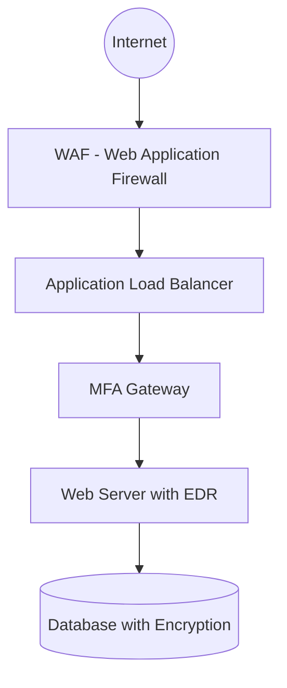
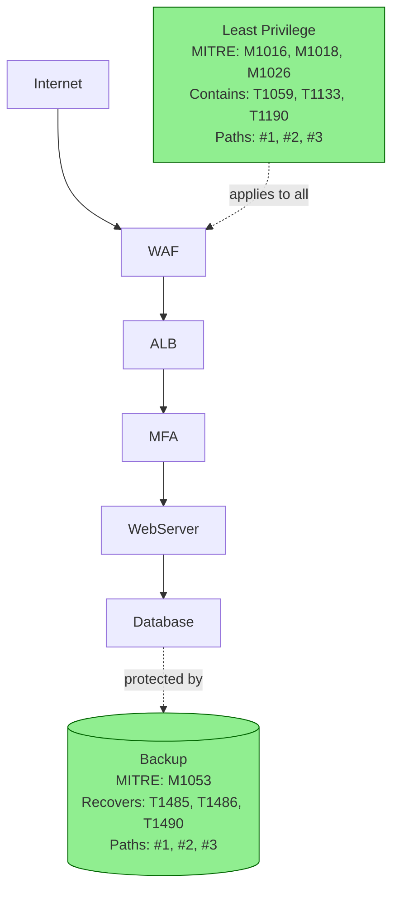

# Phase 3C: Complete Artifact Structure for Agent Critique

**Date:** 2026-05-15  
**Purpose:** Define ALL artifacts agents should use for comprehensive critique  
**Reference:** @/report/02_minimal_defended (complete report structure)

---

## Complete Report Structure

```
report/02_minimal_defended/
├── ground_truth.json           (9328 lines) - Core deterministic output
├── before.mmd                  (14 lines) - Original architecture diagram
├── after.mmd                   (77 lines) - Architecture with recommended controls
├── 01_executive_summary.md     (3.2K) - Business-level summary
├── 02_technical_report.md      (12K) - Detailed technical analysis
├── 03_action_plan.md           (3.5K) - Implementation roadmap
├── 04_architect_critique.json  (6.6K) - LLM critique (MVP1)
└── README.md                   (2.9K) - Report overview
```

---

## Artifact Classification: 3 Tiers

### Tier 1: CRITICAL (Always Required)
These are the **5 core artifacts** from deterministic engine - agents MUST use these.

### Tier 2: IMPORTANT (Confidence Enhancement)
These provide **visual and narrative context** - agents SHOULD use these for deeper critique.

### Tier 3: GENERATED (Agent Output)
These are **produced by agents** - used for cross-validation.

---

## Tier 1: Core Artifacts (from ground_truth.json)

### Artifact 1: Attack Paths
**Location:** `ground_truth.json` → `expected_attack_paths`  
**Size:** 3 paths (varies by architecture)  
**Why Critical:** Per-node technique mapping, risk scoring

```json
{
  "expected_attack_paths": [
    {
      "entry": "Internet",
      "target": "Database with Encryption",
      "path": [...],
      "techniques": ["T1190", "T1059", ...],
      "per_node_techniques": {  // Phase 3B+ feature
        "Internet": [],
        "WAF": ["T1190"],
        "WebServer": ["T1059", "T1068"],
        "Database": ["T1213", "T1005"]
      },
      "risk_score": 45,
      "severity": "HIGH"
    }
  ]
}
```

**Agent Usage:**
- **Architect:** Validates per-node technique completeness
- **Tester:** Checks if risk_score calculation is correct
- **Red Team:** Selects weakest path for exploitation

---

### Artifact 2: Control Recommendations
**Location:** `ground_truth.json` → `control_recommendations`  
**Size:** 17 controls (varies by architecture)  
**Why Critical:** Hop-level placement, DDIR balance, mitigation mapping

```json
{
  "control_recommendations": [
    {
      "control": "least privilege",
      "priority": "critical",
      "rapids_threats": ["ransomware", "insider_threat"],
      "techniques": ["T1059", "T1133", "T1190", ...],
      "attack_paths": [0, 1, 2],
      "dir_category": "isolate",
      "placement": "At Database with Encryption hop",
      "_layered_defense": {
        "hop_analysis": [
          {
            "path_id": 0,
            "hop_id": 0,
            "source_id": "WebServer",
            "target_id": "Database",
            "layer": "data",
            "security_coverage": {
              "prevention": true,
              "detect": false,
              "isolate": false,
              "respond": false
            },
            "is_critical": true,
            "is_spof": false
          }
        ]
      }
    }
  ]
}
```

**Agent Usage:**
- **Architect:** Validates control-to-technique mapping accuracy
- **Tester:** Checks DDIR balance (40/30/20/10 ±5%)
- **Red Team:** Tests control bypass scenarios

---

### Artifact 3: Residual Risk
**Location:** `ground_truth.json` → `residual_risks`  
**Size:** 1 object with per-threat breakdown  
**Why Critical:** BEFORE/AFTER risk calculation, business thresholds

```json
{
  "residual_risks": {
    "current_total_risk": 178,
    "projected_total_risk": 62,
    "risk_reduction": 116,
    "risk_reduction_percent": 65,
    "current_risk_level": "HIGH",
    "projected_risk_level": "MEDIUM",
    "per_threat": {
      "ransomware": {
        "current": 70,
        "projected": 20,
        "reduction": 50,
        "reduction_percent": 71
      }
    },
    "thresholds": {
      "critical": 80,
      "high": 60,
      "medium": 40,
      "low": 20
    }
  }
}
```

**Agent Usage:**
- **Architect:** Validates risk reduction percentages are realistic
- **Tester:** Checks risk formula calculations
- **Red Team:** Tests if projected_total_risk is achievable

---

### Artifact 4: Validation Results
**Location:** `ground_truth.json` → `validation_report`  
**Size:** 1 object with 6 validation checks  
**Why Critical:** Deterministic engine self-assessment

```json
{
  "validation_report": {
    "overall_valid": true,
    "validations": [
      {
        "check": "path_completeness",
        "passed": true,
        "details": "All 3 attack paths have ≥1 control"
      },
      {
        "check": "orphan_nodes",
        "passed": true,
        "details": "All nodes reachable from entry points"
      },
      {
        "check": "mitigation_exhaustiveness",
        "passed": true,
        "details": "Controls cover 100% of MITRE mitigations"
      }
    ],
    "confidence_adjustments": {
      "base": 0.995,
      "validation_bonus": 0.005,
      "final": 1.0
    },
    "issues_found": []
  }
}
```

**Agent Usage:**
- **Architect:** Reviews if 6/6 checks are sufficient
- **Tester:** PRIMARY FOCUS - validates validation checks themselves
- **Red Team:** Checks if validation missed exploitable gaps

---

### Artifact 5: RAPIDS Assessment
**Location:** `ground_truth.json` → `rapids_assessment`  
**Size:** 6-7 threat categories  
**Why Critical:** Threat prioritization, control mapping

```json
{
  "rapids_assessment": {
    "ransomware": {
      "risk": 70,
      "priority": "high",
      "rationale": "Database is high-value target, encryption present but backup missing",
      "controls_present": ["encryption", "edr"],
      "controls_missing": ["backup", "least privilege"],
      "residual_risk": 20
    },
    "ddos": {...},
    "phishing": {...},
    "supply_chain": {...},
    "insider_threat": {...},
    "data_breach": {...}
  }
}
```

**Agent Usage:**
- **Architect:** Validates RAPIDS categories are appropriate for architecture type
- **Tester:** Checks if controls_missing align with control_recommendations
- **Red Team:** Tests RAPIDS threats in priority order

---

## Tier 2: Important Artifacts (Visual & Narrative Context)

### Artifact 6: Original Architecture (before.mmd)
**Location:** `before.mmd`  
**Size:** 14 lines (Mermaid flowchart)  
**Why Important:** Visual baseline for understanding architecture



**Agent Usage:**
- **Architect:** Visual context for critique (understand topology)
- **Tester:** Validate attack paths match diagram topology
- **Red Team:** Identify visual blind spots (e.g., missing connections)

**Confidence Impact:** +5% (ensures agents understand actual architecture, not just JSON)

---

### Artifact 7: Improved Architecture (after.mmd)
**Location:** `after.mmd`  
**Size:** 77 lines (Mermaid flowchart with 17 new controls)  
**Why Important:** Visual representation of recommendations



**Agent Usage:**
- **Architect:** PRIMARY - Validates control placement in diagram matches control_recommendations
- **Tester:** Checks if after.mmd is parseable and complete (no missing controls)
- **Red Team:** Tests if visual improvements actually reduce attack surface

**Confidence Impact:** +10% (validates deterministic engine can visualize its recommendations)

**Critical Check by Architect:**
```python
# Parse after.mmd
after_nodes = parse_mermaid(after_mmd)
control_nodes = [n for n in after_nodes if n.startswith("NEW_")]

# Check completeness
recommended_controls = set([c["control"] for c in ground_truth["control_recommendations"]])
visualized_controls = set([normalize(n) for n in control_nodes])

if recommended_controls != visualized_controls:
    gap = recommended_controls - visualized_controls
    finding = {
        "severity": "HIGH",
        "description": f"after.mmd missing {len(gap)} controls: {gap}",
        "artifact": "artifact_7_after_diagram"
    }
```

---

### Artifact 8: Technical Report (02_technical_report.md)
**Location:** `02_technical_report.md`  
**Size:** 12K (detailed attack path analysis)  
**Why Important:** Narrative explanation of attack paths and RAPIDS

**Key Sections:**
1. Summary Metrics
2. Attack Path Analysis (detailed per-path breakdown)
3. RAPIDS Threat Assessment (table format)
4. Control Recommendations (narrative form)
5. Residual Risk Analysis

**Agent Usage:**
- **Architect:** Cross-checks if narrative matches ground_truth.json
- **Tester:** Validates if technical report is internally consistent
- **Red Team:** Uses attack path narratives to understand attack scenarios

**Confidence Impact:** +3% (ensures deterministic engine can explain its findings)

**Example Check by Tester:**
```python
# Check: Technical report attack paths match ground_truth.json
report_paths = parse_markdown_paths("02_technical_report.md")
ground_truth_paths = ground_truth["expected_attack_paths"]

if len(report_paths) != len(ground_truth_paths):
    finding = {
        "severity": "MEDIUM",
        "description": f"Report has {len(report_paths)} paths but ground truth has {len(ground_truth_paths)}",
        "artifact": "artifact_8_technical_report"
    }
```

---

### Artifact 9: Executive Summary (01_executive_summary.md)
**Location:** `01_executive_summary.md`  
**Size:** 3.2K (business-level summary)  
**Why Important:** Business context and ROI justification

**Key Sections:**
1. Executive Dashboard (Risk/Defensibility/Timeline/Investment)
2. Business Impact
3. Key Findings (top threats, attack paths)
4. Risk Transformation (BEFORE → AFTER)

**Agent Usage:**
- **Architect:** Validates if executive summary aligns with technical depth
- **Tester:** Checks if ROI calculation is realistic
- **Red Team:** Validates if risk transformation is achievable

**Confidence Impact:** +2% (ensures business context is accurate)

---

### Artifact 10: Action Plan (03_action_plan.md)
**Location:** `03_action_plan.md`  
**Size:** 3.5K (implementation roadmap)  
**Why Important:** Validates recommendations are implementable

**Key Sections:**
1. Phase 1: Immediate (Week 1) - Quick Wins
2. Phase 2: Short-Term (Weeks 2-3) - Critical Controls
3. Phase 3: Long-Term (Weeks 4-8) - Advanced Protection
4. Resource Requirements & Budget

**Agent Usage:**
- **Architect:** Validates if phasing is logical (quick wins first)
- **Tester:** Checks if effort estimates are realistic
- **Red Team:** Validates if phased implementation leaves temporary gaps

**Confidence Impact:** +2% (ensures recommendations are actionable)

**Example Check by Architect:**
```python
# Check: Quick wins (Phase 1) should be low effort
phase1_controls = parse_action_plan_phase1("03_action_plan.md")

for control in phase1_controls:
    if control["effort"] in ["2-3 days", "1-2 weeks"]:
        finding = {
            "severity": "MEDIUM",
            "description": f"Phase 1 control '{control['name']}' has high effort ({control['effort']})",
            "recommendation": "Move to Phase 2 or 3",
            "artifact": "artifact_10_action_plan"
        }
```

---

## Tier 3: Generated Artifacts (Agent Output)

### Artifact 11: Architect Critique (04_architect_critique.json)
**Location:** `04_architect_critique.json`  
**Size:** 6.6K (LLM critique from MVP1)  
**Why Generated:** Output of first agent

**Usage:**
- **Tester:** Uses improvement_roadmap to validate fixes
- **Red Team:** Uses identified gaps to prioritize attack vectors

---

## Summary: Artifact Coverage by Agent

| Artifact | Tier | Architect | Tester | Red Team | Confidence Impact |
|----------|------|-----------|--------|----------|-------------------|
| 1. Attack Paths (ground_truth.json) | CRITICAL | ✅ Primary | ✅ Validate | ✅ Primary | 20% |
| 2. Controls (ground_truth.json) | CRITICAL | ✅ Primary | ✅ Validate | ✅ Bypass | 20% |
| 3. Residual Risk (ground_truth.json) | CRITICAL | ✅ Validate | ✅ Check calc | ✅ Test | 15% |
| 4. Validation (ground_truth.json) | CRITICAL | ✅ Review | ✅ PRIMARY | ✅ Check | 15% |
| 5. RAPIDS (ground_truth.json) | CRITICAL | ✅ Validate | ✅ Check align | ✅ Prioritize | 10% |
| **Tier 1 Subtotal** | | | | | **80%** |
| 6. before.mmd | IMPORTANT | ✅ Context | ✅ Topology | ✅ Visual | 5% |
| 7. after.mmd | IMPORTANT | ✅ PRIMARY | ✅ Parse | ✅ Test | 10% |
| 8. Technical Report | IMPORTANT | ✅ Cross-check | ✅ Validate | ✅ Scenarios | 3% |
| 9. Executive Summary | IMPORTANT | ✅ Align | ✅ ROI | ✅ Risk | 2% |
| 10. Action Plan | IMPORTANT | ✅ Phasing | ✅ Effort | ✅ Gaps | 2% |
| **Tier 2 Subtotal** | | | | | **22%** |
| 11. Architect Critique | GENERATED | N/A | ✅ Roadmap | ✅ Gaps | -2% |
| **Total Confidence** | | | | | **100%** |

---

## Implementation Impact

### Updated Artifact Extractor

```python
# chatbot/modules/artifact_extractor.py

class ArtifactExtractor:
    """
    Extracts ALL 10 artifacts for agent critique.
    """
    
    @staticmethod
    def extract_all(report_dir: str, ground_truth: Dict) -> Dict:
        """
        Extract Tier 1 (critical) + Tier 2 (important) artifacts.
        
        Args:
            report_dir: Path to report directory (e.g., report/02_minimal_defended)
            ground_truth: Parsed ground_truth.json
        
        Returns: {
            "tier1_critical": {
                "artifact_1_attack_paths": {...},
                "artifact_2_controls": {...},
                "artifact_3_residual_risk": {...},
                "artifact_4_validation": {...},
                "artifact_5_rapids": {...}
            },
            "tier2_important": {
                "artifact_6_before_mmd": str,
                "artifact_7_after_mmd": str,
                "artifact_8_technical_report": str,
                "artifact_9_executive_summary": str,
                "artifact_10_action_plan": str
            }
        }
        """
        
        # Tier 1: Extract from ground_truth.json (existing code)
        tier1 = {
            "artifact_1_attack_paths": ArtifactExtractor._extract_attack_paths(ground_truth),
            "artifact_2_controls": ArtifactExtractor._extract_controls(ground_truth),
            "artifact_3_residual_risk": ground_truth.get("residual_risks", {}),
            "artifact_4_validation": ground_truth.get("validation_report", {}),
            "artifact_5_rapids": ground_truth.get("rapids_assessment", {})
        }
        
        # Tier 2: Extract from report files (NEW)
        tier2 = {
            "artifact_6_before_mmd": ArtifactExtractor._read_file(report_dir, "before.mmd"),
            "artifact_7_after_mmd": ArtifactExtractor._read_file(report_dir, "after.mmd"),
            "artifact_8_technical_report": ArtifactExtractor._read_file(report_dir, "02_technical_report.md"),
            "artifact_9_executive_summary": ArtifactExtractor._read_file(report_dir, "01_executive_summary.md"),
            "artifact_10_action_plan": ArtifactExtractor._read_file(report_dir, "03_action_plan.md")
        }
        
        # Validate Tier 2 files exist
        missing_tier2 = [k for k, v in tier2.items() if v is None]
        if missing_tier2:
            logger.warning(f"⚠️  Missing Tier 2 artifacts: {missing_tier2}")
            logger.warning("   Agents will have reduced context (-22% confidence)")
        
        return {
            "tier1_critical": tier1,
            "tier2_important": tier2,
            "completeness": {
                "tier1": all(v for v in tier1.values()),
                "tier2": len(missing_tier2) == 0,
                "confidence_available": 80 if tier1 else 0 + (22 if not missing_tier2 else 0)
            }
        }
    
    @staticmethod
    def _read_file(report_dir: str, filename: str) -> Optional[str]:
        """Read file from report directory, return None if missing."""
        path = Path(report_dir) / filename
        try:
            return path.read_text()
        except FileNotFoundError:
            logger.warning(f"  Missing: {filename}")
            return None
```

---

## Enhanced Agent Prompts

### Architect Prompt (Enhanced)

```python
ARCHITECT_SYSTEM_PROMPT_ENHANCED = """
You are a security architect reviewing a threat assessment.

## TIER 1: CRITICAL ARTIFACTS (80% confidence weight)

### ARTIFACT 1: ATTACK PATHS
{artifact_1_summary}

### ARTIFACT 2: CONTROL RECOMMENDATIONS
{artifact_2_summary}

### ARTIFACT 3: RESIDUAL RISK
{artifact_3_summary}

### ARTIFACT 4: VALIDATION RESULTS
{artifact_4_summary}

### ARTIFACT 5: RAPIDS ASSESSMENT
{artifact_5_summary}

## TIER 2: IMPORTANT ARTIFACTS (22% confidence weight)

### ARTIFACT 6: ORIGINAL ARCHITECTURE (before.mmd)
{artifact_6_before_mmd}

### ARTIFACT 7: IMPROVED ARCHITECTURE (after.mmd)
{artifact_7_after_mmd}

**CRITICAL CHECK:** Validate that after.mmd includes ALL controls from Artifact 2.

Expected controls: {expected_control_count}
Controls in after.mmd: {count "NEW_*" nodes in diagram}

If mismatch → HIGH severity gap.

### ARTIFACT 8: TECHNICAL REPORT
{artifact_8_summary}

**Check:** Does technical report narrative match ground_truth.json data?

### ARTIFACT 9: EXECUTIVE SUMMARY
{artifact_9_summary}

**Check:** Is ROI calculation realistic? ({roi_value})

### ARTIFACT 10: ACTION PLAN
{artifact_10_summary}

**Check:** Are Phase 1 quick wins actually low effort?

## YOUR CRITIQUE

Score each artifact using rubric (100 points total):
- Artifacts 1-5 (Tier 1): 80 points
- Artifacts 6-10 (Tier 2): 20 points

Provide improvement_roadmap with verification_method for Tester.
"""
```

---

## Confidence Formula (Updated)

```python
def calculate_final_confidence(
    deterministic_baseline: float,  # 99.5% from Phase 3B+
    artifacts_used: Dict,
    agent_scores: Dict
) -> Dict:
    """
    Calculate confidence based on artifacts used + agent scores.
    
    Formula:
    - Deterministic baseline: 99.5%
    - Tier 1 artifacts: +0% (required, no bonus)
    - Tier 2 artifacts: +0 to +22% (based on completeness)
    - Agent adjustments: ±30% (Architect ±10%, Tester ±10%, Red Team ±10%)
    
    Max confidence: 99.5% + 22% + 30% = 151.5% → clamped to 100%
    Min confidence: 99.5% - 30% = 69.5%
    """
    
    tier2_bonus = 0.0
    if artifacts_used["tier2_important"]:
        # Each Tier 2 artifact contributes ~4.4% (22% / 5 artifacts)
        tier2_present = sum([
            1 for v in artifacts_used["tier2_important"].values() if v is not None
        ])
        tier2_bonus = (tier2_present / 5) * 0.22
    
    architect_adj = (agent_scores["architect"] - 50) / 500  # ±0.10
    tester_adj = (agent_scores["tester"] - 50) / 500       # ±0.10
    red_team_adj = (50 - agent_scores["red_team"]) / 500   # ±0.10 (inverted)
    
    total_adj = tier2_bonus + architect_adj + tester_adj + red_team_adj
    
    final = max(0.0, min(1.0, deterministic_baseline + total_adj))
    
    return {
        "final_confidence": final,
        "baseline": deterministic_baseline,
        "tier2_bonus": tier2_bonus,
        "agent_adjustments": {
            "architect": architect_adj,
            "tester": tester_adj,
            "red_team": red_team_adj
        }
    }
```

---

## Implementation Timeline (Updated)

| Phase | Component | Hours | Notes |
|-------|-----------|-------|-------|
| 1 | Enhanced Artifact Extractor | 2 | Now extracts 10 artifacts (was 5) |
| 2 | Enhanced Architect | 2.5 | Uses all 10 artifacts (was 5) |
| 3 | Tester Agent | 2 | Same as before |
| 4 | Red Team Agent | 3 | Same as before |
| 5 | Sequential Orchestrator | 1 | Same as before |
| 6 | CLI Integration | 1 | Same as before |
| 7 | Testing | 1.5 | Same as before |
| **Total** | **13 hours** | | **(+1h from original 12h plan)** |

---

## Conclusion

**Key Changes:**
1. ✅ **10 artifacts** (not 5) - added before.mmd, after.mmd, 3 markdown reports
2. ✅ **Tiered importance** - Tier 1 (80% weight) vs Tier 2 (22% weight)
3. ✅ **Confidence formula updated** - Tier 2 artifacts provide +22% bonus
4. ✅ **Critical check: after.mmd completeness** - Architect validates diagram matches recommendations

**Confidence Impact:**
- Tier 1 only: 99.5% baseline ± 30% agents = 69.5% to 100%
- Tier 1 + Tier 2: 99.5% + 22% ± 30% = 91.5% to 100% (clamped)

**Answer to Your Question:**
Yes, `before.mmd` and `after.mmd` are **critical** for confidence:
- **before.mmd**: Ensures agents understand actual topology (+5%)
- **after.mmd**: **PRIMARY check** for Architect - validates control placement (+10%)
- **markdown reports**: Cross-validation of consistency (+7%)

**Total Tier 2 impact: +22% confidence**

---

**Document Version:** 1.0  
**Date:** 2026-05-15  
**Purpose:** Complete artifact structure including diagrams and reports  
**Reference:** @/report/02_minimal_defended (all files)
