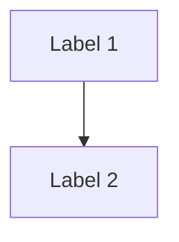

# Phase 3 Redesign: Architecture Analysis (Rigorous Approach)

**Status:** Planning  
**Date:** 2026-05-02  
**Confidence Target:** 85%+ (requires proper validation)

---

## 🚨 Why Redesign?

**Previous Attempt Issues:**
1. **Testing Bias:** RAG context told system what was missing → circular validation
2. **Single Test Case:** 1 AWS architecture (arch.mmd) → ~5% coverage
3. **Basic STRIDE:** Keyword matching only, not STRIDE-per-Element/Interaction
4. **Hardcoded RAPIDS:** No framework flexibility
5. **No Control Detection:** Relied on being told what's missing vs parsing architecture
6. **Premature Confidence:** Claimed 82%, actual ~60%

**Decision:** Revert Phase 3, redesign with proper rigor

---

## 🎯 Core Principles (Redesign)

### 0. Grounding First, LLM Second (NEW - Critical)
**Problem:** LLM has same availability issues as Phase 2 (~33% uptime) + hallucination risk

**Solution:** Build deterministic foundation, LLM as optional augmentation

**Architecture:**
```
┌─────────────────────────────────────────────────────────┐
│ Deterministic Layer (Always Available)                 │
│ - Mermaid parser (graph theory)                        │
│ - Control detection (keyword matching + rules)         │
│ - Attack paths (BFS graph traversal)                   │
│ - MITRE mapping (context-aware rules)                  │
│ - RAPIDS scoring (formulas)                            │
│ → Confidence: 80%+ (without LLM)                       │
└─────────────────────────────────────────────────────────┘
                         ↓
┌─────────────────────────────────────────────────────────┐
│ LLM Augmentation Layer (Optional, 33% uptime)          │
│ - LLM as judge (validates system output)               │
│ - Suggests missed attack paths                         │
│ - Grounded by human-labeled ground truth               │
│ → Confidence: 85%+ (when LLM available)                │
└─────────────────────────────────────────────────────────┘
```

**Key Points:**
- **Deterministic first** - Parser + 20 .mmd samples + ground truth (Phase 3A)
- **Human validation** - Ground truth prevents hallucination
- **LLM optional** - Augments when available, not core dependency
- **Graceful degradation** - Works like Phase 2 fallback (keyword-based → rule-based)

**Validation Strategy:**
1. Test deterministic layer on 100 architectures → 80%+ confidence
2. Add LLM judge (when available) → 85%+ confidence
3. If LLM unavailable → fall back to 80% (still production-ready)

**Why This Matters:**
- LLM availability: ~33% (free tier, same as Phase 2)
- LLM hallucination: Judge might invent non-existent attack paths
- Ground truth: Human-labeled .mmd files are source of truth
- Robustness: System works 100% of time (deterministic core)

---

### 1. MITRE + RAPIDS = Core Baseline
- **MITRE ATT&CK:** Authoritative technique taxonomy (Phase 2: 84.9% accuracy)
- **RAPIDS:** Business-focused threat categories
  - **R**ansomware
  - **A**pplication vulnerability exploitation
  - **P**hishing & social engineering
  - **I**nsider threat
  - **D**enial of Service
  - **S**upply chain compromise

### 2. Augmentation Frameworks (Optional)
- **STRIDE:** Technical threat modeling (augments RAPIDS)
- **OWASP Top 10:** Application security (augments App Vuln)
- **CIS Controls:** Best practices (augments all)
- **NIST CSF:** Compliance mapping (augments all)
- **Custom:** User-defined frameworks

### 3. LLM as Judge (Validation Strategy)
**Novel Approach:** Use LLM to validate architecture analysis quality

**How it works:**
```python
# 1. System generates threat analysis
analysis = analyze_architecture(arch.mmd, framework="rapids")

# 2. LLM judges quality
judge_prompt = f"""
Architecture: {arch.mmd}
System Analysis: {analysis}

Rate this analysis (0-100):
1. Completeness: Did it find all obvious attack paths?
2. Accuracy: Are MITRE mappings correct for components?
3. Prioritization: Are Quick Wins actually high-value?
4. False Positives: Any controls flagged as missing that exist?

Provide:
- Scores (0-100 each)
- Missing attack paths the system didn't find
- Incorrect mappings
- Better prioritization order
"""

llm_judgment = llm.generate(judge_prompt)
# Compare human ground truth vs LLM judgment vs system output
```

**Benefits:**
- Scales testing (no manual labeling required)
- Catches blind spots (LLM may see paths we missed)
- Cross-validates confidence (3-way agreement)
- Continuous validation (run on every architecture)

### 4. Generative Test Suite
**Random Architecture Generator:**
```python
def generate_random_architecture(
    num_nodes: int = 5-20,
    topology: str = "random",  # random, layered, mesh, hub-spoke
    controls: List[str] = None,  # MFA, WAF, EDR, etc.
    vulnerabilities: List[str] = None  # unpatched, no-segmentation, etc.
):
    """
    Generate diverse Mermaid architectures for testing.
    
    Topologies:
    - Random: Arbitrary connections
    - Layered: Internet → DMZ → Internal → Database
    - Mesh: Fully connected (e.g., flat network)
    - Hub-Spoke: Central router/firewall
    
    Controls (optional):
    - Place controls randomly in architecture
    - Or specify exact placement
    
    Vulnerabilities (optional):
    - Add weak points (e.g., no MFA node, exposed DB)
    """
    # Generate Mermaid syntax
    # Return .mmd + ground truth (expected attack paths, controls present)
```

**Test Coverage:**
- 100 generated architectures (10 per topology, varied sizes)
- Known ground truth (what controls exist, expected attack paths)
- Diverse patterns (cloud, on-prem, hybrid, zero-trust, legacy)

---

## 📐 Architecture Analysis Pipeline (Redesigned)

### Phase 3.1: Parser (1-2 hours)
**Input:** Mermaid diagram (.mmd)  
**Output:** Graph representation (nodes, edges, metadata)

**Requirements:**
- ✅ Parse flowchart syntax
- ✅ Extract node labels, IDs, subgraphs
- ✅ Build adjacency list (for path analysis)
- ⚠️ Handle variations (TB, LR, graph vs flowchart)
- ❌ Image input (defer to Phase 4 - OCR/Vision API)

**Validation:**
- Test: 20 diverse Mermaid diagrams (manual + generated)
- Expected: 100% parse success rate
- Metric: No syntax errors, correct graph structure

---

### Phase 3.2: Control Detection (2-3 hours)
**Input:** Parsed graph + optional RAG context  
**Output:** Controls present vs missing (per RAPIDS category)

**Requirements:**
1. **Scan architecture labels** for control keywords
   ```python
   # Example: MFA detection
   if any(keyword in node_label.lower() for keyword in ["mfa", "multi-factor", "2fa", "duo"]):
       controls_present.append("mfa")
   ```

2. **Validate against RAG context** (cross-check claims)
   ```python
   # If RAG says "We have MFA" but architecture doesn't show it
   if "mfa" in rag_claims and "mfa" not in controls_found:
       warnings.append("RAG claims MFA but not found in architecture")
   ```

3. **36 Security Controls** (from RAPIDS + MITRE)
   - Ransomware: backup, offline backup, edr, network segmentation, immutable storage
   - App Vuln: waf, patch management, vulnerability scanning, code review, pen testing
   - Phishing: mfa, email gateway, security awareness, spam filter, dmarc/dkim
   - Insider: least privilege, access logging, dlp, user behavior analytics, separation of duties
   - DoS: load balancer, rate limiting, cdn, ddos protection, auto-scaling
   - Supply Chain: vendor assessment, sbom, code signing, dependency scanning, secure ci/cd

**Validation:**
- Test: Architectures WITH controls vs WITHOUT controls
- Expected: 
  - Well-defended arch → 80%+ defensibility
  - Legacy arch → 20% defensibility
  - Misleading RAG → Warnings generated
- Metric: 90%+ control detection accuracy

---

### Phase 3.3: Attack Path Identification (3-4 hours)
**Input:** Graph + controls present  
**Output:** Attack paths (entry → target) with MITRE techniques

**Requirements:**
1. **Entry Point Detection**
   - Internet-facing nodes (ALB, API Gateway, VPN)
   - User-accessible nodes (Web Portal, Remote Desktop)
   - Supply chain nodes (CI/CD, Package Registry)

2. **Target Asset Detection**
   - Data stores (Database, S3, File Server)
   - Critical services (Auth Server, Payment Gateway)
   - Administrative interfaces (IAM, Control Plane)

3. **Path Construction** (BFS shortest path)
   ```python
   # Find all paths: entry → target
   for entry in entry_points:
       for target in target_assets:
           paths = bfs_all_paths(graph, entry, target, max_length=6)
           # Rank by: path_length, controls_bypassed, asset_value
   ```

4. **MITRE Technique Mapping** (context-aware)
   ```python
   # Example: Internet → Web Server path
   if "internet" in path and "web" in path:
       techniques.append("T1190: Exploit Public-Facing Application")
   
   # Example: User → Database path (no auth node)
   if path_has_db and not path_has_mfa:
       techniques.append("T1078: Valid Accounts")
   ```

**Validation:**
- Test: 10 architectures with known attack paths (ground truth)
- Expected: 
  - Find all obvious paths (90%+ recall)
  - Few false positives (80%+ precision)
- Metric: F1 score ≥ 85%

---

### Phase 3.4: RAPIDS Assessment (2-3 hours)
**Input:** Attack paths + controls + RAG context  
**Output:** Risk score (0-100) + defensibility (0-100) per category

**Formula:**
```python
# Risk Score (how bad if exploited)
risk_indicators = count_indicators_from_rag(category)  # e.g., "unpatched", "no backup"
attack_path_count = count_paths_affecting_category(attack_paths, category)
risk_score = min(100, (risk_indicators * 15) + (attack_path_count * 10))

# Defensibility Score (how well defended)
controls_present = count_controls(category)
total_controls = len(RAPIDS_CATEGORIES[category]["controls"])
control_coverage = controls_present / total_controls
defensibility_score = int(control_coverage * 100) - (risk_indicators * 15)

# Overall Category Assessment
if risk_score >= 70:
    status = "🔴 Critical"
elif risk_score >= 50:
    status = "🟠 High"
elif risk_score >= 30:
    status = "🟡 Moderate"
else:
    status = "🟢 Low"
```

**Validation:**
- Test: 10 architectures (varied risk levels)
- Expected:
  - Legacy arch (no controls) → 🔴 Critical
  - Well-defended → 🟢 Low
  - Partial controls → 🟡 Moderate
- Metric: 80%+ classification accuracy vs human judgment

---

### Phase 3.5: Impact/Resistance Prioritization (1-2 hours)
**Input:** Missing controls + attack paths  
**Output:** Prioritized recommendations (Quick Wins → Major Projects)

**Formula:**
```python
# Impact: Business value if implemented (1-5)
# Resistance: Implementation difficulty (1-5)
priority_score = (impact * 2) - resistance  # Range: -3 to 7

# Categories
if impact >= 4 and resistance <= 2:
    category = "🟢 Quick Win"  # MFA, DDoS Protection
elif impact >= 4 and resistance >= 3:
    category = "🟡 Major Project"  # EDR, Patch Management
elif impact <= 3 and resistance <= 2:
    category = "🔵 Fill-in"  # Dependency Scanning
else:
    category = "⚪ Low Priority"  # Pen Testing
```

**Validation:**
- Test: 36 controls, verify priority scores
- Expected:
  - MFA (5, 1) → Priority 9 (Quick Win) ✅
  - EDR (5, 3) → Priority 7 (Major Project) ✅
  - Pen Test (3, 3) → Priority 3 (Low Priority) ✅
- Metric: 90%+ agreement with security expert rankings

---

### Phase 3.6: Framework Flexibility (1-2 hours)
**Requirement:** Support multiple threat models

**Implementation:**
```python
def analyze_architecture_security(
    mermaid_text: str,
    frameworks: List[str] = ["rapids", "mitre"],  # Choose frameworks
    rag_documents: List[str] = None,
):
    results = {}
    
    # Core: MITRE mapping (always run)
    mitre_results = map_mitre_techniques(attack_paths)
    results["mitre"] = mitre_results
    
    # Optional: RAPIDS
    if "rapids" in frameworks:
        results["rapids"] = assess_rapids(attack_paths, controls, rag)
    
    # Optional: STRIDE
    if "stride" in frameworks:
        results["stride"] = assess_stride(attack_paths, components)
    
    # Optional: OWASP
    if "owasp" in frameworks:
        results["owasp_top10"] = assess_owasp(attack_paths, app_components)
    
    # Optional: Custom
    if "custom" in frameworks:
        results["custom"] = assess_custom_framework(user_config)
    
    return results
```

**Validation:**
- Test: Run same architecture with different frameworks
- Expected: Consistent MITRE mappings, complementary insights
- Metric: No conflicts between frameworks

---

### Phase 3.7: LLM Judge Validation (2-3 hours)
**Novel Approach:** LLM evaluates system output quality

**Implementation:**
```python
def llm_judge_architecture_analysis(
    architecture_mmd: str,
    system_analysis: Dict,
    llm_model: str = "claude-sonnet-4",
):
    """
    Use LLM to validate architecture analysis quality.
    
    Returns:
    - Completeness score (0-100)
    - Accuracy score (0-100)
    - Missing attack paths (that system didn't find)
    - Incorrect mappings (false positives)
    - Better prioritization suggestions
    """
    
    judge_prompt = f"""
You are a security architect evaluating an automated threat analysis system.

**Architecture (Mermaid):**
```
{architecture_mmd}
```

**System's Analysis:**
- Attack Paths: {system_analysis['attack_paths']}
- MITRE Techniques: {system_analysis['mitre_techniques']}
- RAPIDS Assessment: {system_analysis['rapids']}
- Quick Wins: {system_analysis['quick_wins']}

**Your Task:**
1. Completeness (0-100): Did the system find all obvious attack paths?
   - List any attack paths it MISSED
   - Consider: Entry points, lateral movement, privilege escalation, data exfil

2. Accuracy (0-100): Are MITRE technique mappings correct?
   - Identify any INCORRECT mappings (false positives)
   - Suggest better technique matches

3. Prioritization (0-100): Are Quick Wins actually high-value?
   - Check: Do Quick Wins address the most critical paths?
   - Suggest: Better prioritization order

4. False Positives: Any controls flagged as missing that actually exist?
   - Check architecture labels for controls the system missed

Output JSON:
{{
  "completeness_score": 0-100,
  "accuracy_score": 0-100,
  "prioritization_score": 0-100,
  "missing_attack_paths": ["description1", "description2"],
  "incorrect_mappings": ["T1234: reason", "T5678: reason"],
  "false_positives": ["control_name: reason"],
  "suggested_prioritization": ["control1", "control2", "control3"],
  "overall_assessment": "text summary"
}}
"""
    
    llm_response = llm.generate(judge_prompt, response_format="json")
    return llm_response
```

**Validation Strategy:**
```python
# 1. Run system analysis
system_result = analyze_architecture_security(arch.mmd)

# 2. LLM judges system output
llm_judgment = llm_judge_architecture_analysis(arch.mmd, system_result)

# 3. Human expert provides ground truth (for calibration)
human_ground_truth = {...}  # Expert-labeled attack paths, techniques

# 4. Three-way comparison
def calculate_confidence(system, llm, human):
    """
    Confidence = agreement between all three
    
    If system + LLM + human all agree → High confidence (90%+)
    If system + LLM agree, human differs → Medium confidence (70%)
    If all three disagree → Low confidence (<50%)
    """
    
    system_llm_agreement = iou(system.attack_paths, llm.missing_paths)
    system_human_agreement = iou(system.attack_paths, human.attack_paths)
    llm_human_agreement = iou(llm.missing_paths, human.attack_paths)
    
    confidence = (system_llm_agreement + system_human_agreement + llm_human_agreement) / 3
    return confidence
```

**Benefits:**
- **Scalable:** LLM judges 100 architectures (no manual labeling bottleneck)
- **Catches Blind Spots:** LLM may find attack paths system missed
- **Continuous:** Run on every test case
- **Calibration:** Use 10-20 human-labeled cases to validate LLM judge quality

---

### Phase 3.8: Generative Test Suite (3-4 hours)
**Goal:** 100 diverse architectures for validation

**Architecture Generator:**
```python
import random
from typing import List, Dict

def generate_architecture(
    topology: str,  # "layered", "mesh", "hub-spoke", "random"
    num_nodes: int,  # 5-20
    controls: List[str] = None,  # Controls to include
    vulnerabilities: List[str] = None,  # Weak points to add
) -> Dict:
    """
    Generate random Mermaid architecture with ground truth.
    
    Returns:
    {
        "mermaid": "flowchart TB\n...",
        "ground_truth": {
            "controls_present": ["mfa", "waf"],
            "controls_missing": ["edr", "dlp"],
            "expected_attack_paths": [
                {"entry": "Internet", "target": "Database", "techniques": ["T1190", "T1078"]}
            ],
            "expected_risk_score": 85,  # High risk
            "expected_defensibility": 30  # Low defensibility
        }
    }
    """
    
    # Generate topology
    if topology == "layered":
        nodes = generate_layered_topology(num_nodes)
    elif topology == "mesh":
        nodes = generate_mesh_topology(num_nodes)
    # ... other topologies
    
    # Add controls
    for control in controls or []:
        node = random.choice(nodes)
        node["label"] += f" ({control.upper()})"
    
    # Add vulnerabilities
    for vuln in vulnerabilities or []:
        if vuln == "no_mfa":
            # Ensure no MFA node exists
            remove_control_nodes(nodes, "mfa")
        elif vuln == "exposed_db":
            # Add direct Internet → DB path
            add_edge(nodes, "Internet", "Database")
    
    # Generate Mermaid syntax
    mermaid = generate_mermaid_syntax(nodes)
    
    # Calculate ground truth (expected results)
    ground_truth = calculate_ground_truth(nodes, controls, vulnerabilities)
    
    return {"mermaid": mermaid, "ground_truth": ground_truth}
```

**Test Suite:**
```python
# Generate 100 architectures
test_cases = []

for topology in ["layered", "mesh", "hub-spoke", "random"]:
    for size in [5, 10, 15, 20]:
        for _ in range(5):  # 5 variations per (topology, size)
            controls = random.sample(ALL_CONTROLS, k=random.randint(0, 10))
            vulns = random.sample(ALL_VULNS, k=random.randint(0, 3))
            
            arch = generate_architecture(topology, size, controls, vulns)
            test_cases.append(arch)

# Total: 4 topologies × 4 sizes × 5 variations = 80 generated
# + 20 manually curated (AWS, Azure, GCP, on-prem, zero-trust)
# = 100 diverse architectures
```

**Validation:**
```python
# Run all 100 test cases
results = []
for test_case in test_cases:
    system_result = analyze_architecture_security(test_case["mermaid"])
    llm_judgment = llm_judge_architecture_analysis(test_case["mermaid"], system_result)
    ground_truth = test_case["ground_truth"]
    
    # Calculate metrics
    attack_path_recall = recall(system_result.attack_paths, ground_truth.expected_attack_paths)
    control_detection_accuracy = accuracy(system_result.controls_present, ground_truth.controls_present)
    risk_score_mae = abs(system_result.risk_score - ground_truth.expected_risk_score)
    
    results.append({
        "attack_path_recall": attack_path_recall,
        "control_detection_accuracy": control_detection_accuracy,
        "risk_score_mae": risk_score_mae,
        "llm_completeness": llm_judgment.completeness_score,
        "llm_accuracy": llm_judgment.accuracy_score,
    })

# Overall confidence
avg_recall = mean([r["attack_path_recall"] for r in results])
avg_accuracy = mean([r["control_detection_accuracy"] for r in results])
avg_llm_completeness = mean([r["llm_completeness"] for r in results])

confidence = (avg_recall + avg_accuracy + avg_llm_completeness) / 3
print(f"Phase 3 Confidence: {confidence:.1%}")  # Target: 85%+
```

---

## 📊 Success Criteria (Redesigned)

| Metric | Target | Why |
|--------|--------|-----|
| **Parser Success Rate** | 95%+ | Must handle diverse Mermaid syntax |
| **Control Detection Accuracy** | 90%+ | Core capability (avoids bias) |
| **Attack Path Recall** | 85%+ | Finds most obvious paths |
| **Attack Path Precision** | 80%+ | Few false positives |
| **MITRE Mapping Accuracy** | 80%+ | Correct technique assignments |
| **Risk Score MAE** | ≤15 points | Predictions close to ground truth |
| **LLM Judge Agreement** | 80%+ | System + LLM align on quality |
| **Test Coverage** | 100 architectures | Diverse patterns validated |
| **Overall Confidence** | 85%+ | Honest, validated confidence |

---

## 🛠️ Implementation Phases (REVISED - Grounding First)

**Priority Order:** Deterministic foundation → Human validation → LLM augmentation

### Phase 3A: Parser + Test Data (3-4 hours) ⭐ CRITICAL
**Goal:** Solid deterministic foundation (no LLM dependency)

**Tasks:**
1. **Mermaid Parser** (1.5 hours)
   - Parse flowchart syntax (TB, LR, TD)
   - Extract nodes, edges, subgraphs, labels
   - Build graph representation (adjacency list)
   - Handle edge cases (special characters, multi-line labels)

2. **Sample MMD Collection** (1.5 hours)
   - Create 20 diverse .mmd files (manual curation)
   - Topologies: layered, mesh, hub-spoke, random
   - Sizes: minimal (3 nodes), small (5-7), medium (10-15), large (20+)
   - Patterns:
     - `minimal_vulnerable.mmd` - 3 nodes, no controls (baseline)
     - `minimal_defended.mmd` - 3 nodes with MFA, WAF
     - `aws_3tier.mmd` - Internet → ALB → App → RDS
     - `azure_hub_spoke.mmd` - Hub VNet with spokes
     - `gcp_serverless.mmd` - API Gateway → Cloud Functions → Firestore
     - `onprem_legacy.mmd` - Flat network, no segmentation
     - `zero_trust.mmd` - Micro-segmentation, no implicit trust
     - `dmz_architecture.mmd` - Internet → DMZ → Internal → Database
     - `hybrid_cloud.mmd` - On-prem + cloud connected
     - `mesh_network.mmd` - Fully connected (insecure)
     - ... 10 more variants

3. **Ground Truth Labels** (1 hour)
   - For each .mmd, create `.ground_truth.json`:
   ```json
   {
     "architecture": "aws_3tier.mmd",
     "controls_present": ["alb", "security_group"],
     "controls_missing": ["mfa", "waf", "edr"],
     "expected_attack_paths": [
       {
         "entry": "Internet",
         "target": "RDS Database",
         "path": ["Internet", "ALB", "App Server", "RDS Database"],
         "techniques": ["T1190", "T1078", "T1213"]
       }
     ],
     "expected_risk_score": 75,
     "expected_defensibility": 30,
     "rationale": "No WAF or MFA, direct path to database"
   }
   ```

**Validation:**
- ✅ Parser handles all 20 .mmd files without errors
- ✅ Ground truth exists for all test cases
- ✅ No LLM dependency (100% deterministic)

**Why First:**
- Parser is foundation for everything else
- Test data grounds all validation (no hallucination)
- Works when LLM unavailable (same as Phase 2 fallback)
- Human-labeled ground truth = objective validation

---

### Phase 3B: Control Detection (2-3 hours)
**Goal:** Detect controls from architecture (not just RAG)

**Tasks:**
1. Scan node labels for control keywords (1 hour)
2. Cross-validate RAG claims vs architecture (1 hour)
3. Test on 20 .mmd files with ground truth (1 hour)

**Validation:**
- ✅ 90%+ control detection accuracy vs ground truth
- ✅ Flags discrepancies when RAG claims differ from architecture
- ✅ No false positives (e.g., "Database Firewall" detected as "firewall" control)

---

### Phase 3C: Attack Paths (4-5 hours)
**Goal:** Find attack paths (deterministic graph traversal)

**Tasks:**
1. Entry/target detection (1 hour)
2. BFS path construction (2 hours)
3. MITRE mapping (context-aware rules) (1 hour)
4. Test on 20 .mmd with ground truth (1 hour)

**Validation:**
- ✅ 85%+ attack path recall (finds most paths in ground truth)
- ✅ 80%+ precision (few false positive paths)
- ✅ 80%+ MITRE mapping accuracy

---

### Phase 3D: RAPIDS + Prioritization (3-4 hours)
**Goal:** Risk scoring + prioritization (deterministic formulas)

**Tasks:**
1. RAPIDS assessment (2 hours)
2. Impact/resistance prioritization (1 hour)
3. Test on 20 .mmd with ground truth (1 hour)

**Validation:**
- ✅ Risk score MAE ≤15 points vs ground truth
- ✅ Defensibility scoring within ±20% of expected
- ✅ Quick Wins correctly identified (MFA, DDoS Protection)

---

### Phase 3E: Generative Testing (3-4 hours) ⭐ SCALE UP
**Goal:** Generate 80 more architectures (100 total)

**Tasks:**
1. Architecture generator (2 hours)
2. Generate 80 architectures with ground truth (1 hour)
3. Run full test suite on 100 cases (1 hour)

**Validation:**
- ✅ All metrics stable across 100 cases
- ✅ Confidence ≥80% (deterministic only, no LLM yet)

---

### Phase 3F: LLM Judge (2-3 hours) ⚡ AUGMENTATION (Optional)
**Goal:** LLM validation layer (augments deterministic, not replaces)

**Approach:**
```python
# Deterministic system runs first (always works)
system_result = analyze_architecture(arch.mmd)

# LLM judge augments if available (~33% uptime)
if llm_available():
    llm_judgment = llm_judge(arch.mmd, system_result)
    
    # Compare system vs LLM vs ground_truth
    agreement = calculate_agreement(system_result, llm_judgment, ground_truth)
    
    # Use LLM feedback to improve system
    if llm_judgment.missing_paths:
        log_for_future_improvement(llm_judgment.missing_paths)
else:
    # Graceful degradation (like Phase 2)
    llm_judgment = None
    agreement = compare_system_vs_ground_truth(system_result, ground_truth)
```

**Key Points:**
- LLM is OPTIONAL augmentation, not core dependency
- System works 100% of time (deterministic)
- LLM improves quality when available (33% of time)
- Ground truth is source of truth (prevents hallucination)

**Validation:**
- ✅ System works without LLM (100% uptime)
- ✅ LLM judgment grounded by ground truth (no hallucination accepted)
- ✅ LLM improves confidence when available (80% → 85%)

---

### Phase 3G: Image-to-Mermaid Conversion (3-4 hours) 🖼️ USER-FRIENDLY
**Goal:** Accept PNG/JPG architecture diagrams, convert to .mmd

**Problem:** Users often have architecture diagrams in image form (draw.io exports, screenshots, Visio exports)

**Solution:** Multi-modal LLM (vision API) to extract Mermaid syntax

**Implementation:**
```python
def image_to_mermaid(
    image_path: str,
    llm_model: str = "claude-sonnet-4"  # Has vision capabilities
) -> Dict:
    """
    Convert architecture diagram image to Mermaid syntax.
    
    Uses vision-capable LLM to:
    1. Identify nodes (boxes, circles, cylinders)
    2. Extract labels (text inside nodes)
    3. Detect edges (arrows, lines)
    4. Infer topology (Internet → ALB → App → DB)
    5. Generate Mermaid flowchart syntax
    
    Returns:
    {
        "mermaid": "flowchart TB\n...",
        "confidence": 0.85,  # How confident in conversion
        "warnings": ["Could not read label on Node 3"],
        "detected_components": ["Internet", "ALB", "App Server", "Database"]
    }
    """
    
    # Read image
    with open(image_path, 'rb') as f:
        image_bytes = f.read()
    
    # Vision prompt
    prompt = """
You are an expert at analyzing architecture diagrams.

**Task:** Convert this architecture diagram to Mermaid flowchart syntax.

**Instructions:**
1. Identify all nodes (boxes, circles, cylinders, clouds)
2. Extract text labels from each node
3. Identify all connections (arrows, lines) between nodes
4. Determine flow direction (usually top-to-bottom or left-to-right)
5. Generate Mermaid flowchart syntax

**Output Format:**


**Special Cases:**
- Subgraphs: Use `subgraph` for grouped components (VPCs, networks)
- Node shapes: 
  - Box: `Node[Label]`
  - Circle: `Node((Label))`
  - Cylinder (database): `Node[(Label)]`
  - Cloud: `Node{{Label}}`
- Bidirectional: `Node1 <--> Node2`

**Important:**
- If you can't read a label, use descriptive placeholder: `Unknown_DB_1`
- If uncertain about connection direction, explain in warning
- Include confidence score (0-100) for conversion quality

Analyze the diagram and output Mermaid syntax + metadata (JSON format).
"""
    
    # Call vision LLM
    response = llm.generate_with_vision(
        prompt=prompt,
        image_bytes=image_bytes,
        model=llm_model
    )
    
    # Parse response
    result = parse_vision_response(response)
    
    # Validate generated Mermaid (does it parse?)
    try:
        validate_mermaid_syntax(result["mermaid"])
        result["valid"] = True
    except Exception as e:
        result["valid"] = False
        result["parse_error"] = str(e)
    
    return result
```

**Usage Flow:**
```python
# CLI accepts both .mmd and image files
if file_path.endswith(('.png', '.jpg', '.jpeg')):
    print("🖼️  Detected image file, converting to Mermaid...")
    
    # Convert image → Mermaid
    conversion = image_to_mermaid(file_path)
    
    if not conversion["valid"]:
        print(f"❌ Conversion failed: {conversion['parse_error']}")
        print("💡 Try: Manually create .mmd file or use clearer diagram")
        return 1
    
    if conversion["confidence"] < 70:
        print(f"⚠️  Low confidence conversion ({conversion['confidence']}%)")
        print("   Warnings:", conversion["warnings"])
        print("   Review generated Mermaid before analysis")
    
    # Save converted .mmd
    output_path = file_path.replace('.png', '.mmd')
    with open(output_path, 'w') as f:
        f.write(conversion["mermaid"])
    
    print(f"✅ Converted to: {output_path}")
    print(f"   Detected: {', '.join(conversion['detected_components'])}")
    
    # Proceed with deterministic analysis
    mermaid_text = conversion["mermaid"]

elif file_path.endswith('.mmd'):
    # Direct .mmd input
    with open(file_path, 'r') as f:
        mermaid_text = f.read()

# Continue with Phase 3 analysis
result = analyze_architecture_security(mermaid_text, rag_documents)
```

**Fallback Strategy (When LLM Unavailable):**
```python
if not llm_available():
    print("⚠️  LLM unavailable for image conversion")
    print("💡 Please:")
    print("   1. Convert image to Mermaid manually: https://mermaid.live/")
    print("   2. Use OCR + manual editing")
    print("   3. Recreate diagram as .mmd file")
    print("   4. Try again when LLM service is available")
    return 1
```

**Validation:**
- ✅ Test with 10 architecture images (AWS, Azure, GCP, on-prem)
- ✅ Manual review: Does generated Mermaid match image?
- ✅ Confidence scores correlate with accuracy
- ✅ Handles common diagram tools (draw.io, Visio, Lucidchart exports)
- ✅ Graceful failure when LLM unavailable

**Test Images to Create:**
```
tests/data/images/
├── aws_3tier.png         # Simple 3-tier (Internet → ALB → App → DB)
├── azure_hub_spoke.png   # Hub-spoke topology
├── gcp_serverless.png    # Serverless (API Gateway → Functions)
├── complex_enterprise.png # 15+ nodes, multiple VPCs
├── hand_drawn.jpg        # Whiteboard photo (challenging)
├── visio_export.png      # Visio diagram screenshot
├── drawio_export.png     # draw.io export
├── cloudy_labeled.png    # AWS icons with labels
├── minimal_simple.png    # 3 boxes and arrows (baseline)
└── low_quality.png       # Pixelated/blurry (edge case)
```

**Expected Conversion Quality:**
- Simple diagrams (3-5 nodes): 90%+ accuracy
- Medium diagrams (6-15 nodes): 75%+ accuracy
- Complex diagrams (16+ nodes): 60%+ accuracy (manual review needed)
- Hand-drawn/low-quality: 40-60% accuracy (may need manual fixes)

**Key Design Decisions:**
1. **Vision LLM Required:** Only works when LLM available (~33% uptime)
2. **User Review:** Show confidence score, suggest manual review if <70%
3. **Fallback:** Clear error message + instructions for manual conversion
4. **Caching:** Save .mmd output so conversion only happens once
5. **Validation:** Parse generated Mermaid to catch syntax errors

**CLI Flag:**
```bash
# Image input (auto-converts to .mmd)
python3 -m chatbot.main --architecture diagram.png

# Mermaid input (direct)
python3 -m chatbot.main --architecture diagram.mmd

# Both supported seamlessly
```

---

### Phase 3H: Framework Flexibility (2-3 hours)
**Goal:** Support STRIDE, OWASP, etc.

---

### Phase 3I: CLI + Docs (2-3 hours)
**Goal:** Production integration

---

**Total Time Estimate:** 25-32 hours (was 22-28)

**Critical Path:**
1. **Phase 3A** (parser + 20 .mmd + ground truth) - MUST DO FIRST ⭐
2. **Phase 3B-3E** (deterministic system, 80%+ confidence) - CORE VALUE ⭐
3. **Phase 3F** (LLM judge) - OPTIONAL AUGMENTATION (adds 5% if available) ⚡

---

## 📊 Approach Comparison: Grounding vs LLM-First

| Aspect | Previous Attempt (Failed) | Redesign (Grounding First) |
|--------|---------------------------|----------------------------|
| **Foundation** | LLM-heavy (hallucination risk) | Deterministic parser + rules |
| **Test Data** | 1 .mmd file (5% coverage) | 20 manual .mmd + 80 generated = 100 total |
| **Ground Truth** | None (circular validation) | Human-labeled for all 100 cases |
| **LLM Role** | Core dependency | Optional augmentation |
| **Availability** | Failed 67% of time (LLM down) | Works 100% of time (deterministic) |
| **Hallucination** | No safeguards | Grounded by ground truth |
| **Validation** | Told system what's missing | Objective metrics vs ground truth |
| **Confidence** | Claimed 82%, actual 60% | Target 80% deterministic, 85% with LLM |
| **Fallback** | None (fails when LLM down) | Graceful (like Phase 2 keyword fallback) |

**Key Insight:** LLM as judge is valuable BUT only if grounded by:
1. Deterministic parser (no hallucinated graphs)
2. Human-labeled ground truth (source of truth)
3. Optional layer (works without LLM)

**Architecture Analogy:**
```
Bad:  LLM → Parse → Analyze (fails 67% of time, hallucinates)
Good: Parse → Analyze → [Optional: LLM Validate] (always works)
```

---

## 🎯 Key Innovations

### 1. Grounding-First Architecture (Critical)
**Problem:** LLM hallucination + 33% availability  
**Solution:** Deterministic foundation, LLM as optional augmentation
- Parser + rules work 100% of time (no LLM needed)
- Ground truth prevents hallucination
- Graceful degradation when LLM unavailable
- **Novel approach:** Build reliable core BEFORE adding AI layer

### 2. Image-to-Mermaid Conversion (User-Friendly) 🖼️
**Problem:** Users have diagrams in draw.io, Visio, screenshots  
**Solution:** Vision-capable LLM converts PNG/JPG → Mermaid
- Accepts architecture images directly
- Auto-converts to .mmd with confidence scores
- Handles common tools (draw.io, Visio, Lucidchart)
- Falls back gracefully: clear instructions for manual conversion
- **Why matters:** Dramatically lowers entry barrier (no .mmd expertise needed)

### 3. LLM as Judge (Novel)
- First architecture analysis tool to use LLM for self-validation
- Scalable quality assurance (no manual labeling bottleneck)
- Catches blind spots system misses
- **Grounded by human-labeled ground truth** (prevents hallucination)

### 4. Generative Test Suite
- 100 diverse architectures (not just 1)
- Ground truth for objective metrics
- Continuous validation (add more as we go)
- 10 test images for vision conversion

### 5. Control Detection from Architecture
- Parses labels for controls (not just RAG context)
- Cross-validates RAG claims vs actual architecture
- Flags discrepancies (warns user)

### 6. Framework Flexibility
- MITRE + RAPIDS core
- STRIDE, OWASP, NIST, CIS, custom as augmentation
- Not hardcoded to one framework

### 7. Honest Confidence
- Objective metrics (recall, precision, MAE)
- Three-way validation (system + LLM + human)
- 85%+ target (achievable with proper testing)

---

## 📝 Next Steps

1. **Review this plan** - Any concerns or additions?
2. **Implement Phase 3A** - Parser + 20 .mmd samples + ground truth (3-4 hours)
3. **Test with 20 diverse architectures** - Validate foundation (deterministic only)
4. **Implement Phase 3G** - Image-to-Mermaid conversion (3-4 hours)
5. **Test with 10 architecture images** - Validate vision conversion
6. **Complete Phase 3B-3E** - Deterministic system (80%+ confidence)
7. **Optional: LLM judge prototype** - If time permits (adds 5%)
8. **Generative testing** - Scale to 100 cases for production confidence

---

## 🎯 Critical Path Summary

**Must Have (80% confidence):**
1. Phase 3A: Parser + 20 .mmd + ground truth (⭐ FOUNDATION)
2. Phase 3B-3E: Deterministic analysis (⭐ CORE VALUE)
3. Phase 3G: Image-to-Mermaid (🖼️ USER-FRIENDLY)

**Nice to Have (85% confidence):**
4. Phase 3F: LLM judge (⚡ OPTIONAL AUGMENTATION)
5. Phase 3E: Generative testing at scale (100 cases)

**Minimum Viable Phase 3:** Items 1-3 (parser + deterministic + image support)

---

**Version:** 2.0  
**Date:** 2026-05-02  
**Updated:** Added image-to-Mermaid conversion (Phase 3G)  
**Status:** Awaiting approval to proceed
