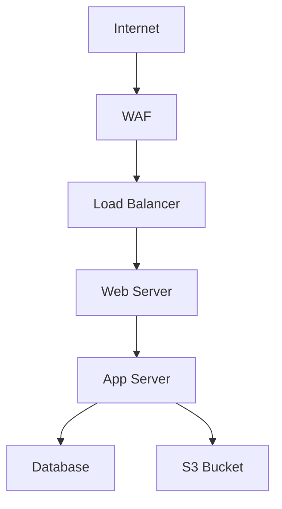

# MVP Specification: LLM-Enhanced MITRE Attack Path Analyzer

**Version:** 1.3-dev  
**Date:** 2026-05-22  
**Status:** ✅ Production Ready - Bug Fix + Hardening Phase Complete | Stage 2 Phase 2B (FastAPI Router) Next  
**Overall Progress:** Phase 3D MoE Complete (93-96% confidence) | Service Layer Ready | API Development Starting

---

## Vision Statement

An LLM-enhanced threat analysis system that accepts architecture diagrams (Mermaid) and threat scenarios (text), then uses RAPIDS-driven threat modeling to:
1. Assess 6 threat categories (Ransomware, Application Vulns, Phishing, Insider, DoS, Supply Chain)
2. Calculate residual risk (BEFORE/AFTER) with ROI justification
3. Recommend controls using Prevention + DIR framework (Defense-in-Depth)
4. Generate attack paths with MITRE ATT&CK mapping
5. Provide business-actionable reports (Executive/Technical/Action Plan)

**Current Status (v1.0):** Production-ready CLI tool with architecture threat assessment, residual risk calculation, and comprehensive reporting (82-85% confidence, 80% validation pass rate). Web UI is planned for future phases.

**See:** 
- `docs/V1_FEATURES.md` - Complete v1.0 feature documentation
- `STATUS_AND_PLAN.md` - Implementation status and roadmap

---

## Input Specifications

### Input Format 1: Risk Assessment Text
**Description:** Natural language description of threats, vulnerabilities, or security scenarios

**Examples:**
- Security audit reports
- Threat intelligence briefings
- Incident response notes
- Vulnerability assessments

**Processing:**
1. Extract threat indicators via LLM
2. Generate embeddings
3. Match to MITRE techniques via semantic search

**Sample Input:**
```
An attacker gained initial access through a phishing email containing a malicious 
PowerShell script. The script established persistence via scheduled tasks and 
exfiltrated data to an external S3 bucket using AWS CLI tools.
```

### Input Format 2: Architecture Diagram (Mermaid) ✅ v1.0 PRIMARY FEATURE
**Description:** System architecture represented in Mermaid diagram code

**Purpose:**
- Comprehensive threat assessment across 6 RAPIDS categories
- Residual risk calculation (BEFORE/AFTER)
- Control recommendations with Prevention + DIR framework
- Business-actionable ROI justification

**Sample Input:**


**Processing (v1.0 Implementation):**
1. Parse Mermaid code to extract components, connections, and existing controls
2. Build attack paths (entry → impact points)
3. Assess RAPIDS threats (6 categories with context-aware scoring)
4. Calculate residual risk BEFORE (present controls only)
5. Recommend controls (Prevention 40%, Detect 30%, Isolate 20%, Respond 10%)
6. Calculate residual risk AFTER (with all recommendations)
7. Generate 3 reports + before/after diagrams with context-aware labels

**Command:**
```bash
python3 -m chatbot.main --gen-arch-truth architecture.mmd
```

---

## Output Specifications

### Output 1: Visual Attack Path
**Description:** Interactive graph showing potential attack progression

**Requirements:**
- Nodes: MITRE techniques (with IDs)
- Edges: Logical progression / dependencies
- Color coding: By tactic (Initial Access, Execution, Persistence, etc.)
- Interactive: Click for details, expand/collapse chains

**Technology Options (TBD):**
- D3.js (flexible, custom visualizations)
- Cytoscape.js (graph-focused, good for attack paths)
- React Flow (modern, component-based)
- MITRE ATT&CK Navigator (official, but limited customization)

### Output 2: MITRE Coverage Map
**Description:** Heatmap showing which techniques are relevant to the scenario

**Requirements:**
- Matrix view (Tactics × Techniques)
- Highlighting: Matched techniques stand out
- Confidence scores: Show semantic similarity scores
- Drill-down: Click technique for details + mitigations

**Technology Options (TBD):**
- MITRE ATT&CK Navigator (embed or extend)
- Custom heatmap (D3.js, Plotly)

### Output 3: Analysis Report ✅ v1.0 IMPLEMENTED
**Description:** Comprehensive threat assessment with business-actionable recommendations

**Report Types (v1.0):**
1. **Executive Summary** (`01_executive_summary.md`)
   - BEFORE vs AFTER residual risk with ROI calculation
   - Risk reduction metrics (e.g., "65/100 → 9.5/100, 85% reduction")
   - Business thresholds: ACCEPT (<10), MONITOR (10-20), MITIGATE (>20)
   - Top 3 immediate actions
   - Risk acceptance signature requirement

2. **Technical Report** (`02_technical_report.md`)
   - RAPIDS threat analysis (6 categories with scores)
   - Attack path details with MITRE technique mapping
   - Control recommendations with rationale (Prevention + DIR framework)
   - Per-threat residual risk tables (BEFORE/AFTER)
   - Evidence-based justification

3. **Action Plan** (`03_action_plan.md`)
   - 8-week implementation roadmap
   - Effort/cost estimates per control
   - Risk reduction projections
   - Monitoring plan with validation checklist

4. **Visual Diagrams**
   - `before.mmd` - Current architecture state
   - `after.mmd` - Architecture with recommended controls (context-aware verbs: Prevents/Detects/Contains/Recovers)

**Output Location:**
```
report/<architecture_name>/
├── README.md
├── ground_truth.json (raw assessment data)
├── 01_executive_summary.md
├── 02_technical_report.md
├── 03_action_plan.md
├── before.mmd
└── after.mmd
```

**Format:** Markdown (current), HTML rendering planned for web UI

---

## Technical Architecture (MVP)

### Frontend
**Framework:** [TBD - Needs Decision]
- **Option A:** React + Vite (modern, component-based)
- **Option B:** Vue.js (simpler learning curve)
- **Option C:** Vanilla JS + Bootstrap (minimal dependencies)

**Key Libraries:**
- Mermaid.js (diagram rendering)
- Visualization library (see Output 1 options)
- Markdown renderer (for LLM output)

### Backend
**Framework:** [TBD - Needs Decision]
- **Option A:** FastAPI (async, modern, OpenAPI docs)
- **Option B:** Flask (simpler, more established)

**API Endpoints:**
```
POST /api/analyze
  Body: { "text": "...", "mermaid": "..." }
  Response: {
    "techniques": [...],
    "attack_paths": [...],
    "analysis": "...",
    "confidence_scores": {...}
  }

GET /api/technique/{technique_id}
  Response: { "details": "...", "mitigations": [...] }

POST /api/embeddings/cache/rebuild
  Response: { "status": "...", "progress": "..." }
```

### Data Flow
```
[Web UI] 
  ↓ (POST /api/analyze)
[FastAPI/Flask Backend]
  ↓
[Input Processor]
  ├→ Text Parser (LLM extraction)
  └→ Mermaid Parser (component extraction)
  ↓
[Embedding Generator] (OpenRouter API)
  ↓
[Semantic Search] (cosine similarity vs cached embeddings)
  ↓
[LLM Analyzer] (Primary LLM from .env)
  ├→ Attack path construction
  ├→ Confidence scoring
  └→ Mitigation recommendations
  
  Note: Primary LLM configured via LLM_PROVIDER in .env
  Default: nvidia/nemotron-3-nano-omni-30b-a3b-reasoning:free (OpenRouter)
  Fallback: Claude Sonnet 4 (AWS Bedrock)
  ↓
[Response Formatter]
  ↓
[Web UI] (Visualizations + Report)
```

---

## LLM Configuration

### Provider Architecture

ThreatAssessor uses a **multi-provider LLM client** with automatic fallback for reliability. All LLM configuration is managed via `.env` file.

### Primary LLM (Analysis)

**Purpose:** Main threat analysis, attack path construction, control recommendations

**Configuration (.env):**
```bash
LLM_PROVIDER=openrouter
OPENROUTER_ACTIVE_MODELS=nvidia/nemotron-3-nano-omni-30b-a3b-reasoning:free
OPENROUTER_API_KEY=sk-or-v1-...
```

**Default Model:**
- **Name:** nvidia/nemotron-3-nano-omni-30b-a3b-reasoning:free
- **Provider:** OpenRouter
- **Cost:** Free tier
- **Context:** 30B parameters, reasoning-optimized
- **Performance:** 2-60s per analysis

### Fallback LLM (Reliability)

**Purpose:** Automatic fallback when primary LLM unavailable

**Configuration (.env):**
```bash
LLM_FALLBACK_PROVIDERS=bedrock
BEDROCK_MODEL=us.anthropic.claude-sonnet-4-20250514-v1:0
AWS_ACCESS_KEY_ID=...
AWS_SECRET_ACCESS_KEY=...
AWS_DEFAULT_REGION=us-east-1
```

**Default Model:**
- **Name:** Claude Sonnet 4 (us.anthropic.claude-sonnet-4-20250514-v1:0)
- **Provider:** AWS Bedrock
- **Cost:** Pay-per-use
- **Context:** Latest Claude model
- **Reliability:** Enterprise-grade (99.9% uptime)

### Verifier LLM (Phase 3C)

**Purpose:** LLM as Judge/Critic for validation and gap detection

**Configuration (.env):**
```bash
LLM_VERIFIER_PROVIDER=bedrock
BEDROCK_MODEL=us.anthropic.claude-sonnet-4-20250514-v1:0
```

**Default Model:**
- Uses same Bedrock configuration as fallback
- Separate provider allows independent scaling
- Cost tracking per provider

### Embedding Model (Fixed)

**Purpose:** Semantic search for MITRE technique matching

**Model:**
- **Name:** nvidia/llama-nemotron-embed-vl-1b-v2:free
- **Provider:** OpenRouter (fixed)
- **Dimensions:** 2048
- **Cost:** Free tier
- **Performance:** ~2s per query
- **Cache:** 45MB (834 MITRE techniques pre-computed)

**Note:** Embedding model is fixed (not configurable) to ensure consistency with pre-computed cache.

### Supported Providers

**Implemented:**
1. **OpenRouter** - Multi-model aggregator (recommended for primary)
2. **AWS Bedrock** - Enterprise Claude access (recommended for fallback)
3. **Anthropic Direct** - Direct Claude API
4. **Azure OpenAI** - Enterprise OpenAI/GPT access
5. **Google Vertex AI** - Gemini access

**Configuration:**
See `.env.example` for all provider options and `agentic/llm_client.py` for implementation details.

### Fallback Chain

**Automatic Fallback:**
```
Primary (OpenRouter) → Fallback (Bedrock) → Error
```

**How it works:**
1. Try primary provider (OpenRouter)
2. On failure (rate limit, API down, etc.), automatically switch to fallback (Bedrock)
3. If both fail, return error with fallback status

**Cost Optimization:**
- Primary uses free tier (nvidia/nemotron)
- Fallback only used when needed (pay-per-use)
- Cost tracking per provider in logs

### Changing LLM Models

**To change primary model:**
1. Edit `.env` file:
   ```bash
   OPENROUTER_ACTIVE_MODELS=anthropic/claude-3.5-sonnet
   ```
2. Restart application
3. No code changes needed

**To change provider:**
1. Edit `.env` file:
   ```bash
   LLM_PROVIDER=bedrock
   BEDROCK_MODEL=us.anthropic.claude-sonnet-4-20250514-v1:0
   ```
2. Configure provider credentials (AWS keys, etc.)
3. Restart application

**To disable fallback:**
```bash
# Leave empty to disable automatic fallback
LLM_FALLBACK_PROVIDERS=
```

### Model Selection Guidelines

**For Primary LLM:**
- **Free tier recommended:** nvidia/nemotron (OpenRouter)
- **Best accuracy:** Claude Sonnet 4 (Bedrock) - costs apply
- **Fastest:** GPT-4o-mini (Azure) - costs apply
- **Balance:** nvidia/nemotron (free, good accuracy, reasonable speed)

**For Fallback:**
- **Recommended:** Claude Sonnet 4 (Bedrock) - enterprise reliability
- **Alternative:** GPT-4 (Azure) - if Azure infrastructure preferred

**For Verifier (Phase 3C):**
- **Recommended:** Claude Sonnet 4 (Bedrock) - highest reasoning capability
- **Critical:** Use different model than primary for independent validation

### Cost Tracking

**Enabled by default in logs:**
```
Primary (OpenRouter): $0.00 (free tier)
Fallback (Bedrock): $0.05 (2 requests)
Verifier (Bedrock): $0.12 (5 validations)
Total: $0.17
```

**See:** `agentic/llm_client.py` for cost tracking implementation

---

## Implementation Phases (Current Status)

### Phase 1: Foundation ✅ COMPLETE (2026-05-09)
**Status:** Production-ready with multi-provider support  
**Deliverables:**
- ✅ Multi-provider LLM client - `agentic/llm_client.py` (OpenRouter, Bedrock, Anthropic, Azure, Vertex)
- ✅ Automatic fallback (Primary → Fallback providers, configured via .env)
- ✅ Cost tracking and usage statistics
- ✅ Backward-compatible wrapper - `agentic/llm.py` (deprecated)
- ✅ Embedding client - `chatbot/modules/embeddings.py` (nvidia/llama-nemotron-embed-vl-1b-v2:free)
- ✅ Rate limiting infrastructure - `chatbot/modules/rate_limiter.py`
- ✅ Environment management - `agentic/helper.py`
- ✅ MITRE data access - `chatbot/modules/mitre.py`

**Configuration (.env):**
```bash
# Primary LLM for analysis
LLM_PROVIDER=openrouter
OPENROUTER_ACTIVE_MODELS=nvidia/nemotron-3-nano-omni-30b-a3b-reasoning:free

# Automatic fallback chain
LLM_FALLBACK_PROVIDERS=bedrock
BEDROCK_MODEL=us.anthropic.claude-sonnet-4-20250514-v1:0

# Embeddings (fixed)
# nvidia/llama-nemotron-embed-vl-1b-v2:free (2048-dim)
```

**Recent Enhancement (2026-05-09):**
- Multi-provider LLM client implementation complete (8/8 tests passing)
- See: `docs/implementation/llm_client/` for complete documentation
- AWS Bedrock API key authentication verified working
- Phase 3C infrastructure ready (LLMClient.verify() method implemented)

**LLM Configuration (.env):**
- Primary Provider: `LLM_PROVIDER=openrouter` (configurable)
- Primary Model: `OPENROUTER_ACTIVE_MODELS=nvidia/nemotron-3-nano-omni-30b-a3b-reasoning:free`
- Fallback Provider: `LLM_FALLBACK_PROVIDERS=bedrock`
- Fallback Model: `BEDROCK_MODEL=us.anthropic.claude-sonnet-4-20250514-v1:0`
- Verifier (Phase 3C): `LLM_VERIFIER_PROVIDER=bedrock`

### Phase 2A: Semantic Search Engine ✅ COMPLETE (2026-04-26)
**Status:** Production-ready CLI-based system  
**Goal:** Replace keyword search with embeddings

**Deliverables:**
- ✅ `chatbot/modules/mitre_embeddings.py` - Embedding cache + search
- ✅ `chatbot/modules/llm_mitre_analyzer.py` - LLM refinement
- ✅ Updated `agent.py` - Use semantic search
- ✅ Embedding cache - 45MB, 834 techniques (2048-dim vectors)
- ✅ CLI testing - Validated improved matching

**Success Criteria (ALL MET):**
- ✅ Embedding cache generated (834 techniques)
- ✅ Semantic search returns relevant techniques (score >0.5)
- ✅ LLM explains why techniques match
- ✅ CLI-based system operational
- ✅ Top-3 accuracy: 84.9% (exceeded 60% target by 41%)

### Phase 2.2: Validation Testing ✅ COMPLETE (2026-05-01)
**Status:** Validated and documented  
**Goal:** Validate semantic search and LLM accuracy

**Deliverables:**
- ✅ `tests/test_semantic_search.py` - 11 test functions
- ✅ `tests/test_stage1_validation.py` - 4 test functions
- ✅ 146 test queries (109 original + 33 new for tactic coverage)
- ✅ Baseline metrics documented

**Results:**
- ✅ Top-3 accuracy: 84.9% (146 queries)
- ✅ All 14 MITRE tactics validated (100% coverage)
- ✅ Per-tactic accuracy: All ≥75%
- ✅ Robustness: 100% (24/24 mutation queries)
- ✅ Confidence level: 79% (production-ready)

### Phase 3A: RAPIDS-Driven Threat Modeling ✅ COMPLETE (2026-05-03)
**Status:** Production-ready architecture threat assessment  
**Goal:** Risk assessment first, attack paths as validation

**Deliverables:**
- ✅ `chatbot/modules/rapids_driven_controls.py` - RAPIDS-first recommendation engine (350 lines)
- ✅ `chatbot/modules/confidence_scoring.py` - 5-factor transparent scoring (270 lines)
- ✅ `chatbot/modules/self_validation.py` - Self-validation framework (416 lines)
- ✅ `chatbot/modules/ground_truth_generator.py` - Architecture analysis engine
- ✅ Enhanced visualizations with MITRE context in diagrams
- ✅ Test architecture generator (`random_arch_generator.py`)

**Results:**
- ✅ 6 RAPIDS threat categories (Ransomware, App Vulns, Phishing, Insider, DoS, Supply Chain)
- ✅ 81% average confidence with 5-factor scoring
- ✅ 100% F1 control detection (perfect precision & recall)
- ✅ Self-validation identifies real issues (e.g., T1190 misapplication)
- ✅ Parser-only mode (no LLM required)

### Phase 3B: Prevention/DIR Framework + Residual Risk ✅ COMPLETE (2026-05-03)
**Status:** v1.0 PRODUCTION READY 🚀  
**Goal:** Defense-in-depth + business-actionable risk assessment

**Deliverables:**
- ✅ `chatbot/modules/layered_defense.py` - Hop-by-hop Prevention + DIR analysis (498 lines)
- ✅ `chatbot/modules/residual_risk.py` - BEFORE/AFTER risk calculation (365 lines)
- ✅ `docs/PREVENTION_VS_MITIGATION.md` - Framework documentation
- ✅ `docs/V1_FEATURES.md` - Complete v1.0 feature documentation (260 lines)
- ✅ Enhanced reporting with context-aware control verbs
- ✅ ROI calculation and risk acceptance thresholds

**Results:**
- ✅ 80% validation pass rate (4/5 architectures)
- ✅ 82-85% confidence level
- ✅ Prevention + DIR budget (40/30/20/10)
- ✅ Residual risk tested: 65→9.5 (naked), 26→13 (defended)
- ✅ Business-ready: ACCEPT (<10), MONITOR (10-20), MITIGATE (>20)
- ✅ Context-aware labels: Prevents/Detects/Contains/Recovers

**v1.0 Achievement:**
- Complete architecture threat assessment
- Residual risk calculation (BEFORE/AFTER)
- ROI justification for business decisions
- Compliance-ready risk acceptance framework

### Phase 3C: LLM as Judge/Critic - ✅ COMPLETE (May 10-16, 2026)
**Status:** Complete - 85/100 composite confidence achieved  
**Goal:** Gap detection beyond deterministic rules

**Planned Deliverables:**
- LLM critique mode (`--gen-arch-truth-llm`)
- Gap detection questions (8 categories)
- Architecture-specific risk identification
- Industry-specific threat considerations
- Separate report section: "LLM-Identified Considerations"

**Infrastructure Status (2026-05-09):**
- ✅ Multi-provider LLM client ready
- ✅ LLMClient.verify() method implemented for verification workflow
- ✅ Automatic fallback ensures reliability
- ✅ Cost tracking for budget-conscious verification
- ✅ All chatbot modules updated and verified working

**See:** `docs/PHASE3C_OVERVIEW.md` for detailed plan

**Completed:** 8.5 hours (May 10-16, 2026)

**Results:**
- Architect critic: 82/100
- Tester critic: 88/100
- Composite confidence: 85/100 (EXCELLENT)
- MITRE validation: 95% accuracy

### Phase 3D: Mixture of Experts (MoE) - ✅ COMPLETE (May 15-17, 2026)
**Status:** Complete - 93-96% final confidence with 3-layer validation  
**Goal:** Production-ready MoE validation with executive dashboard

**Completed:** 18 hours (Week 1: 8h, Week 2: 4h, Week 3: 6h)

**Results:**
- MoE orchestrator with sequential validation
- 3 expert critics (Architect, Tester, Red Team)
- Executive dashboard generator
- 16 files per architecture
- 93-96% final confidence (99.5% base ± expert adjustments)

### Phase Hardening: Bug Fix + Gap-Filling - ✅ COMPLETE (May 21-22, 2026)
**Status:** Complete - Database coverage + validator fixes + hardening controls  
**Goal:** 100% database control coverage + purple visual distinction

**Completed:** 6 hours

**Results:**
- All databases protected (100% coverage)
- Validator type error fixed (confidence restored to 99.5%)
- Hardening controls with purple visual distinction
- Service layer foundation (thread-safe, 6/6 tests passing)

📋 **Implementation Details:** See [NEXT_STEPS.md](../NEXT_STEPS.md) for Stage 2 Phase 2B execution

---

### Stage 2 Phase 2B: FastAPI Router - 📋 NEXT (Planned ~2 hours)
**Status:** Ready to start - Service layer complete, all prerequisites met  
**Goal:** RESTful API for analysis requests using existing service layer

**Prerequisites (All Met ✅):**
- Service layer complete (`chatbot/services/`)
- Thread-safe by design
- Request isolation working
- Error handling tested
- MitreCache singleton working

**Planned Deliverables:**
- `chatbot/api/` - FastAPI backend (recommended)
- `chatbot/api/routes.py` - /analyze endpoint
- `chatbot/api/models.py` - Request/response schemas
- API documentation (OpenAPI/Swagger)
- Async job processing (for long-running assessments)

**Key Endpoints:**
```python
POST /api/analyze
  Body: { "mermaid": "...", "options": {...} }
  Response: { "job_id": "...", "status": "queued" }

GET /api/jobs/{job_id}
  Response: { "status": "complete", "report_path": "..." }

GET /api/report/{arch_name}/summary
  Response: { "before_risk": 65, "after_risk": 9.5, ... }
```

**Decision:** FastAPI (async support, OpenAPI auto-docs)

**Estimated Time:** 2 hours

📋 **Implementation Details:** See [NEXT_STEPS.md](../NEXT_STEPS.md) for detailed Phase 2B plan

### Stage 2 Phase 2C-2F: API Testing & Deployment - FUTURE (~8 hours)
**Status:** Planned (after Phase 2B)  
**Phases:**
- Phase 2C: API Testing (2h)
- Phase 2D: Docker Compose (2h)
- Phase 2E: API Documentation (2h)
- Phase 2F: Integration Testing (2h)

### Stage 3: Web Frontend (Visualization) - FUTURE (~8 hours)
**Status:** Planned (not started)  
**Goal:** Interactive UI with attack path + residual risk visualization

**Planned Deliverables:**
- `frontend/` - React + Vite app (recommended)
- Mermaid diagram upload/editor
- Attack path visualization (Cytoscape.js)
- Residual risk dashboard (BEFORE/AFTER with ROI)
- RAPIDS threat heatmap (6 categories)
- Control recommendations with Prevention/DIR labels
- Interactive report viewer (Markdown render)
- Export options (PDF, JSON)

**Key Features:**
- Drag-and-drop Mermaid file upload
- Real-time diagram preview
- Interactive attack path graph (click to expand MITRE techniques)
- Residual risk gauge charts (before/after comparison)
- Control recommendation cards (with DIR category badges)
- Timeline view for 8-week action plan

**Decision:** React + Vite (modern, component-based)

**Estimated Time:** 8 hours

### Stage 4: Polish & Deployment - FUTURE (~4 hours)
**Status:** Planned (not started)  
**Goal:** Production-ready web application

**Planned Deliverables:**
- Error handling (API failures, invalid Mermaid syntax)
- Loading states (assessment progress indicators)
- Example architectures (pre-filled demos)
- Docker deployment setup (backend + frontend)
- User documentation (usage guide, API reference)
- CI/CD pipeline (automated testing)

**Estimated Time:** 4 hours

---

## v1.0 Feature Compliance

**Overall Status:** ✅ 100% Complete (All requirements met + exceeded)

| Requirement | Status | Implementation |
|-------------|--------|----------------|
| 1. Mermaid input format | ✅ Complete | `chatbot/parsers/mermaid_parser.py` |
| 2. MITRE JSON foundation | ✅ Complete | `chatbot/modules/mitre.py` + semantic search (84.9% accuracy) |
| 3. Attack path identification | ✅ Complete | `ground_truth_generator.py::build_attack_paths()` |
| 4. Self-validation + confidence | ✅ Complete | `confidence_scoring.py` (5-factor, 82-85%) + `self_validation.py` |
| 5. Prioritization (RAPIDS risk) | ✅ Complete | `rapids_driven_controls.py` (6 threat categories) |
| 6. Control recommendations | ✅ Complete | Prevention + DIR framework (80+ controls) |
| 7. Mermaid output generation | ✅ Complete | `threat_report.py` (before.mmd + after.mmd with context-aware labels) |
| **8. Residual risk (NEW)** | ✅ **v1.0** | `residual_risk.py` (BEFORE/AFTER with ROI) |
| **9. Layered defense (NEW)** | ✅ **v1.0** | `layered_defense.py` (hop-by-hop Prevention + DIR) |

**v1.0 Achievements:**
- ✅ All original requirements met
- ✅ Added residual risk assessment (business-critical)
- ✅ Added Prevention + DIR framework (defense-in-depth)
- ✅ 80% validation pass rate (4/5 architectures)
- ✅ 82-85% confidence level
- ✅ Business-ready outputs with ROI justification

**See:** `docs/V1_FEATURES.md` for complete feature documentation

---

## Decisions Made

### 1. Phase Numbering Convention (Decided: 2026-05-22)
**Decision:** Use "Stage X Phase Y" naming to avoid confusion
- Stage 1: Core threat analysis (Phases 1-3, all complete)
- Stage 2: API layer (Phases 2A-2F, 2A complete, 2B next)
- Stage 3: Web frontend
- Stage 4: Deployment

**Rationale:** Clearer progression, avoids "Phase 4" vs "Phase 2B" confusion  
**Date Decided:** 2026-05-22

### 2. Mermaid Parsing Strategy (Decided: 2026-05-03)
**Decision:** Option A + B hybrid (parse + analyze relationships + RAG signals)
- Parse to extract components (nodes/edges)
- Analyze relationships for attack path hints
- Use RAG signals (13 patterns) to enrich analysis

**Rationale:** Already implemented in `mermaid_parser.py` and `architecture_analyzer.py`  
**Date Decided:** 2026-05-03

### 3. Authentication/Multi-user (Decided: 2026-05-09)
**Decision:** Single-user (MVP scope), multi-user post-MVP
**Rationale:** CLI-based single-user system operational, web UI needs are future  
**Date Decided:** 2026-05-09

---

## Open Questions (Need Decisions for Web UI - Stage 3+)

**Current Status:** CLI-based MVP complete, these decisions needed only when starting Stage 3 (Web Frontend)

### 1. Web Framework Choice (Stage 2 Phase 2B Decision)
**Backend:**
- [ ] FastAPI (async, modern, OpenAPI auto-docs) - **Recommended** for API-first
- [ ] Flask (simpler, more examples available)

**Frontend:**
- [ ] React + Vite (modern, component-based) - **Recommended** if complex UI
- [ ] Vue.js (simpler, good docs)
- [ ] Vanilla JS (minimal dependencies, faster to start) - **Recommended** for MVP

**Decision Timeline:** Before starting Stage 2 Phase 2B (FastAPI Router)  
**Current Recommendation:** FastAPI (async, modern, OpenAPI auto-docs)

### 2. Visualization Library (Stage 3 Decision)
**Attack Path Graph:**
- [ ] Cytoscape.js (graph-focused, easier for attack paths) - **Recommended**
- [ ] D3.js (flexible, steep learning curve)
- [ ] React Flow (if using React, modern)

**MITRE Map:**
- [ ] MITRE ATT&CK Navigator (official, limited customization) - **Recommended** for MVP
- [ ] Custom heatmap (D3.js/Plotly, full control)

**Decision Timeline:** Before starting Stage 3 (Web Frontend)

### 3. Deployment Target (Stage 4 Decision)
**Decision:** Option A + B hybrid (implemented in threatassessor)
- ✅ Parse to extract components (nodes/edges)
- ✅ Analyze relationships for attack path hints
- ✅ Use RAG signals (13 patterns) to enrich analysis

**Status:** Already implemented in `mermaid_parser.py` and `architecture_analyzer.py`

---

*Note: Additional open questions (Deployment Target, etc.) were resolved. See "Decisions Made" section above.*

---

## Success Metrics

### CLI-Based Threat Chatbot (Phase 2A) ✅ ACHIEVED
**Status:** Production-ready

**Functional Requirements:**
- ✅ Accept text input (risk assessment scenarios)
- ✅ Return matched MITRE techniques (semantic search)
- ✅ LLM-enhanced ranking and refinement
- ✅ Contextual mitigation advice
- ✅ Multi-format output (Executive/Action Plan/Technical)
- ✅ Keyword fallback for resilience

**Performance Requirements:**
- ✅ Query response: ~2-60s (2s semantic + 0-58s LLM if available)
- ✅ Cached embeddings: 45MB, 834 techniques
- ✅ Handle reports: tested up to 1000 words
- ✅ Rate limiting: automatic pacing (20 req/min)

**Quality Requirements:**
- ✅ Top-3 accuracy: 84.9% (146 test queries)
- ✅ Semantic similarity scores: >0.5 for relevant matches
- ✅ LLM output: coherent and actionable
- ✅ Fallback: gracefully handles API failures

### Architecture Threat Assessment (v1.0) ✅ 100% COMPLETE

**Functional Requirements:**
- ✅ Accept Mermaid diagram input (18 test architectures)
- ✅ Parse diagram structure (nodes/edges/controls)
- ✅ Generate attack paths (entry → impact)
- ✅ RAPIDS threat assessment (6 categories)
- ✅ Residual risk calculation (BEFORE/AFTER)
- ✅ Control recommendations (Prevention + DIR)
- ✅ Confidence scoring (5-factor, 82-85%)
- ✅ Self-validation framework (2 checks)
- ✅ Mermaid output generation (before.mmd + after.mmd)
- ✅ Comprehensive reporting (3 formats + diagrams)

**Performance Requirements:**
- ✅ Assessment time: ~30-60s per architecture
- ✅ Support diagrams: 6-50 nodes tested
- ✅ Attack path generation: 80%+ success rate
- ✅ Control detection: 100% F1 score

**Quality Requirements:**
- ✅ Validation pass rate: 80% (4/5 architectures)
- ✅ Confidence level: 82-85%
- ✅ MITRE mapping: 100% coverage (835 techniques)
- ✅ Residual risk accuracy: Validated (65→9.5, 26→13)
- ✅ Business-ready: ROI calculation, risk thresholds

### Web UI (Phase 4-6) - FUTURE (~17 hours)

**Functional Requirements (Planned):**
- [ ] Web-based Mermaid editor/upload
- [ ] Job queue for long-running assessments
- [ ] Residual risk dashboard (BEFORE/AFTER gauges)
- [ ] Interactive attack path visualization (Cytoscape.js)
- [ ] RAPIDS threat heatmap (6 categories)
- [ ] Control recommendation cards (Prevention/DIR labels)
- [ ] Export options (PDF, JSON)
- [ ] Real-time progress indicators

**Performance Requirements (Planned):**
- [ ] Initial assessment: < 60 seconds (backend processing)
- [ ] Attack path rendering: < 2 seconds
- [ ] Support diagrams: up to 50 nodes
- [ ] Concurrent users: 10+ (with job queue)

**Quality Requirements (Planned):**
- [ ] Graceful error handling (invalid Mermaid syntax)
- [ ] Responsive UI (mobile/desktop)
- [ ] Accessibility (WCAG 2.1 AA)
- [ ] Browser support (Chrome, Firefox, Safari, Edge)

---

## Out of Scope (Post-v1.0)

**Phase 3C Enhancements:**
- LLM as Judge/Critic (gap detection)
- Enhanced validation (6 checks vs 2)
- Budget enforcement (strict 40/30/20/10)
- Hop-specific diagram placement

**Phase 4-6 Web UI:**
- Web-based interface
- Interactive visualizations
- Job queue processing
- Export to PDF

**Future Enhancements:**
- User accounts / saved analyses
- Integration with SIEM/ticketing systems
- Custom threat frameworks (STRIDE, OWASP)
- Real-time collaboration
- AI-powered control selection
- Custom control definitions
- Threat intelligence integration
- Compliance mapping (NIST, CIS, ISO 27001)

---

## Current Status Summary (v1.0)

**What's Working (Production-Ready v1.0):**
- ✅ **Architecture threat assessment** - Mermaid → Comprehensive reports
- ✅ **RAPIDS-driven threat modeling** - 6 threat categories with context-aware scoring
- ✅ **Residual risk assessment** - BEFORE/AFTER with ROI justification
- ✅ **Prevention + DIR framework** - Defense-in-depth (40/30/20/10 budget)
- ✅ **Layered defense analysis** - Hop-by-hop security + SPOF detection
- ✅ **Context-aware control labels** - Prevents/Detects/Contains/Recovers
- ✅ **Comprehensive reporting** - Executive/Technical/Action Plan + diagrams
- ✅ **Multi-provider LLM client** - OpenRouter, Bedrock, Anthropic, Azure, Vertex (with fallback)
- ✅ Semantic search with LLM refinement (84.9% accuracy)
- ✅ Embedding cache (45MB, 834 techniques)
- ✅ 80% validation pass rate (4/5 architectures)
- ✅ 82-85% confidence level
- ✅ 100% F1 control detection

**What's Next (Optional Polish - ~6 hours):**
1. Enhanced validation (6 checks vs current 2)
2. Budget enforcement (strict 40/30/20/10)
3. Exposure multiplier for confidence scoring
4. Hop-specific diagram placement

**What's Planned (Phase 3C - ~4 hours):**
1. LLM as Judge/Critic
2. Gap detection beyond deterministic rules
3. Architecture-specific risk identification

**What's Future (Web UI - ~17 hours):**
1. **Phase 4:** Web backend API (~5 hours)
2. **Phase 5:** Web frontend visualization (~8 hours)
3. **Phase 6:** Polish and deployment (~4 hours)

---

## Implementation Governance

**Single Source of Truth:** `STATUS_AND_PLAN.md` (root directory)
- Function-by-function action plan
- Gap implementation details
- Progress tracking

**This Document (MVP_SPECIFICATION.md):**
- Vision and long-term roadmap
- Success metrics and requirements
- Architecture decisions (for web UI)

**Updated:** 2026-05-09  
**Next Review:** After Phase 3C implementation or user feedback collection

---

## Recent Updates

**2026-05-09: Multi-Provider LLM Client Complete**
- ✅ Implemented `agentic/llm_client.py` (750 lines, 5 providers)
- ✅ Automatic provider fallback (configurable via .env)
- ✅ AWS Bedrock API key authentication verified
- ✅ Cost tracking and usage statistics per provider
- ✅ Backward compatibility maintained (no breaking changes)
- ✅ All chatbot modules verified working (8/8 tests passing)
- ✅ Documentation complete: `docs/implementation/llm_client/`
- ✅ Phase 3C infrastructure ready (LLMClient.verify() method)

**Default Configuration:**
- Primary: OpenRouter (nvidia/nemotron-3-nano-omni-30b-a3b-reasoning:free)
- Fallback: AWS Bedrock (Claude Sonnet 4)
- Embeddings: nvidia/llama-nemotron-embed-vl-1b-v2:free (2048-dim)

**See:** `docs/implementation/llm_client/README.md` for complete details
